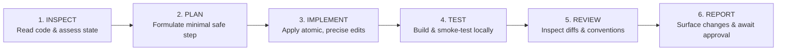

# MS Tutorials — AI Coding Constitution & Guide

This document constitutes the governing charter and binding operational protocol for AI pair programming assistants (Antigravity) and developers working on the MS Tutorials codebase.

---

## 1. The 20 Golden Rules of Development

1. **Inspect before modifying**: Always examine existing files, signatures, and dependencies before attempting changes. Never blindly overwrite code.
2. **Explain the plan before major changes**: Always outline intended alterations and wait for review/approval before touching critical code.
3. **Make the smallest safe change**: Deliver iterative, focused increments. Avoid compounding risk by bundling unrelated edits.
4. **Reuse existing components**: Before creating a new button, card, modal, or layout, inspect `src/components/` and `src/layouts/` for reusable assets.
5. **Do not duplicate functionality**: Maintain single sources of truth for utility functions, API calls, and domain business calculations.
6. **Do not modify unrelated files**: Confine edits strictly to files directly required for the current task.
7. **Do not add dependencies unnecessarily**: Prefer native browser APIs and standard Node.js libraries. Every new dependency requires explicit architectural justification.
8. **Never expose secrets**: Database passwords, JWT keys, and API tokens must never appear in source code or console logs.
9. **Never commit `.env`**: Ensure `.env` is permanently excluded from Git tracking via `.gitignore`. Only commit sanitized `.env.example`.
10. **Keep frontend/backend/database responsibilities separate**:
    - `src/` does not connect to the database.
    - `server/` does not render client UI markup.
    - `database/` does not store application runtime code.
11. **Backend must enforce authorization**: Never rely on UI button hiding for access control. Every API route must validate permissions independently.
12. **Maintain responsive design**: All UI components and layouts must render flawlessly across mobile (375px+), tablet (768px+), and desktop (1024px+) viewports.
13. **Maintain accessibility**: Ensure high text contrast ratios, semantic HTML elements (`<main>`, `<header>`, `<nav>`, `<button>`), and keyboard navigability.
14. **Maintain SEO on public pages**: Ensure proper page titles, semantic headings, meta descriptions, and fast initial rendering for search crawlers.
15. **Test after changes**: Run local production builds (`npm run build`) and relevant route/unit smoke tests immediately following any edit.
16. **Review git diff before committing**: Inspect staged modifications (`git diff --staged`) line-by-line to ensure no accidental debug logs or unwanted edits slip in.
17. **Report changed files**: Explicitly list all created or modified files in every summary.
18. **Report tests performed**: Clearly document the exact test commands and verification steps conducted.
19. **Report unresolved issues**: Transparently surface any pending risks, edge cases, or known limitations before signing off on a task.
20. **Ask before major architectural changes**: Never modify folder structures, authentication strategies, or database relational designs without explicit user consent.

---

## 2. Standard AI Operating Workflow

Every single AI engineering task must follow this exact sequential loop:

### Detailed Breakdown:
- **INSPECT**: Read file contents, inspect current directory tree, verify running server or build state. Do not modify files during this phase.
- **PLAN**: Present a concrete plan with affected files and user review items. Wait for user approval before making changes.
- **IMPLEMENT**: Execute changes cleanly. Apply modifications to targeted files only.
- **TEST**: Run `npm run build` and backend smoke tests to confirm zero build breakages or runtime crashes.
- **REVIEW**: Check git status, verify no secrets are exposed, ensure code conforms to project standards.
- **REPORT**: Provide a concise report showing:
  - List of files created/modified
  - Tests performed and their outputs
  - Unresolved issues or risks
  - Recommended next step (awaiting approval)
