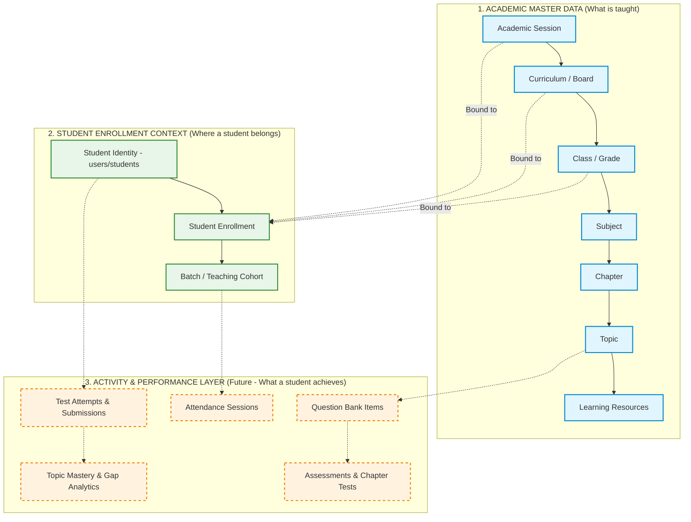
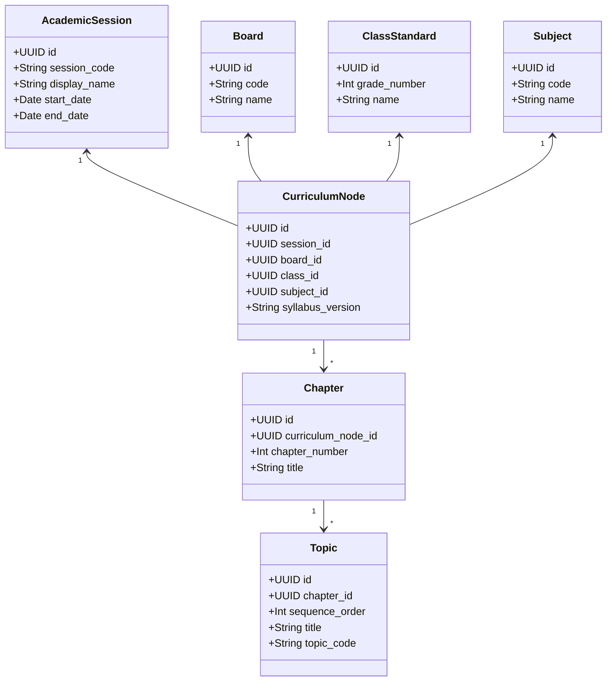
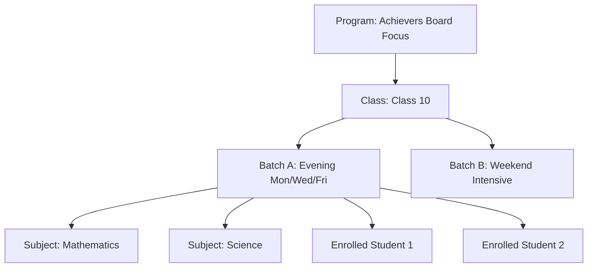
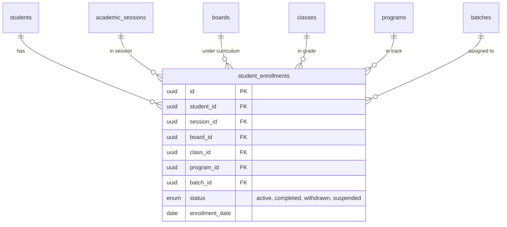
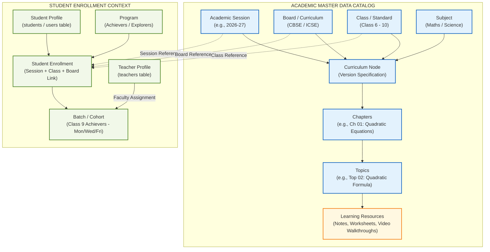
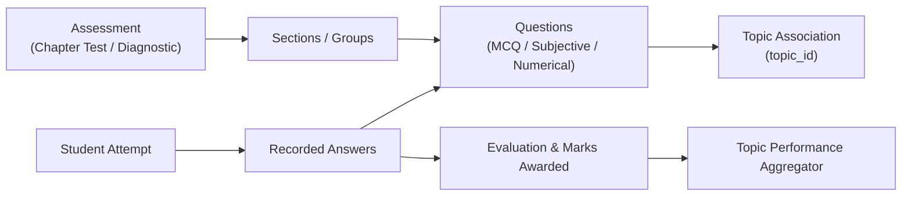
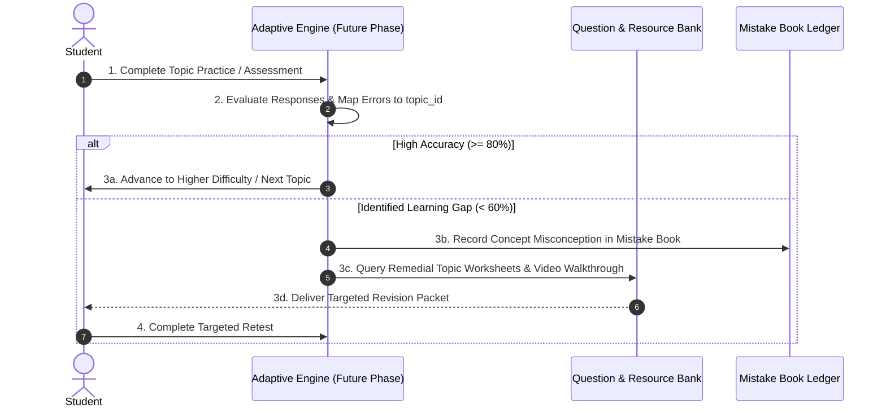

# MS Tutorials — Academic Structure & Learning Resource Architecture Blueprint (Phase 5.6)

> **Governing Specifications**: `docs/project-roadmap.md`, `docs/database.md` (Phase 5.1), `docs/api-architecture.md` (Phase 5.4)  
> **Status**: Architectural Specification & Domain Blueprint (Phase 5.6)  
> **Scope**: Specification ONLY. Zero application code, database tables, migrations, or UI components are implemented in this phase.

---

## 1. Purpose & Domain Principles

### 1.1 Purpose
This blueprint defines the formal academic domain architecture for the MS Tutorials platform. It establishes the master data models, hierarchical taxonomies, curriculum versioning mechanisms, student enrollment constructs, and learning resource associations required to support:
- Central Board of Secondary Education (**CBSE**) and Indian Certificate of Secondary Education (**ICSE**) curricula.
- **Classes 6 through 10** across core focus subjects (**Mathematics** and **Science**).
- Advanced learning tracks (**Explorers**, **Achievers**, **Foundation**, and **Remedial**).
- Multi-session continuity across successive academic calendar years.
- Downstream readiness for assessment engines, mistake logs, topic-level performance metrics, and adaptive learning loops.

### 1.2 Core Domain Separation: Master Data vs. Student Context vs. Activity Layer

A fundamental architectural failure in legacy learning management systems is the conflation of *curriculum content* with *student interaction*. MS Tutorials strictly partitions the domain into three decoupled layers:

1. **Academic Master Data (Centrally Managed Catalog)**:
   - Describes the syllabus, taxonomies, and pedagogical content independently of any student or teacher.
   - An equation topic (e.g., *"Quadratic Equations — Quadratic Formula"*) exists as an immutable curriculum node regardless of whether 0 or 500 students are currently enrolled.
2. **Student Enrollment Context (Relational Junction)**:
   - Associates an independent student identity with an academic session, a curriculum/board, a class level, and an operational teaching batch.
3. **Student Activity & Performance Layer (Downstream Transactions)**:
   - Captures transactional events (test submissions, attendance, homework, question attempts, revision triggers).
   - This layer is strictly planned for subsequent phases and is **not** implemented in Phase 5.6.

---

## 2. Academic Session Architecture

### 2.1 Domain Definition
An **Academic Session** defines the institutional calendar year during which educational instruction, cohort operations, and assessments take place (e.g., `2026–2027`, `2027–2028`).

### 2.2 Entity Characteristics
- **Unique Identifier**: UUIDv4 or structured code (e.g., `sess_2026_27`).
- **Display Name**: Human-readable label (e.g., `"Academic Year 2026–2027"`).
- **Session Code**: Canonical string (e.g., `"2026-27"`).
- **Date Boundaries**: `start_date` (e.g., `2026-04-01`) and `end_date` (e.g., `2027-03-31`).
- **Lifecycle Status**: Enum:
  - `upcoming`: Pre-admission and curriculum planning phase.
  - `active`: Current running academic instructional year (only one session is typically active).
  - `completed`: Archived historical session (read-only for historical report cards and ledgers).

### 2.3 Separation from Student Identity
A student exists as a persistent user identity in the `users` and `students` tables. A student does **not** belong to an academic session directly:
- A student enrolled in Class 9 during the `2026–27` session advances to Class 10 during the `2027–28` session.
- Storing session data directly on the `students` table would destroy historical continuity and prevent multi-year progress tracking.
- Session linkage is managed exclusively via the **Enrollment** entity.

---

## 3. Curriculum & Board Architecture

### 3.1 Domain Definition
A **Curriculum / Board** entity represents the governing educational authority and standard that prescribes the syllabus and examination structure.

### 3.2 Current Scope & Future Extensibility
- **Current Core Boards**:
  - `CBSE`: Central Board of Secondary Education.
  - `ICSE`: Indian Certificate of Secondary Education.
- **Extensibility Standard**:
  - The design rejects hardcoded board enums in application routing or database primary keys.
  - Future curricula (e.g., `State_Board_MH`, `Cambridge_IGCSE`, `IB_MYP`, `Foundation_Olympiad`) can be provisioned as master data rows without requiring schema migrations or code refactoring.

### 3.3 Separation from Academic Sessions
A Board (e.g., `CBSE`) is an enduring institution. However, syllabus guidelines evolve over time. The architecture models curriculum revisions by linking curriculum definitions to specific academic sessions, enabling side-by-side management of legacy and revised syllabi.

---

## 4. Class / Grade Architecture

### 4.1 Domain Definition
A **Class / Grade** represents the formal academic standard or level of schooling.

### 4.2 Standard Coverage
- **Standard Classes**: `Class 6`, `Class 7`, `Class 8`, `Class 9`, `Class 10`.
- **Entity Properties**:
  - `id`: System identifier.
  - `grade_number`: Numeric standard integer (`6`, `7`, `8`, `9`, `10`) for deterministic ordering and level comparisons.
  - `display_name`: Formatted label (e.g., `"Class 9"`, `"Grade 10"`).
  - `stage`: Academic stage classification (e.g., `middle_school` for 6–8; `secondary` for 9–10).

### 4.3 Elimination of Hardcoded Grade Logic
Application business logic must never contain conditional branching such as `if (grade === 9)`. Instead:
- Features, subjects, and resource availability are driven by relational metadata associated with the class record.
- Advancing a student from Class 9 to Class 10 is an administrative enrollment transition, not a code change.

---

## 5. Subject Architecture

### 5.1 Domain Definition
A **Subject** represents a major academic discipline taught within a class standard.

### 5.2 Core Initial Disciplines & Science Modeling
1. **Mathematics**:
   - Number Systems, Algebra, Geometry, Coordinate Geometry, Mensuration, Statistics, Probability, Trigonometry (Class 10).
2. **Science & Disciplinary Components**:
   - Science may be represented as a single subject or as curriculum-specific subject components depending on the applicable board/curriculum. The exact modeling decision will be made when the academic schema is implemented.
   - For example, CBSE typically treats Science as a unified subject incorporating Physics, Chemistry, and Biology modules, whereas ICSE and advanced Foundation curricula often administer them as distinct subject streams. The domain architecture supports both patterns flexibly without prematurely committing to a single schema structure.

### 5.3 Domain Invariants
- Subjects exist as independent academic master entities.
- A subject is **never** tied to a single student.
- Subject entities maintain a display name, canonical subject code (e.g., `MATH_09_CBSE`), and icon/color theme metadata for frontend presentation.

---

## 6. Chapter Architecture

### 6.1 Domain Definition
A **Chapter** represents a coherent pedagogical unit of study within a subject for a specific curriculum and class.

### 6.2 Context-Dependent Structure & Ordering
- Chapters are **not globally unique strings**. For example, the title *"Linear Equations"* exists in Class 8, Class 9, and Class 10, across both CBSE and ICSE, but with radically different scope and depths.
- A chapter belongs strictly to an academic context:
  $$\text{Chapter} \in (\text{Session}, \text{Board}, \text{Class}, \text{Subject})$$
- **Explicit Ordering**: Every chapter holds a `chapter_number` or `sequence_index` (integer $\ge 1$) to preserve the institutional pedagogical sequence.

---

## 7. Topic Architecture (The Atomic Concept Unit)

### 7.1 Domain Definition
A **Topic** is the atomic granular learning concept within a chapter. It represents the lowest addressable unit of curriculum mastery.

### 7.2 Hierarchy and Properties
$$\text{Subject} \longrightarrow \text{Chapter} \longrightarrow \text{Topic}$$

Every Topic entity maintains:
- `id`: Unique topic identifier (UUIDv4).
- `chapter_id`: Parent chapter foreign key.
- `topic_code`: Structured code (e.g., `CBSE-09-MATH-CH02-TOP03`).
- `title`: Concept name (e.g., `"Factor Theorem and Algebraic Factorization"`).
- `description`: Core learning outcomes and key formulas introduced.
- `sequence_order`: Ordering within the parent chapter.
- `status`: `active` or `inactive` (allows disabling deprecated syllabus segments without orphan issues).

### 7.3 Architectural Significance
The Topic is the foundational pivot of the entire MS Tutorials learning ecosystem:
1. **Learning Resources** are attached directly to topics.
2. **Question Bank items** are tagged down to the topic level.
3. **Mistake Log entries** identify the exact topic where a misconception occurred.
4. **Adaptive Practice Sets** generate drills focused on specific topic learning gaps.

---

## 8. Multi-Curriculum Mapping Standard

### 8.1 The Cross-Board Syllabus Challenge
A common architectural pitfall is assuming *"Maths Class 9"* is universal. In reality:
- **CBSE Class 9 Maths** covers *Polynomials, Coordinate Geometry, Linear Equations in Two Variables, Triangles, Quadrilaterals, Circles, Heron's Formula, Surface Areas & Volumes, Statistics*.
- **ICSE Class 9 Maths** covers *Pure Arithmetic, Compound Interest, Expansions, Factorisation, Simultaneous Equations, Indices, Logarithms, Triangles, Mid-Point Theorem, Pythagoras, Rectilinear Figures, Coordinate Geometry, Area & Perimeter, Statistics*.

### 8.2 Conceptual Domain Entity: CurriculumNode & The Curriculum Version Map (CVM)
**CurriculumNode represents the session-specific curriculum context formed by Academic Session + Board/Curriculum + Class + Subject. It provides the academic context under which chapters and topics are organized.**

> ⚠️ **CONCEPTUAL ENTITY NOTICE**: `CurriculumNode` is a conceptual domain entity defined for domain modeling and architectural specification. It does NOT represent an implemented database table in Phase 5.6. The physical database normalization and schema implementation remain scheduled for future database phases.

To support diverse syllabi without redundant schema duplication, the conceptual model connects academic master entities as follows:

This model guarantees:
1. Chapters and topics belong to a specific `CurriculumNode`.
2. Master subjects (e.g., Mathematics) and Class standards (e.g., Class 9) remain reusable shared master entities.
3. Board differences and yearly syllabus alterations (e.g., rationalized content) are isolated to specific versions without corrupting historical student records.

---

## 9. Educational Programs vs. Classes vs. Batches

To maintain clear operational and pedagogical boundaries, the platform distinguishes between **Program**, **Class**, **Batch**, and **Subject**:

| Dimension | Definition | Institutional Example |
|:---|:---|:---|
| **Program** | Pedagogical approach, academic rigor track, or specialized curriculum stream. | **Explorers** (Foundation 6–8), **Achievers** (Board Excellence 9–10), **Foundation Olympiad**, **Remedial Maths**. |
| **Class / Grade** | Formal academic schooling standard. | **Class 8**, **Class 9**, **Class 10**. |
| **Subject** | Specific area of study. | **Mathematics**, **Science** (unified or partitioned by board). |
| **Batch** | The operational teaching cohort grouped by time, center location, and faculty assignment. | **Class 9 Achievers — Mon/Wed/Fri (5:30 PM - 7:00 PM)**. |

---

## 10. Student Enrollment Architecture

### 10.1 Domain Definition
An **Enrollment** is the transactional record that binds an individual student to an institutional offering for a specific academic session.

### 10.2 Relational Model

### 10.3 Multi-Session Progression Example
A student's academic journey unfolds across distinct enrollment records:
- **Record 1**: `Student ID: usr_991`, `Session: 2026-27`, `Board: ICSE`, `Class: 9`, `Program: Achievers`, `Batch: Batch_ICSE_9A`.
- **Record 2**: `Student ID: usr_991`, `Session: 2027-28`, `Board: ICSE`, `Class: 10`, `Program: Achievers`, `Batch: Batch_ICSE_10A`.

The primary student identity (`students.id`) remains persistent, while all academic, attendance, and fee ledgers link to the student and session context.

---

## 11. Learning Resources Architecture

### 11.1 Domain Definition
A **Learning Resource** represents an instructional asset authored, curated, or hosted by MS Tutorials to support concept mastery, revision, or self-study.

### 11.2 Resource Taxonomies & Categories
Learning resources are categorized into standardized pedagogical types:
1. **Study Material / Theory Notes**: Structured explanations, definitions, and key formulas.
2. **Worksheets**: Practice problem sheets with varying difficulty levels.
3. **Important / Board Questions**: Curated previous years' questions (PYQ) and high-yield problems.
4. **Explanation Videos**: Pre-recorded lectures, concept walkthroughs, or problem-solving breakdowns.
5. **Revision Flashcards / Summaries**: One-page concept maps and quick-revision summaries.
6. **Question Banks**: Structured repositories of questions with verified answer keys.
7. **Reference Solutions / Exemplars**: Step-by-step model solutions.

### 11.3 Extensible Resource Types
Rather than hardcoding document formats across the database, resources are classified by standard technical types:
- `document` (PDF documents, guides, worksheets)
- `video` (Curated or hosted streaming video links)
- `question_bank` (Structured JSON questions)
- `interactive` (Simulations, quizzes, interactive formula sheets)
- `link` (External authorized academic reference URLs)

### 11.4 Hierarchical Attachment Rule
Resources can be attached to the academic tree at different levels of granularity:
- **Topic Level (Primary)**: 85%+ of practice sheets and concept notes attach directly to a specific `topic_id`.
- **Chapter Level**: Overall chapter summary notes or full-chapter diagnostic mock papers attach to `chapter_id`.
- **Subject Level**: Comprehensive formula booklets or syllabus overviews attach to `subject_id`.

---

## 12. Canonical Academic Hierarchy Diagram

The following comprehensive diagram illustrates the complete relational topology connecting Master Data, Student Context, and Learning Resources:

---

## 13. Data Ownership & Governance Model

The platform enforces strict administrative governance over academic master data:

| Entity Domain | Primary Owner | Manage / Mutate Permissions | Read Permissions | Invariants & Constraints |
|:---|:---|:---|:---|:---|
| **Academic Master Data** (Sessions, Boards, Classes, Subjects, Chapters, Topics) | Central Academic Administration | `admin` (Curriculum Coordinator) | `admin`, `teacher`, `student`, `parent` | Immutable during an active session once instructional activity commences. |
| **Learning Resources** | Faculty & Academic Staff | `admin`, authorized `teacher` | Enrolled `student`, linked `parent`, `teacher`, `admin` | Resources must be verified and published (`is_published = true`) before student visibility. |
| **Student Enrollment** | Institutional Registrar | `admin` | `student` (self), `parent` (linked child), assigned `teacher`, `admin` | Exactly one active enrollment per student per academic session. |
| **Batches & Cohorts** | Center Operations | `admin`, `teacher` (assigned view) | Enrolled students & parents | Batches belong to a single class, program, and session. |

---

## 14. Future Performance Model (Conceptual)

> ⚠️ **NOTICE**: The performance metrics detailed below are conceptual architectural specifications for future phases. **No performance tables or calculation engines are implemented in Phase 5.6.**

When assessment and test submission tables are created in subsequent phases, student performance will be evaluated deterministically using topic-level metrics:

$$\text{Topic Mastery Score} = \frac{\sum \text{Correct Attempts in Topic}}{\sum \text{Total Evaluated Question Attempts in Topic}} \times 100$$

### Conceptual Performance States:
1. **Mastery Thresholds**:
   - `Strong / Mastered`: Accuracy $\ge 80\%$ across $\ge 15$ attempts.
   - `Adequate / Developing`: Accuracy between $60\%$ and $79\%$.
   - `Weak / Learning Gap`: Accuracy $< 60\%$ or recurring fundamental errors.
2. **Pedagogical Gap Classification**:
   - *Calculation Error*: Arithmetic slip despite correct formula application.
   - *Conceptual Gap*: Incorrect rule, formula mismatch, or theorem misapplication.
   - *Comprehension Gap*: Misunderstanding word problem constraints.
3. **Learning Loop Integration**:
   - A detected topic gap immediately tags the student's profile to surface matching **Worksheets** and **Theory Notes** from that topic's learning resources.

---

## 15. Future Assessment Model (Conceptual)

> ⚠️ **NOTICE**: The assessment model below is an architectural blueprint. **No test tables, question schemas, or evaluation logic are implemented in Phase 5.6.**

### Key Assessment Principles:
- Every question in the question bank is tagged with a mandatory `topic_id`.
- Tests can be diagnostic (pre-instruction), formative (chapter milestones), or summative (full mock examinations).
- Automatic scoring calculates both aggregate test marks and granular topic-by-topic diagnostic breakdowns.

---

## 16. Future Adaptive Learning Architecture (Conceptual)

MS Tutorials' pedagogy is anchored in the established **6-Step Learning Cycle**:
$$\text{Diagnose} \longrightarrow \text{Understand} \longrightarrow \text{Practice} \longrightarrow \text{Assess} \longrightarrow \text{Identify Gaps} \longrightarrow \text{Improve \& Revise}$$

*(Note: Concept mastery is the ultimate learning and performance outcome achieved through iterative cycles, rather than a separate discrete step within the official operational cycle).*

### Architectural Safeguards:
- The system uses deterministic, rule-based mastery thresholds rather than unpredictable black-box algorithms.
- Teachers maintain full override authority over any adaptive recommendation.
- Zero external "AI claims" or unverified automated systems are deployed.

---

## 17. Database Design Principles for Academic Domain

When academic tables are created in subsequent phases, they will adhere to these structural standards:

1. **Strict 3NF Normalization**:
   - Master taxonomies (Sessions, Boards, Classes, Subjects) are independent records.
   - No denormalized duplicate curriculum trees.
2. **Explicit Foreign Key Referential Integrity**:
   - Cascading deletes are strictly restricted on master catalog data (`ON DELETE RESTRICT`) to prevent accidental destruction of student history.
   - Deletion of an academic session or subject with existing enrollments is forbidden.
3. **Positional Ordering Columns**:
   - Chapters and topics maintain explicit integer sequence indexes (`chapter_number`, `sequence_order`) with unique composite constraints (e.g., `UNIQUE(chapter_id, sequence_order)`).
4. **Auditability**:
   - Every academic table will carry `created_at` and `updated_at` timestamps.
5. **Soft Deactivation (`is_active` / `status`)**:
   - Outdated curriculum nodes or deprecated topics are marked `is_active = false` rather than deleted, preserving integrity for historical graduation records.

---

## 18. Future Conceptual API Specifications

> ⚠️ **NOTICE**: The endpoints detailed below are conceptual architectural designs representing future phase specifications. **None of these routes are implemented in Phase 5.6.**

### 18.1 Master Data Catalog Endpoints (`/api/v1/academic/*`) — [FUTURE]
- `GET /api/v1/academic/sessions` — List all academic sessions (filterable by `status=active`).
- `GET /api/v1/academic/curricula` — List supported boards/curricula (CBSE, ICSE).
- `GET /api/v1/academic/classes` — List class standards (Classes 6 through 10).
- `GET /api/v1/academic/subjects` — List subjects offered for a specified class and board.
- `GET /api/v1/academic/chapters` — List ordered chapters for a subject curriculum node.
- `GET /api/v1/academic/topics` — List granular topics under a specified chapter.

### 18.2 Learning Resource Endpoints (`/api/v1/resources/*`) — [FUTURE]
- `GET /api/v1/resources` — Paginated resource catalog filterable by `topicId`, `chapterId`, `subjectId`, `resourceType`.
- `GET /api/v1/resources/:resourceId` — Detailed resource view and download metadata.
- `POST /api/v1/resources` — Faculty upload and publishing of educational worksheets/notes (`teacher`, `admin` only).

### 18.3 Enrollment & Batch Endpoints (`/api/v1/enrollment/*`) — [FUTURE]
- `GET /api/v1/student/enrollments` — View authenticated student's active and historical enrollments.
- `GET /api/v1/teacher/batches/:batchId/syllabus` — View syllabus completion progress for assigned batch.

---

## 19. Authorization & Access Principles

Future access control over academic resources will integrate directly with the Phase 5.3 RBAC Gateway:

1. **Student Access**:
   - Students may view learning resources and syllabus trees **only** for classes and boards in which they hold an active enrollment in the current academic session.
   - Students cannot access teacher-only answer keys, draft tests, or administrative curriculum configurations.
2. **Parent Access**:
   - Parents hold read-only visibility into the curriculum progress, assigned materials, and syllabus outlines relevant to their verified linked children.
3. **Teacher Access**:
   - Teachers may browse the universal academic catalog and upload/manage learning resources for subjects and batches assigned to them.
4. **Admin Access**:
   - Administrators possess comprehensive authority to define academic sessions, provision boards/classes, adjust curriculum mappings, and oversee resource publication.

---

## 20. Database Boundary with Phase 5.1 Identity Foundation

The current database architecture comprises seven strictly identity-focused tables locked in Phase 5.1 (`405d383`):
1. `users` (central authentication credentials and lifecycle state)
2. `students` (student profile extension & admission numbers)
3. `parents` (parent profile extension & parent codes)
4. `teachers` (faculty profile extension & faculty codes)
5. `admins` (administrative profile extension & access levels)
6. `parent_student` (relational junction for guardians and children)
7. `refresh_tokens` (SHA-256 session token store)

### The Structural Separation Invariant
- **Zero Schema Mutations**: Phase 5.6 makes **zero changes** to these 7 tables.
- **Independent Evolution**: When future academic tables (`academic_sessions`, `boards`, `classes`, `subjects`, `chapters`, `topics`, `resources`, `student_enrollments`, `batches`) are introduced, they will connect to `students.id` and `teachers.id` via foreign keys without adding academic columns to the core identity tables.

---

## 21. Implementation Boundaries & Project Phases

| Phase | Description | Scope & Status |
|:---|:---|:---|
| **Phase 4** | Public Website V1 | Locked (`f99cbf5`) |
| **Phase 5.0** | Authentication Architecture Blueprint | Locked (`3d817bf`) |
| **Phase 5.1** | Database Identity Foundation | Locked (`405d383`) |
| **Phase 5.2** | Backend Authentication Core | Locked (`7cd2293`) |
| **Phase 5.3** | Authentication + RBAC Gateway | Locked (`aa159dc`) |
| **Phase 5.4** | API Architecture Blueprint | Locked (`c3c2f07`) |
| **Phase 5.5** | Protected Identity / Profile API | Locked (`deea551`) |
| **Phase 5.6** | **Academic Structure & Learning Resource Blueprint** | **CURRENT — Architectural Specification ONLY** |
| **Phase 6.0+**| Academic Database Schema & Migrations | Future Phase: `academic_sessions`, `curriculum`, `chapters`, `topics`, `resources` |
| **Phase 7.0+**| Learning Resource APIs & Portals | Future Phase: Resource download, student curriculum viewer, batch rosters |
| **Phase 8.0+**| Assessment & Question Bank Engine | Future Phase: Topic-tagged questions, online tests, evaluation |
| **Phase 9.0+**| Performance Analytics & Adaptive Loops | Future Phase: Mistake Book, diagnostic reports, revision loops |

### Strict Phase 5.6 Commitments:
- ✅ Strictly documentation only (`docs/academic-architecture.md`).
- ❌ No application code files created or modified.
- ❌ No database tables, migrations, or schemas altered.
- ❌ No packages installed or dependencies changed.
- ❌ No public website assets modified.
- ❌ No automatic Git commits.
