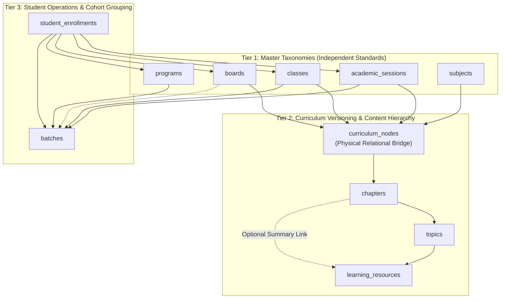
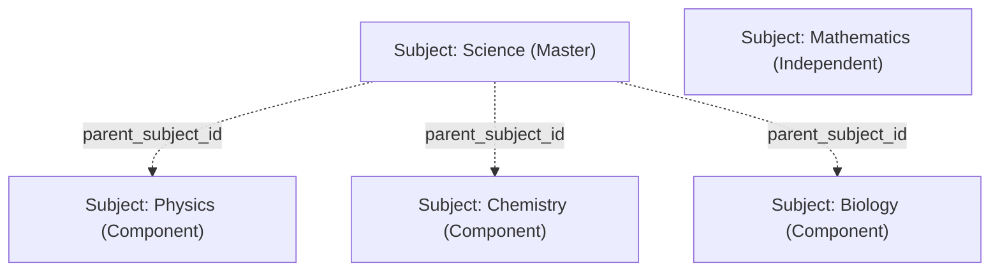
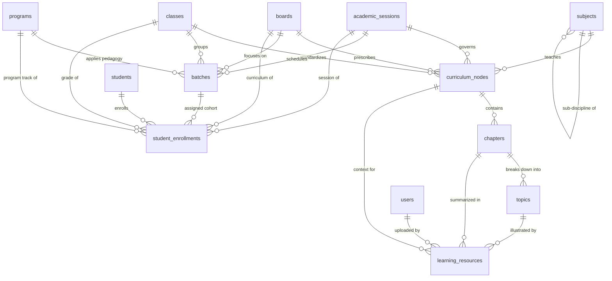

# MS Tutorials — Academic Database Schema Design (Phase 5.7)

> **Governing Specifications**: `docs/academic-architecture.md` (Phase 5.6), `docs/database.md` (Phase 5.1), `docs/api-architecture.md` (Phase 5.4)  
> **Status**: Architectural Specification & Proposed Relational Schema Design (Phase 5.7)  
> **Scope**: Specification ONLY. No database tables, migrations, backend code, or frontend components are created in this phase.

---

## 1. Purpose

This document translates the approved Phase 5.6 Academic Architecture Blueprint into a concrete, normalized relational database design for the MS Tutorials platform. It defines the tables, columns, data types, primary keys, foreign key constraints, unique indexes, and referential integrity rules necessary to support:

1. **Academic Sessions**: Multi-year session continuity (`2026–27`, `2027–28`).
2. **Curricula & Boards**: Independent governance bodies (`CBSE`, `ICSE`, and future curricula).
3. **Class Standards**: Grades 6 through 10 with integer-driven ordering.
4. **Subjects & Disciplinary Components**: Flexible modeling where Science may exist as a unified subject or may have curriculum-specific component subjects such as Physics, Chemistry and Biology.
5. **Curriculum-Specific Contexts (`CurriculumNode`)**: Relational representation of the session-specific curriculum context formed by Academic Session + Board/Curriculum + Class + Subject under which chapters and topics are organized.
6. **Chapters & Topics**: Sequenced, version-aware chapters and atomic learning topics.
7. **Educational Programs**: Reusable tracks (**Explorers**, **Achievers**, **Foundation**, **Remedial**).
8. **Operational Batches**: Physical/virtual cohorts with nullable board scope (supporting combined foundation or board-specific batches) strictly subordinate to student enrollment context.
9. **Student Enrollments**: Clean separation between persistent student identity and annual academic progression.
10. **Learning Resources**: 3-tier hierarchical assets (Subject → Chapter → Topic) with strict contextual integrity.

---

## 2. Design Principles

1. **Strict Third Normal Form (3NF)**: Eliminates data redundancy and update anomalies across curriculum trees and enrollment records.
2. **Immutability of Historical Academic Data**: Cascading deletes are strictly restricted (`ON DELETE RESTRICT`) on academic master records to safeguard student transcripts, historic marks, and fee ledgers.
3. **Identity vs. Academic Separation**: No student identity tables contain academic session, class, or batch pointers. Student progress is captured purely through transactional enrollment records.
4. **Context-Preserving Hierarchies**: Chapters and topics are never global unattached strings; they are strictly bound to their governing curriculum context.
5. **Explicit Sequencing & Unique Constraints**: Chapters and topics enforce explicit composite unique indexes on `(parent_id, sequence_order)` to preserve pedagogical flow.
6. **Soft Deactivation (`status` / `is_active`)**: Deprecated syllabi, completed sessions, and inactive batches are deactivated rather than deleted.
7. **Audit Consistency**: Every table includes `created_at TIMESTAMP DEFAULT CURRENT_TIMESTAMP` and `updated_at TIMESTAMP DEFAULT CURRENT_TIMESTAMP ON UPDATE CURRENT_TIMESTAMP`.

---

## 3. Existing Identity Boundary (Phase 5.1 Foundation)

The platform's identity foundation was locked in Phase 5.1 (`405d383`) and remains **100% untouched**:

| Identity Table | Purpose in Phase 5.1 | Phase 5.7 Interaction Boundary |
|:---|:---|:---|
| **`users`** | Central authentication identity, credentials, roles, lockout state | Referenced as foreign key (`uploaded_by`) in `learning_resources`. Zero schema mutations. |
| **`students`** | Student profile extension, canonical admission number (`AS26090`) | Referenced as foreign key (`student_id`) in `student_enrollments`. Zero schema mutations. |
| **`parents`** | Parent profile extension, parent code (`PR26090`) | Linked to students via `parent_student`. Zero schema mutations. |
| **`teachers`** | Faculty profile extension, faculty code (`TR2604`) | Referenced in future batch faculty assignment. Zero schema mutations. |
| **`admins`** | Administrative profile extension, access levels (`superadmin`, `staff`) | Administrative audit authority. Zero schema mutations. |
| **`parent_student`**| Relational junction supporting multi-child families | Read by authorization gateway. Zero schema mutations. |
| **`refresh_tokens`**| SHA-256 session token store | Authentication only. Zero schema mutations. |

---

## 4. Academic Entity Overview

The proposed academic domain introduces 11 normalized relational entities grouped into three functional tiers:



---

## 5. Proposed Relational Model

### Entity Summary Matrix

| Proposed Table | Category | Primary Key | Foreign Keys | Key Unique Constraints |
|:---|:---|:---:|:---|:---|
| `academic_sessions` | Master Taxonomy | UUID | None | `uq_session_code` |
| `boards` | Master Taxonomy | UUID | None | `uq_board_code` |
| `classes` | Master Taxonomy | UUID | None | `uq_grade_number`, `uq_class_code` |
| `programs` | Master Taxonomy | UUID | None | `uq_program_code` |
| `subjects` | Master Taxonomy | UUID | `parent_subject_id` (Self-FK, nullable) | `uq_subject_code` |
| `curriculum_nodes` | Curriculum Bridge | UUID | `session_id`, `board_id`, `class_id`, `subject_id` | `uq_curriculum_node_context` |
| `chapters` | Academic Content | UUID | `curriculum_node_id` | `uq_chapter_sequence` |
| `topics` | Academic Content | UUID | `chapter_id` | `uq_topics_chapter_sequence`, `uq_topics_chapter_code` |
| `batches` | Operational Cohort | UUID | `session_id`, `class_id`, `program_id`, `board_id` | `uq_batches_session_code`, `uq_batches_context` |
| `student_enrollments` | Transactional Context | UUID | `student_id`, `session_id`, `board_id`, `class_id`, `program_id`, `batch_id` (context-validated) | `uq_student_session_class` |
| `learning_resources` | Educational Assets | UUID | `curriculum_node_id`, `chapter_id`, `topic_id`, `uploaded_by` | None (indexed on topic/type) |

---

## 6. Entity-by-Entity Specification

### 6.1 `academic_sessions`
- **Purpose**: Defines institutional school calendar boundaries and controls active enrolment sessions.
- **Reason for Existence**: Decouples student lifetime identity from annual academic progression.
- **Columns**:
  - `id`: `VARCHAR(36) NOT NULL` (UUIDv4)
  - `session_code`: `VARCHAR(20) NOT NULL` (e.g., `'2026-27'`)
  - `display_name`: `VARCHAR(100) NOT NULL` (e.g., `'Academic Year 2026–2027'`)
  - `start_date`: `DATE NOT NULL` (e.g., `2026-04-01`)
  - `end_date`: `DATE NOT NULL` (e.g., `2027-03-31`)
  - `status`: `ENUM('upcoming', 'active', 'completed') NOT NULL DEFAULT 'upcoming'`
  - `created_at`, `updated_at`: `TIMESTAMP NOT NULL`
- **Primary Key**: `PRIMARY KEY (id)`
- **Foreign Keys**: None
- **Unique Constraints**: `UNIQUE KEY uq_academic_sessions_code (session_code)`
- **Indexes**: `INDEX idx_academic_sessions_status (status)`

### 6.2 `boards`
- **Purpose**: Represents educational boards prescribing curricula and examinations.
- **Reason for Existence**: Avoids hardcoded board logic, allowing future additions (e.g., State Boards, Cambridge) without schema refactoring.
- **Columns**:
  - `id`: `VARCHAR(36) NOT NULL` (UUIDv4)
  - `code`: `VARCHAR(20) NOT NULL` (e.g., `'CBSE'`, `'ICSE'`)
  - `name`: `VARCHAR(150) NOT NULL` (e.g., `'Central Board of Secondary Education'`)
  - `description`: `TEXT NULL`
  - `status`: `ENUM('active', 'inactive') NOT NULL DEFAULT 'active'`
  - `created_at`, `updated_at`: `TIMESTAMP NOT NULL`
- **Primary Key**: `PRIMARY KEY (id)`
- **Foreign Keys**: None
- **Unique Constraints**: `UNIQUE KEY uq_boards_code (code)`
- **Indexes**: `INDEX idx_boards_status (status)`

### 6.3 `classes`
- **Purpose**: Defines academic grades/standards.
- **Reason for Existence**: Provides integer-driven grade comparison and ordering without hardcoded string logic.
- **Columns**:
  - `id`: `VARCHAR(36) NOT NULL` (UUIDv4)
  - `grade_number`: `TINYINT UNSIGNED NOT NULL` (e.g., `6`, `7`, `8`, `9`, `10`)
  - `code`: `VARCHAR(20) NOT NULL` (e.g., `'CLASS_09'`)
  - `display_name`: `VARCHAR(50) NOT NULL` (e.g., `'Class 9'`)
  - `stage`: `ENUM('middle_school', 'secondary') NOT NULL DEFAULT 'secondary'`
  - `status`: `ENUM('active', 'inactive') NOT NULL DEFAULT 'active'`
  - `created_at`, `updated_at`: `TIMESTAMP NOT NULL`
- **Primary Key**: `PRIMARY KEY (id)`
- **Foreign Keys**: None
- **Unique Constraints**: `UNIQUE KEY uq_classes_grade_number (grade_number)`, `UNIQUE KEY uq_classes_code (code)`
- **Indexes**: `INDEX idx_classes_stage (stage)`

### 6.4 `programs`
- **Purpose**: Defines pedagogical tracks and academic rigor programs.
- **Reason for Existence**: Reusable educational tracks (**Explorers**, **Achievers**, **Foundation**, **Remedial**) without duplicating track definitions across batches or students.
- **Columns**:
  - `id`: `VARCHAR(36) NOT NULL` (UUIDv4)
  - `code`: `VARCHAR(30) NOT NULL` (e.g., `'achievers'`, `'explorers'`, `'foundation'`, `'remedial'`)
  - `name`: `VARCHAR(100) NOT NULL` (e.g., `'Achievers Board Excellence'`)
  - `description`: `TEXT NULL`
  - `target_stage`: `ENUM('middle_school', 'secondary', 'all') NOT NULL DEFAULT 'secondary'`
  - `status`: `ENUM('active', 'inactive') NOT NULL DEFAULT 'active'`
  - `created_at`, `updated_at`: `TIMESTAMP NOT NULL`
- **Primary Key**: `PRIMARY KEY (id)`
- **Foreign Keys**: None
- **Unique Constraints**: `UNIQUE KEY uq_programs_code (code)`
- **Indexes**: `INDEX idx_programs_status (status)`

### 6.5 `subjects`
- **Purpose**: Master catalog of academic disciplines. Science may exist as a unified subject or may have curriculum-specific component subjects such as Physics, Chemistry and Biology.
- **Reason for Existence**: Centralizes subject metadata and provides self-referential support for sub-disciplinary components (Science $\rightarrow$ Physics/Chemistry/Biology) without implying that every curriculum requires component subjects.
- **Columns**:
  - `id`: `VARCHAR(36) NOT NULL` (UUIDv4)
  - `code`: `VARCHAR(30) NOT NULL` (e.g., `'MATH'`, `'SCIENCE'`, `'PHYSICS'`, `'CHEMISTRY'`, `'BIOLOGY'`)
  - `name`: `VARCHAR(100) NOT NULL` (e.g., `'Mathematics'`, `'Science'`)
  - `parent_subject_id`: `VARCHAR(36) NULL` (Self-referencing FK for sub-disciplines)
  - `color_code`: `VARCHAR(10) NULL` (Hex color for UI theme, e.g., `'#0066CC'`)
  - `status`: `ENUM('active', 'inactive') NOT NULL DEFAULT 'active'`
  - `created_at`, `updated_at`: `TIMESTAMP NOT NULL`
- **Primary Key**: `PRIMARY KEY (id)`
- **Foreign Keys**: 
  - `CONSTRAINT fk_subjects_parent FOREIGN KEY (parent_subject_id) REFERENCES subjects (id) ON DELETE SET NULL ON UPDATE CASCADE`
- **Unique Constraints**: `UNIQUE KEY uq_subjects_code (code)`
- **Indexes**: `INDEX idx_subjects_parent (parent_subject_id)`, `INDEX idx_subjects_status (status)`

### 6.6 `curriculum_nodes` (Concrete Relational Representation of CurriculumNode)
- **Approved Definition**: *"CurriculumNode represents the session-specific curriculum context formed by Academic Session + Board/Curriculum + Class + Subject. It provides the academic context under which chapters and topics are organized."*
- **Purpose**: Physical relational bridge binding **Academic Session + Board + Class + Subject + Version**. Phase 5.7 proposes representing this domain concept as a physical relational table named `curriculum_nodes`.
- **Reason for Existence**: Eliminates redundant composite foreign keys across chapters and resources, while providing version-controlled syllabus management for annual NCERT/ICSE rationalization.
- **Columns**:
  - `id`: `VARCHAR(36) NOT NULL` (UUIDv4)
  - `session_id`: `VARCHAR(36) NOT NULL` (FK -> `academic_sessions.id`)
  - `board_id`: `VARCHAR(36) NOT NULL` (FK -> `boards.id`)
  - `class_id`: `VARCHAR(36) NOT NULL` (FK -> `classes.id`)
  - `subject_id`: `VARCHAR(36) NOT NULL` (FK -> `subjects.id`)
  - `syllabus_version`: `VARCHAR(20) NOT NULL DEFAULT 'v1.0'` (e.g., `'2026.1'`)
  - `is_active`: `BOOLEAN NOT NULL DEFAULT TRUE`
  - `created_at`, `updated_at`: `TIMESTAMP NOT NULL`
- **Primary Key**: `PRIMARY KEY (id)`
- **Foreign Keys**:
  - `CONSTRAINT fk_cn_session FOREIGN KEY (session_id) REFERENCES academic_sessions (id) ON DELETE RESTRICT ON UPDATE CASCADE`
  - `CONSTRAINT fk_cn_board FOREIGN KEY (board_id) REFERENCES boards (id) ON DELETE RESTRICT ON UPDATE CASCADE`
  - `CONSTRAINT fk_cn_class FOREIGN KEY (class_id) REFERENCES classes (id) ON DELETE RESTRICT ON UPDATE CASCADE`
  - `CONSTRAINT fk_cn_subject FOREIGN KEY (subject_id) REFERENCES subjects (id) ON DELETE RESTRICT ON UPDATE CASCADE`
- **Unique Constraints**:
  - `UNIQUE KEY uq_curriculum_node_context (session_id, board_id, class_id, subject_id, syllabus_version)`
- **Indexes**:
  - `INDEX idx_cn_lookup (board_id, class_id, subject_id)`
  - `INDEX idx_cn_session (session_id)`

### 6.7 `chapters`
- **Purpose**: Pedagogical unit of study under a specific curriculum context.
- **Reason for Existence**: Isolates board-specific chapter sequences without mixing CBSE and ICSE topics.
- **Columns**:
  - `id`: `VARCHAR(36) NOT NULL` (UUIDv4)
  - `curriculum_node_id`: `VARCHAR(36) NOT NULL` (FK -> `curriculum_nodes.id`)
  - `chapter_number`: `SMALLINT UNSIGNED NOT NULL` (e.g., `1`, `2`, `3`)
  - `title`: `VARCHAR(200) NOT NULL` (e.g., `'Quadratic Equations'`)
  - `description`: `TEXT NULL`
  - `estimated_teaching_hours`: `DECIMAL(4,1) NULL`
  - `status`: `ENUM('active', 'inactive') NOT NULL DEFAULT 'active'`
  - `created_at`, `updated_at`: `TIMESTAMP NOT NULL`
- **Primary Key**: `PRIMARY KEY (id)`
- **Foreign Keys**:
  - `CONSTRAINT fk_chapters_cn FOREIGN KEY (curriculum_node_id) REFERENCES curriculum_nodes (id) ON DELETE RESTRICT ON UPDATE CASCADE`
- **Unique Constraints**:
  - `UNIQUE KEY uq_chapters_sequence (curriculum_node_id, chapter_number)`
- **Indexes**:
  - `INDEX idx_chapters_node (curriculum_node_id)`

### 6.8 `topics`
- **Purpose**: Atomic concept unit within a chapter.
- **Reason for Existence**: The foundational relational anchor for learning resources, question bank items, and mistake tracking.
- **Columns**:
  - `id`: `VARCHAR(36) NOT NULL` (UUIDv4)
  - `chapter_id`: `VARCHAR(36) NOT NULL` (FK -> `chapters.id`)
  - `sequence_order`: `SMALLINT UNSIGNED NOT NULL` (e.g., `1`, `2`, `3`)
  - `topic_code`: `VARCHAR(50) NOT NULL` (e.g., `'CBSE-09-MATH-CH02-TOP03'`)
  - `title`: `VARCHAR(200) NOT NULL` (e.g., `'Factor Theorem & Algebraic Identities'`)
  - `description`: `TEXT NULL`
  - `status`: `ENUM('active', 'inactive') NOT NULL DEFAULT 'active'`
  - `created_at`, `updated_at`: `TIMESTAMP NOT NULL`
- **Primary Key**: `PRIMARY KEY (id)`
- **Foreign Keys**:
  - `CONSTRAINT fk_topics_chapter FOREIGN KEY (chapter_id) REFERENCES chapters (id) ON DELETE RESTRICT ON UPDATE CASCADE`
- **Unique Constraints**:
  - `UNIQUE KEY uq_topics_chapter_sequence (chapter_id, sequence_order)`
  - `UNIQUE KEY uq_topics_chapter_code (chapter_id, topic_code)`
  - `UNIQUE KEY uq_topics_id_chapter (id, chapter_id)`
- **Indexes**:
  - `INDEX idx_topics_chapter (chapter_id)`
  - `INDEX idx_topics_code (topic_code)`

### 6.9 `batches`
- **Purpose**: Operational teaching cohorts grouped by time, center location, and class.
- **Reason for Existence**: Enables operational scheduling, attendance logging, and batch-level assignment delivery.
- **Board Scope & Context Authority**:
  - `batch.board_id` is nullable.
  - `NULL board_id`: Represents combined or foundation cohorts where students from multiple boards study together (e.g., Class 7 Explorers Combined).
  - Populated `board_id`: Represents board-specific cohorts (e.g., Class 10 ICSE Batch A).
  - **Primacy of Enrollment**: `student_enrollments` remains the authoritative academic context for the student's board/class/session; `batch.board_id` must NEVER override the student's enrollment context.
  - If `batch.board_id` is populated, application/service validation must ensure it agrees with the enrollment board.
- **Columns**:
  - `id`: `VARCHAR(36) NOT NULL` (UUIDv4)
  - `session_id`: `VARCHAR(36) NOT NULL` (FK -> `academic_sessions.id`)
  - `class_id`: `VARCHAR(36) NOT NULL` (FK -> `classes.id`)
  - `program_id`: `VARCHAR(36) NOT NULL` (FK -> `programs.id`)
  - `board_id`: `VARCHAR(36) NULL` (FK -> `boards.id`, nullable for combined/foundation cohorts)
  - `code`: `VARCHAR(30) NOT NULL` (e.g., `'BAT_2026_09_ACH_EV1'`)
  - `name`: `VARCHAR(150) NOT NULL` (e.g., `'Class 9 Achievers — Evening Mon/Wed/Fri'`)
  - `schedule_description`: `VARCHAR(255) NULL` (e.g., `'Mon, Wed, Fri 5:30 PM - 7:00 PM'`)
  - `max_students`: `SMALLINT UNSIGNED NOT NULL DEFAULT 30`
  - `status`: `ENUM('upcoming', 'active', 'completed', 'cancelled') NOT NULL DEFAULT 'active'`
  - `created_at`, `updated_at`: `TIMESTAMP NOT NULL`
- **Primary Key**: `PRIMARY KEY (id)`
- **Foreign Keys**:
  - `CONSTRAINT fk_batches_session FOREIGN KEY (session_id) REFERENCES academic_sessions (id) ON DELETE RESTRICT ON UPDATE CASCADE`
  - `CONSTRAINT fk_batches_class FOREIGN KEY (class_id) REFERENCES classes (id) ON DELETE RESTRICT ON UPDATE CASCADE`
  - `CONSTRAINT fk_batches_program FOREIGN KEY (program_id) REFERENCES programs (id) ON DELETE RESTRICT ON UPDATE CASCADE`
  - `CONSTRAINT fk_batches_board FOREIGN KEY (board_id) REFERENCES boards (id) ON DELETE SET NULL ON UPDATE CASCADE`
- **Unique Constraints**:
  - `UNIQUE KEY uq_batches_session_code (session_id, code)`
  - `UNIQUE KEY uq_batches_context (id, session_id, class_id, program_id)`
- **Indexes**:
  - `INDEX idx_batches_session_class (session_id, class_id)`
  - `INDEX idx_batches_status (status)`

### 6.10 `student_enrollments`
- **Purpose**: Binds an individual student to an institutional academic context for a specific session.
- **Reason for Existence**: Allows a single persistent student identity (`students.id`) to enroll in successive grades across years without overwriting historical records.
- **Context Integrity**:
  - `fk_enr_batch_context`: Composite FK `(batch_id, session_id, class_id, program_id) REFERENCES batches(id, session_id, class_id, program_id)` prevents a student enrollment from referencing a batch whose academic session, class, or program differs from the student's enrollment.
  - `board_id` is excluded from `fk_enr_batch_context` because `batches.board_id` is nullable (allowing combined/foundation cohorts).
  - `student_enrollments.board_id` remains the authoritative student academic board context; `batch.board_id` is optional cohort metadata and must never override enrollment context.
- **Columns**:
  - `id`: `VARCHAR(36) NOT NULL` (UUIDv4)
  - `student_id`: `VARCHAR(36) NOT NULL` (FK -> `students.id`)
  - `session_id`: `VARCHAR(36) NOT NULL` (FK -> `academic_sessions.id`)
  - `board_id`: `VARCHAR(36) NOT NULL` (FK -> `boards.id`)
  - `class_id`: `VARCHAR(36) NOT NULL` (FK -> `classes.id`)
  - `program_id`: `VARCHAR(36) NOT NULL` (FK -> `programs.id`)
  - `batch_id`: `VARCHAR(36) NULL` (FK -> `batches.id`, nullable during pre-batch enrollment)
  - `enrollment_date`: `DATE NOT NULL`
  - `status`: `ENUM('active', 'completed', 'withdrawn', 'suspended') NOT NULL DEFAULT 'active'`
  - `roll_number`: `VARCHAR(20) NULL` (Optional batch roll number)
  - `created_at`, `updated_at`: `TIMESTAMP NOT NULL`
- **Primary Key**: `PRIMARY KEY (id)`
- **Foreign Keys**:
  - `CONSTRAINT fk_enr_student FOREIGN KEY (student_id) REFERENCES students (id) ON DELETE RESTRICT ON UPDATE CASCADE`
  - `CONSTRAINT fk_enr_session FOREIGN KEY (session_id) REFERENCES academic_sessions (id) ON DELETE RESTRICT ON UPDATE CASCADE`
  - `CONSTRAINT fk_enr_board FOREIGN KEY (board_id) REFERENCES boards (id) ON DELETE RESTRICT ON UPDATE CASCADE`
  - `CONSTRAINT fk_enr_class FOREIGN KEY (class_id) REFERENCES classes (id) ON DELETE RESTRICT ON UPDATE CASCADE`
  - `CONSTRAINT fk_enr_program FOREIGN KEY (program_id) REFERENCES programs (id) ON DELETE RESTRICT ON UPDATE CASCADE`
  - `CONSTRAINT fk_enr_batch FOREIGN KEY (batch_id) REFERENCES batches (id) ON DELETE SET NULL ON UPDATE CASCADE`
  - `CONSTRAINT fk_enr_batch_context FOREIGN KEY (batch_id, session_id, class_id, program_id) REFERENCES batches (id, session_id, class_id, program_id) ON DELETE RESTRICT ON UPDATE CASCADE`
- **Unique Constraints**:
  - `UNIQUE KEY uq_student_session_class (student_id, session_id, class_id)`
- **Indexes**:
  - `INDEX idx_enr_student (student_id)`
  - `INDEX idx_enr_batch (batch_id)`
  - `INDEX idx_enr_session_status (session_id, status)`

### 6.11 `learning_resources`
- **Purpose**: Curated instructional assets (notes, worksheets, questions, videos) attached to academic entities.
- **Reason for Existence**: Provides structured digital repository for student revision and targeted learning gap remediation.
- **Hierarchical Attachment Model**:
  ```text
  LearningResource
      ├── curriculum_node_id REQUIRED
      ├── chapter_id OPTIONAL
      └── topic_id OPTIONAL
  ```
  - `curriculum_node_id` only: **Subject-level resource** (e.g., syllabus blueprint, subject formula booklet).
  - `curriculum_node_id` + `chapter_id`: **Chapter-level resource** (e.g., chapter summary notes, unit mock test paper).
  - `curriculum_node_id` + `chapter_id` + `topic_id`: **Topic-level resource** (e.g., topic concept worksheet, focused practice drill, video walkthrough).
- **Contextual Integrity Rule**:
  - When `chapter_id` or `topic_id` is supplied, it **must belong to the same curriculum context** represented by `curriculum_node_id`. Specifically, the supplied chapter must be an element of the specified `curriculum_node_id`, and any supplied topic must belong to the specified `chapter_id`.
  - Referential integrity across this multi-level hierarchy is enforced by application service validation and composite constraints/triggers in physical implementation.
  - Complex multi-tagging taxonomy systems are omitted to maintain structural simplicity; any tagging system is strictly considered a future extension.
- **Columns**:
  - `id`: `VARCHAR(36) NOT NULL` (UUIDv4)
  - `title`: `VARCHAR(200) NOT NULL` (e.g., `'Polynomial Factorization Practice Sheet'`)
  - `description`: `TEXT NULL`
  - `resource_type`: `ENUM('notes', 'worksheet', 'important_questions', 'video', 'question_bank', 'summary_sheet') NOT NULL`
  - `curriculum_node_id`: `VARCHAR(36) NOT NULL` (FK -> `curriculum_nodes.id`, REQUIRED)
  - `chapter_id`: `VARCHAR(36) NULL` (FK -> `chapters.id`, OPTIONAL)
  - `topic_id`: `VARCHAR(36) NULL` (FK -> `topics.id`, OPTIONAL)
  - `storage_type`: `ENUM('local', 'cloud_s3', 'cdn', 'external_link') NOT NULL DEFAULT 'local'`
  - `file_url`: `VARCHAR(500) NOT NULL` (Relative path or secure CDN URL)
  - `file_size_bytes`: `BIGINT UNSIGNED NULL`
  - `mime_type`: `VARCHAR(100) NULL` (e.g., `'application/pdf'`, `'video/mp4'`)
  - `duration_seconds`: `INT UNSIGNED NULL` (For video assets)
  - `difficulty_level`: `ENUM('foundation', 'standard', 'advanced') NOT NULL DEFAULT 'standard'`
  - `is_published`: `BOOLEAN NOT NULL DEFAULT FALSE`
  - `uploaded_by`: `VARCHAR(36) NOT NULL` (FK -> `users.id`)
  - `created_at`, `updated_at`: `TIMESTAMP NOT NULL`
- **Primary Key**: `PRIMARY KEY (id)`
- **Foreign Keys**:
  - `CONSTRAINT fk_res_cn FOREIGN KEY (curriculum_node_id) REFERENCES curriculum_nodes (id) ON DELETE RESTRICT ON UPDATE CASCADE`
  - `CONSTRAINT fk_res_chapter FOREIGN KEY (chapter_id) REFERENCES chapters (id) ON DELETE SET NULL ON UPDATE CASCADE`
  - `CONSTRAINT fk_res_topic FOREIGN KEY (topic_id) REFERENCES topics (id) ON DELETE SET NULL ON UPDATE CASCADE`
  - `CONSTRAINT fk_res_user FOREIGN KEY (uploaded_by) REFERENCES users (id) ON DELETE RESTRICT ON UPDATE CASCADE`
- **Unique Constraints**: None
- **Indexes**:
  - `INDEX idx_res_topic (topic_id)`
  - `INDEX idx_res_chapter (chapter_id)`
  - `INDEX idx_res_node (curriculum_node_id)`
  - `INDEX idx_res_type (resource_type)`
  - `INDEX idx_res_published (is_published)`

---

## 7. Primary Keys, Foreign Keys & Unique Constraints Standard

1. **Primary Key Strategy**:
   - Phase 5.1 established UUIDv4 (`VARCHAR(36)`) for principal identity entities (`users`, `students`, `parents`, `teachers`, `admins`), while junction tables like `parent_student` utilized `BIGINT UNSIGNED AUTO_INCREMENT`.
   - In Phase 5.7, major domain entities (`academic_sessions`, `boards`, `classes`, `programs`, `subjects`, `curriculum_nodes`, `chapters`, `topics`, `batches`, `student_enrollments`, `learning_resources`) are proposed to use UUID (`VARCHAR(36)`), consistent with principal identity entities.
   - Junction / association tables may use `BIGINT UNSIGNED AUTO_INCREMENT` where appropriate.
   - This is a Phase 5.7 design proposal requiring approval prior to SQL implementation.
2. **Referential Integrity Actions**:
   - `ON DELETE RESTRICT`: Applied to all core academic taxonomies (`academic_sessions`, `boards`, `classes`, `subjects`, `curriculum_nodes`, `chapters`, `topics`). Prevents catastrophic deletion of historical curriculum trees while students are enrolled.
   - `ON DELETE SET NULL`: Applied to optional associations (`batches.board_id`, `learning_resources.chapter_id`, `learning_resources.topic_id`, `student_enrollments.batch_id`).
   - `ON UPDATE CASCADE`: Guarantees seamless ID maintenance across all related tables.
3. **Composite Unique Indexes for Sequencing & Academic Scoping**:
   - `chapters (curriculum_node_id, chapter_number)` prevents duplicate chapter numbers within a curriculum.
   - `topics (chapter_id, sequence_order)` guarantees deterministic concept order.
   - `student_enrollments (student_id, session_id, class_id)` enforces a single primary enrollment per student per academic standard.

---

## 8. Relational Representation of CurriculumNode & Curriculum Versioning

### 8.1 Approved Definition & Purpose
As defined and approved in Phase 5.6:
> **"CurriculumNode represents the session-specific curriculum context formed by Academic Session + Board/Curriculum + Class + Subject. It provides the academic context under which chapters and topics are organized."**

Phase 5.7 proposes representing this domain concept as a physical relational table named **`curriculum_nodes`**.

### 8.2 Curriculum Versioning Hierarchy
The academic domain enforces an explicit top-down structural hierarchy:

```text
Academic Session
   └── Board / Curriculum
        └── Class
             └── Subject
                  └── CurriculumNode
                       └── Chapter
                            └── Topic
```

**Session-Isolated Versioning Rule**:
Different academic sessions must be able to have different curriculum structures without overwriting historical records.
- When an educational board (e.g., NCERT for CBSE or CISCE for ICSE) rationalizes, deletes, renames, or re-sequences chapters/topics for an upcoming year (e.g., session `2027–28`), new `curriculum_nodes`, `chapters`, and `topics` records are created under the new `academic_sessions.id`.
- Historical curricula, past student performance, exam records, and resource associations anchored to session `2026–27` remain completely immutable and historically accurate.

### 8.3 Relational Evaluation: Physical Table vs. Composite Keys

| Evaluation Criteria | Approach 1: Physical `curriculum_nodes` Table (Recommended) | Approach 2: Direct 4-Column Composite FKs on Chapters |
|:---|:---|:---|
| **Foreign Key Complexity** | Chapters hold a single foreign key `curriculum_node_id` (`VARCHAR(36)`). | Chapters must hold 4 foreign keys: `session_id`, `board_id`, `class_id`, `subject_id`. |
| **Index Overhead** | Compact single-column indexes on downstream tables. | Bulky 4-column composite indexes repeated across `chapters`, `resources`, `syllabus_trackers`. |
| **Syllabus Versioning** | Easily tracks minor revisions via `syllabus_version` attribute (e.g., NCERT 2026.1). | Extremely difficult to version without duplicating 4 columns across all content tables. |
| **Query Ergonomics** | Simple single-join resolution: `JOIN curriculum_nodes cn ON c.curriculum_node_id = cn.id`. | Requires 4 equality join conditions for every hierarchical traversal. |

### Architectural Recommendation
Phase 5.7 recommends implementing `curriculum_nodes` as a **physical relational junction table**. It acts as the canonical bridge linking independent master taxonomies to the content hierarchy, providing clean foreign key targets for chapters, learning resources, and future assessment blueprints.

---

## 9. Science Subject Modeling: Unified vs. Component-Based

A critical requirement established in Phase 5.6 and Phase 5.7 is preventing premature hardcoding of the Science curriculum.

### Foundational Principle
> **"Science may exist as a unified subject or may have curriculum-specific component subjects such as Physics, Chemistry and Biology."**

The schema does **not** imply that every curriculum requires component subjects. Instead, it provides the relational flexibility to support both unified and component models seamlessly.

### Disciplinary Hierarchy Mechanism
The `subjects` table incorporates a self-referential `parent_subject_id`:


### Supported Operational Modes:
1. **Unified Mode (e.g., CBSE Pattern)**:
   - `curriculum_nodes` references `subject_id = 'SCI_UUID'`.
   - Chapters represent the full unified NCERT textbook (*Ch 1: Chemical Reactions, Ch 8: Motion*), with optional component tagging.
2. **Partitioned Component Mode (e.g., ICSE Pattern)**:
   - `curriculum_nodes` references `subject_id = 'PHY_UUID'`, `'CHEM_UUID'`, and `'BIO_UUID'` independently.
   - Chapters belong specifically to their respective disciplinary node.
3. **Primary/Middle School Unified Mode**:
   - For younger grades where Science is taught purely holistically, `parent_subject_id` is simply omitted.

---

## 10. Student Enrollment & Batch Architecture

### 10.1 Student Enrollment Model
- The `student_enrollments` table acts as the authoritative multi-year record:
  - Links `students.id` $\longrightarrow$ `academic_sessions.id`, `boards.id`, `classes.id`, `programs.id`, and `batches.id`.
  - When a student finishes Class 9 in session `2026–27`, their enrollment status updates to `completed`.
  - A new enrollment record is created for Class 10 in session `2027–28`.
- **Integrity Guarantee**: The `students` profile table remains immutable across yearly promotions.

### 10.2 Operational Batch Model & Board Scoping
- Batches represent physical or virtual cohorts:
  - Bound to an `academic_session` (batches do not span multiple years).
  - Bound to a `class` and `program` (e.g., Class 10 Achievers).
- **Batch Board Scope & Context Authority**:
  - `batch.board_id` is nullable.
  - `NULL board_id`: Represents combined or foundation cohorts where students from multiple boards study together (e.g., Class 7 Explorers Combined).
  - Populated `board_id`: Represents board-specific cohorts (e.g., Class 10 ICSE Batch A).
  - **Primacy of Enrollment**: `student_enrollments` remains the authoritative academic context for the student's board/class/session; `batch.board_id` must NEVER override the student's enrollment context. Even when enrolled in a combined batch, a student's curriculum, tests, and tracking follow their individual `student_enrollments.board_id`.
- Capacity bounds (`max_students`) are enforced at the application service layer.

---

## 11. Learning Resource Relational Model

### 11.1 Hierarchical Structure
The `learning_resources` table connects educational materials to the academic tree using a strictly governed hierarchical attachment model:

```text
LearningResource
    ├── curriculum_node_id REQUIRED
    ├── chapter_id OPTIONAL
    └── topic_id OPTIONAL
```

This model establishes three distinct attachment tiers:
1. **Subject-Level Resource** (`curriculum_node_id` only):
   - `chapter_id = NULL`, `topic_id = NULL`.
   - Examples: Full-syllabus blueprint, annual curriculum roadmap, subject-wide formula handbook.
2. **Chapter-Level Resource** (`curriculum_node_id` + `chapter_id`):
   - `chapter_id` populated, `topic_id = NULL`.
   - Examples: Chapter summary revision sheet, comprehensive chapter review question paper, chapter mind map.
3. **Topic-Level Resource** (`curriculum_node_id` + `chapter_id` + `topic_id`):
   - `chapter_id` populated, `topic_id` populated.
   - Examples: Concept explanation notes, atomic topic worksheet, focused practice drill, illustrative video walkthrough.

### 11.2 Contextual Integrity Rule
- When `chapter_id` or `topic_id` is supplied, it **must belong to the same curriculum context** represented by `curriculum_node_id`:
  - If `chapter_id` is present, `chapters.curriculum_node_id` must match `learning_resources.curriculum_node_id`.
  - If `topic_id` is present, `topics.chapter_id` must match `learning_resources.chapter_id`, and that chapter must belong to `learning_resources.curriculum_node_id`.
- This ensures resources cannot be accidentally cross-linked to a chapter or topic belonging to a completely different board, class, or session.
- Referential integrity across this multi-level hierarchy is validated by the application service layer and can be backed by composite foreign keys or validation triggers in future physical database phases.

### 11.3 Tagging System Boundary
- Complex multi-attribute resource tagging systems (e.g., arbitrary tags, multi-topic cross-tagging, taxonomy ontologies) are **intentionally omitted** to preserve clean relational normalization.
- Any future tagging system is identified strictly as a future extension (Phase 8.0+ or 9.0+).

---

## 12. Entity Relationship Overview (Master ER Diagram)



---

## 13. What is Intentionally NOT Included in Phase 5.7

To preserve strict phase boundaries, the following systems are **prohibited and excluded** from Phase 5.7:

1. **Assessments & Tests**: No `tests`, `quizzes`, `test_sections`, or `test_questions` tables.
2. **Question Bank**: No `questions`, `options`, or `answer_keys` tables.
3. **Student Attempts & Grading**: No `test_attempts`, `test_answers`, or `marks` tables.
4. **Attendance System**: No `attendance_sessions` or `student_attendance` tables.
5. **Fee & Billing System**: No `fees`, `fee_installments`, or `payments` tables.
6. **Teacher Batch Assignment Junction**: No physical `teacher_batches` assignment table (documented only as an extension point).
7. **Adaptive Learning Algorithms & Mistake Logs**: No calculation engines, recommendation tables, or automated difficulty adjusters.
8. **File Storage Infrastructure**: No S3 buckets, local file upload endpoints, or multipart streaming pipelines.

---

## 14. Future Extension Points

When downstream phases are activated, the schema accommodates them without restructuring:

1. **Question Bank Integration (Phase 8.0+)**:
   - `questions` table will link directly via `topic_id VARCHAR(36) REFERENCES topics(id)`.
2. **Attendance Tracking (Phase 7.0+)**:
   - `attendance` table will link via `batch_id VARCHAR(36) REFERENCES batches(id)` and `student_id VARCHAR(36) REFERENCES students(id)`.
3. **Faculty Assignments (Phase 7.0+)**:
   - `batch_teachers` junction table will link `batch_id REFERENCES batches(id)`, `subject_id REFERENCES subjects(id)`, and `teacher_id REFERENCES teachers(id)`.
4. **Adaptive Practice Loops (Phase 9.0+)**:
   - Mistake logs and mastery aggregates will group directly on `topic_id`.

---

## 15. Migration Strategy

When approved for physical implementation in future database phases:

1. **Zero Impact on Identity**:
   - The migration script (`002_create_academic_tables.sql`) will execute non-destructively alongside `001_create_identity_tables.sql`.
   - Identity tables (`users`, `students`, etc.) remain completely untouched.
2. **Order of Table Creation**:
   $$\begin{aligned}
   &\text{1. } \text{academic\_sessions}, \text{boards}, \text{classes}, \text{programs}, \text{subjects} \\
   &\longrightarrow \text{2. } \text{curriculum\_nodes} \\
   &\longrightarrow \text{3. } \text{chapters} \\
   &\longrightarrow \text{4. } \text{topics} \\
   &\longrightarrow \text{5. } \text{batches} \\
   &\longrightarrow \text{6. } \text{student\_enrollments} \\
   &\longrightarrow \text{7. } \text{learning\_resources}
   \end{aligned}$$
3. **Rollback Safety**:
   - Master tables specify `ON DELETE RESTRICT`, preventing accidental data loss. Dropping academic tables during migration rollbacks will not harm user authentication or identity tables.

---

## 16. Open Architectural Decisions Requiring Approval

The following design decisions are documented for administrative review and approval before physical implementation:

### Decision 1: Physical `curriculum_nodes` Table vs. Composite Foreign Keys
- **Proposed**: Physical `curriculum_nodes` table linking `(session_id, board_id, class_id, subject_id)` with a single UUID primary key.
- **Alternative**: Omit `curriculum_nodes` and replicate all 4 foreign key columns across `chapters`, `learning_resources`, and future `tests`.
- **Recommendation**: Approve physical `curriculum_nodes` table for index efficiency, query simplicity, and syllabus version isolation.

### Decision 2: Science Subject Modeling: Self-Referential FK vs. Separate Table
- **Proposed**: Single `subjects` table with optional self-referencing `parent_subject_id`. As established, Science may exist as a unified subject or may have curriculum-specific component subjects such as Physics, Chemistry and Biology, without implying that every curriculum requires component subjects.
- **Alternative**: Create a dedicated `subject_components` table exclusively for Physics, Chemistry, and Biology.
- **Recommendation**: Approve self-referencing `parent_subject_id` on `subjects` for maximum simplicity and flexibility across CBSE, ICSE, and future curricula.

### Decision 3: Batch Scoping: Mandatory vs. Optional Board Association
- **Proposed**: `batches.board_id` is nullable. `NULL board_id` represents combined or foundation cohorts where students from multiple boards study together. Populated `board_id` represents board-specific cohorts. Crucially, `student_enrollments` remains the authoritative academic context for the student's board/class/session; `batch.board_id` must NEVER override the student's enrollment context.
- **Alternative**: Mandate that every batch must strictly declare a board.
- **Recommendation**: Approve nullable `board_id` on `batches` to support multi-curriculum foundation classes while preserving individual student enrollment authority.

### Decision 4: Learning Resource Attachment Hierarchy & Contextual Integrity
- **Proposed**: `learning_resources` enforces `curriculum_node_id` REQUIRED, `chapter_id` OPTIONAL, and `topic_id` OPTIONAL. When `chapter_id` or `topic_id` is supplied, it must belong to the curriculum context represented by `curriculum_node_id`. Complex tagging systems are excluded and designated as future extensions.
- **Alternative**: Strictly enforce that 100% of resources must link only to an atomic `topic_id`, or implement an open-ended multi-tagging taxonomy.
- **Recommendation**: Approve 3-tier hierarchical attachment with contextual integrity validation; allows subject roadmaps, chapter mock tests, and atomic concept drills without taxonomy bloat.

### Decision 5: Primary Key Strategy for Academic Domain
- **Proposed**: Major domain entities are proposed to use UUID (`VARCHAR(36)`), consistent with principal identity entities established in Phase 5.1 (`users`, `students`, `parents`, `teachers`, `admins`). Junction / association tables may use `BIGINT UNSIGNED AUTO_INCREMENT` where appropriate (matching `parent_student`). This is a Phase 5.7 design proposal requiring approval prior to SQL implementation.
- **Alternative**: Use `BIGINT UNSIGNED AUTO_INCREMENT` uniformly across all content tables (`chapters`, `topics`, `learning_resources`).
- **Recommendation**: Approve UUID (`VARCHAR(36)`) for major domain entities and `BIGINT UNSIGNED AUTO_INCREMENT` for high-volume junctions/associations where appropriate, pending stakeholder sign-off prior to Phase 6 physical migrations.

---

## 17. Implementation Boundaries Summary

| Entity / System | Phase 5.7 Status | Future Implementation Phase |
|:---|:---:|:---:|
| **Identity Schema (`users`, `students`, etc.)** | **LOCKED (Phase 5.1)** | Maintained unchanged |
| **Academic Architecture Blueprint** | **LOCKED (Phase 5.6)** | Maintained unchanged |
| **Academic Database Design (`docs/academic-database-design.md`)** | **CURRENT (Phase 5.7)** | Specification ONLY |
| **Academic Migration SQL & DDL** | ❌ Prohibited | Phase 6.0+ |
| **Academic Express Routes & Controllers** | ❌ Prohibited | Phase 6.0+ |
| **Assessments, Question Banks & Attempts** | ❌ Prohibited | Phase 8.0+ |
| **Adaptive Learning & Mistake Book** | ❌ Prohibited | Phase 9.0+ |
