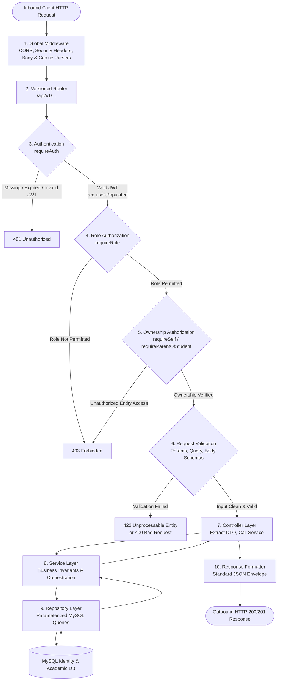
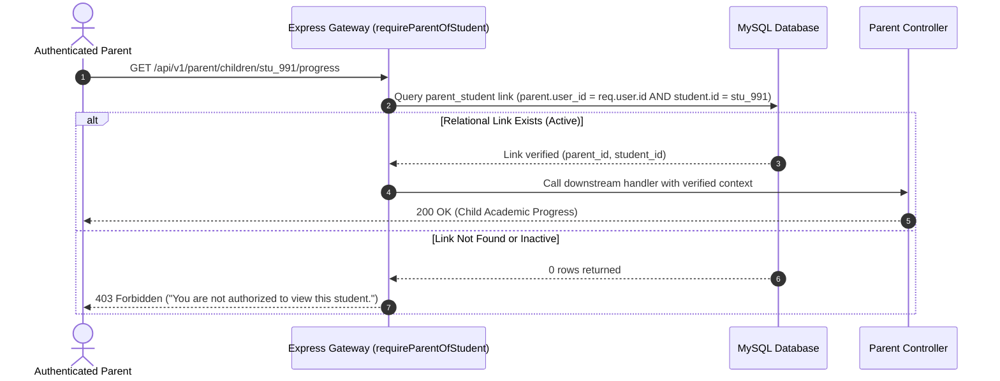
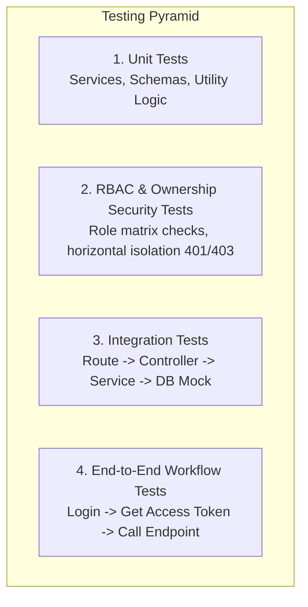

# MS Tutorials — API & Protected Resource Architecture Blueprint (Phase 5.4)

> **Governing Blueprint**: `docs/authentication-architecture.md` (Phase 5.0)  
> **Preceding Implemented Layers**: `docs/database.md` (Phase 5.1), `docs/authentication-backend.md` (Phase 5.2), `docs/authorization.md` (Phase 5.3)  
> **Status**: Architectural Specification & Design Standard (Phase 5.4)  
> **Scope**: Specification ONLY. No application endpoints, database mutations, or UI features are implemented in this phase.

---

## 1. Purpose & Architectural Principles

### 1.1 Purpose
This document establishes the comprehensive architectural blueprint governing how all future protected REST API endpoints and resources will be structured, secured, versioned, and consumed across the MS Tutorials platform. It defines the contract between the backend Express server and future client portals (Student, Parent, Teacher, and Administrator portals).

### 1.2 Core Architectural Principles

1. **Separation of Concerns & Layered Decoupling**:
   - Every request travels through distinctly separated layers: **Route Definition $\rightarrow$ Security & RBAC Middleware $\rightarrow$ Input Validation $\rightarrow$ Controller $\rightarrow$ Service $\rightarrow$ Repository / Database $\rightarrow$ Standardized Response**.
   - No layer leaks its internal abstractions: controllers do not execute SQL queries; services do not manipulate HTTP request/response objects; repositories do not perform business validation.

2. **Zero-Trust Security & Server-Side Enforcement**:
   - Authentication identity is asserted exclusively through cryptographically signed, short-lived Access JWTs.
   - Client-provided identifiers (`req.params`, `req.body`, `req.query`) are never trusted implicitly. Authorization middleware strictly verifies that the authenticated user (`req.user`) has explicit ownership of or administrative authority over the requested entity.

3. **Horizontal & Vertical Privilege Isolation**:
   - **Vertical**: Role-based access control (`requireRole`) restricts entire route hierarchies to authorized user types (`student`, `parent`, `teacher`, `admin`).
   - **Horizontal**: Ownership checks (`requireSelf`, `requireStudentSelf`, `requireParentOfStudent`, `requireTeacherAssignment`) ensure users cannot access records belonging to peers of the same role (e.g., Student A cannot access Student B; Parent A cannot inspect unlinked Child C).

4. **Predictable & Uniform API Contracts**:
   - All endpoints emit standardized JSON envelopes for both success and error conditions.
   - Clients can reliably inspect `.success` (boolean) to determine outcome, consume `.data` on success, and parse `.error.code` / `.error.message` on failure.

5. **Defense-in-Depth & Non-Leaking Diagnostics**:
   - 100% parameterized SQL queries via `mysql2/promise` eliminate SQL injection risks.
   - Sensitive internal diagnostics (database error codes, table names, stack traces, password hashes, and raw tokens) are scrubbed at the gateway boundary and never exposed to clients.

6. **Evolutionary Extensibility & Backward Compatibility**:
   - API versioning under `/api/v1/` ensures future iterations can be introduced without breaking deployed clients or legacy integration hooks.

---

## 2. API Versioning Strategy

### 2.1 Versioning Prefix Standard
All future protected application resource endpoints are partitioned under an explicit major version prefix:

$$\text{Canonical Base URL: } \mathbf{/api/v1/}$$

Resource routes will be segmented by domain under this prefix:
- `/api/v1/auth/*` — Authentication lifecycle and session renewal
- `/api/v1/student/*` — Student self-service portal resources
- `/api/v1/parent/*` — Parent portal resources (linked children oversight)
- `/api/v1/teacher/*` — Faculty portal resources (cohorts, grading, attendance)
- `/api/v1/admin/*` — Institutional governance and system administration
- `/api/v1/academic/*` — Academic reference taxonomies (sessions, boards, classes, programs, subjects)
- `/api/v1/curriculum/*` — Curriculum structure (nodes, chapters, topics)
- `/api/v1/health` — Service and database health monitoring

### 2.2 Existing Routes & Future Migration Strategy
Phase 5.2 and Phase 5.3 established the initial authentication and health routes at `/api/auth/*` and `/api/health`.

- **Future Resource Placement**: New future resource APIs are planned under `/api/v1/*`.
- **Existing Route Compatibility**: Existing `/api/auth/*` and `/api/health` routes remain unchanged for compatibility during the current architecture phase.
- **Future Migration Strategy**: If authentication versioning is introduced in a future phase, a controlled compatibility/migration strategy may be defined.
- **No Immediate Aliases**: Aliases are not implemented now.

---

## 3. Route Organization & Directory Structure

To maintain strict modularity as the codebase expands, the backend code will follow this organized directory layout:

```
server/
├── config/
│   ├── database.js               # MySQL connection pool
│   └── environment.js            # Centralized environment variables
├── middleware/
│   ├── authMiddleware.js         # requireAuth (JWT verification)
│   ├── roleMiddleware.js         # requireRole (RBAC gating)
│   ├── ownershipMiddleware.js    # requireSelf, requireStudentSelf, requireParentOfStudent
│   ├── validationMiddleware.js   # Generic schema/request validator
│   └── errorMiddleware.js        # Global error & 404 handlers
├── routes/
│   ├── authRoutes.js             # Existing auth router (/api/auth)
│   ├── studentRoutes.js          # /api/v1/student router (mounts profile, context, resources)
│   ├── studentAcademicContextRoutes.js # /api/v1/student/academic-context router
│   ├── studentResourceRoutes.js  # /api/v1/student/resources router
│   ├── parentRoutes.js           # /api/v1/parent router
│   ├── teacherRoutes.js          # /api/v1/teacher router
│   ├── adminRoutes.js            # /api/v1/admin router
│   ├── academicReferenceRoutes.js# /api/v1/academic reference router
│   ├── curriculumRoutes.js       # /api/v1/curriculum hierarchy router
│   └── healthRoutes.js           # /api/health router
├── controllers/
│   ├── authController.js         # Login, refresh, logout, session me
│   ├── studentController.js      # Student profile HTTP handlers
│   ├── studentAcademicContextController.js # Student academic context HTTP handlers
│   ├── studentResourceController.js # Student learning resource HTTP handlers
│   ├── parentController.js       # Parent portal HTTP handlers
│   ├── teacherController.js      # Teacher portal HTTP handlers
│   ├── adminController.js        # Admin portal HTTP handlers
│   ├── academicReferenceController.js # Academic reference HTTP handlers
│   └── curriculumController.js   # Curriculum hierarchy HTTP handlers
├── services/
│   ├── tokenService.js           # JWT & refresh token cryptographic utilities
│   ├── passwordService.js        # Bcrypt hashing & verification
│   ├── userService.js            # User domain business logic
│   ├── refreshTokenService.js    # Refresh token database lifecycle
│   ├── studentService.js         # Student domain operations
│   ├── studentAcademicContextService.js # Student academic context business logic & mapping
│   ├── studentResourceService.js # Student learning resource business logic & pagination
│   ├── parentService.js          # Parent domain operations
│   ├── teacherService.js         # Faculty domain operations
│   ├── adminService.js           # Administrative management operations
│   ├── academicReferenceService.js # Academic reference normalization & mapping
│   └── curriculumService.js      # Curriculum tree normalization & traversal
├── repositories/
│   ├── userRepository.js         # Database queries for `users`
│   ├── studentRepository.js      # Database queries for `students`
│   ├── studentAcademicContextRepository.js # Parameterized queries for student academic context
│   ├── studentResourceRepository.js # Parameterized queries for student learning resources
│   ├── parentRepository.js       # Database queries for `parents` & `parent_student`
│   ├── teacherRepository.js      # Database queries for `teachers`
│   ├── adminRepository.js        # Database queries for `admins`
│   ├── academicReferenceRepository.js # Parameterized queries for academic reference tables
│   ├── curriculumRepository.js   # Parameterized queries for nodes, chapters, topics
│   └── tokenRepository.js        # Database queries for `refresh_tokens`
├── utils/
│   ├── responseFormatter.js      # Standardized JSON response helpers
│   ├── apiErrors.js              # Canonical ApiError domain exception classes
│   └── logger.js                 # Sanitized console/file logger
└── server.js                     # Express app initialization & HTTP listener
```

---

## 4. Canonical Request Lifecycle

Every inbound HTTP request to a protected endpoint traverses a deterministic sequence of stages:



### Stage Walkthrough:
1. **Global Security Middleware**: Parses cookies (`cookie-parser`), parses JSON request bodies (`express.json({ limit: '1mb' })`), and enforces CORS / Security Headers.
2. **Versioned Route Matching**: Directs the request to the matching resource router (e.g., `/api/v1/student`).
3. **Authentication Gateway (`requireAuth`)**: Verifies the `Authorization: Bearer <token>` header, decodes the Access JWT, confirms `decoded.type === 'access'`, and mounts `req.user = { id, role, identifier, name }`.
4. **Role Authorization (`requireRole`)**: Checks if `req.user.role` matches the permissible roles for the route. Returns `403 Forbidden` on mismatch.
5. **Ownership Authorization**: If the route references a specific target resource (`:studentId`, `:userId`, `:childId`), executes relationship verification against the database to prevent cross-account snooping.
6. **Input Validation**: Evaluates path parameters, query parameters, and body payloads against schema definitions. Rejects invalid inputs before any business logic executes.
7. **Controller Execution**: Extracts validated inputs, passes plain objects to the appropriate service, handles errors via `try/catch` or next handlers.
8. **Service Logic**: Executes business rules, transactions, calculations, and domain workflows.
9. **Repository Access**: Executes strictly parameterized queries (`?`) using the database connection pool.
10. **Standardized Response Formatting**: Wraps result data in the unified response envelope and dispatches the HTTP response with appropriate status code.

---

## 5. Layer Responsibilities & Strict Boundaries

| Layer | Strict Responsibilities | Prohibited Actions |
|:---|:---|:---|
| **Routes** (`server/routes/`) | - Define HTTP method and path pattern<br/>- Assemble middleware pipeline in correct order<br/>- Bind route to controller method | - No business logic<br/>- No direct database access<br/>- No manual response dispatching |
| **Middleware** (`server/middleware/`) | - Authenticate request tokens (`requireAuth`)<br/>- Gate access by role (`requireRole`)<br/>- Verify resource ownership (`ownershipMiddleware`)<br/>- Validate request schemas (`validationMiddleware`)<br/>- Trap errors globally (`errorMiddleware`) | - No business workflow orchestration<br/>- No domain calculations<br/>- No direct client data mutations |
| **Controllers** (`server/controllers/`) | - Extract inputs (`req.params`, `req.query`, `req.body`, `req.user`)<br/>- Invoke relevant service methods<br/>- Translate service return values to HTTP status codes<br/>- Format output using standard response envelopes | - No direct SQL or database calls<br/>- No credential hashing or token signing<br/>- No domain calculation logic |
| **Services** (`server/services/`) | - Enforce business invariants and core logic<br/>- Coordinate multiple repository calls within transactions<br/>- Perform domain-level access rule validation<br/>- Throw domain-specific exceptions (`ApiError`) | - No knowledge of Express `req` or `res`<br/>- No HTTP status code dependencies<br/>- No direct execution of raw SQL |
| **Repositories** (`server/repositories/`) | - Execute parameterized SQL queries via `pool`<br/>- Map database rows to clean JavaScript domain objects<br/>- Manage atomic database transactions (`START TRANSACTION`, `COMMIT`, `ROLLBACK`) | - No HTTP context handling<br/>- No authorization decisions<br/>- No business rule enforcement |

---

## 6. Standardized Response Format

Every JSON response emitted by the MS Tutorials API conforms to a single, predictable envelope structure.

### 6.1 Success Envelope
Dispatched on all `2xx` HTTP responses:

```json
{
  "success": true,
  "data": {
    "profile": {
      "id": "usr_9f8b7a6c",
      "name": "Rahul Sharma",
      "role": "student"
    }
  },
  "message": "Resource retrieved successfully.",
  "meta": {
    "timestamp": "2026-09-26T14:50:00.000Z"
  }
}
```

*Notes:*
- `data`: Can be an object, array, or `null`. Contains the resource payload.
- `message`: Optional human-readable informational message.
- `meta`: Optional metadata for pagination, filtering, or system timestamps.

### 6.2 Error Envelope
Dispatched on all `4xx` and `5xx` HTTP responses:

```json
{
  "success": false,
  "error": {
    "code": "RESOURCE_NOT_FOUND",
    "message": "The requested student record does not exist or you do not have permission to view it.",
    "details": []
  }
}
```

When input validation fails (`422 Unprocessable Entity` or `400 Bad Request`), the `details` array provides granular field-level feedback:

```json
{
  "success": false,
  "error": {
    "code": "VALIDATION_ERROR",
    "message": "One or more input fields failed validation.",
    "details": [
      {
        "field": "email",
        "message": "Please provide a valid institutional email address."
      },
      {
        "field": "password",
        "message": "Password must be at least 8 characters in length."
      }
    ]
  }
}
```

### 6.3 Security Constraints for Responses
1. **Never Expose Sensitive Fields**: Passwords, bcrypt hashes, refresh token secrets, reset tokens, and raw session tokens are stripped before JSON serialization.
2. **Never Expose Internal Traces**: Stack traces, MySQL error numbers (e.g., `ER_DUP_ENTRY`), table/column names, and file system paths are completely omitted in production responses.
3. **Safe Fallback**: Any unhandled internal error maps to a generic `500 Internal Server Error` with code `INTERNAL_SERVER_ERROR`.

---

## 7. HTTP Status Code & Error Translation Matrix

The API uses standard HTTP status codes combined with explicit machine-readable error codes:

| HTTP Status | Meaning | Typical Scenarios | Standard `error.code` |
|:---:|:---|:---|:---|
| **200** | OK | Successful GET, PUT, PATCH, or non-creation POST. | *None (success = true)* |
| **201** | Created | Successful entity creation (e.g., creating a new user or test submission). | *None (success = true)* |
| **204** | No Content | Successful DELETE or operation with no response body. | *None (empty body)* |
| **400** | Bad Request | Malformed JSON syntax, missing required headers, unparseable input. | `BAD_REQUEST` |
| **401** | Unauthorized | Missing, expired, malformed, or invalid signature Access JWT. | `UNAUTHORIZED`, `TOKEN_EXPIRED` |
| **403** | Forbidden | Authenticated user lacks required role or ownership over entity. | `FORBIDDEN`, `ACCESS_DENIED` |
| **404** | Not Found | Resource does not exist, or unlinked resource concealed for privacy. | `RESOURCE_NOT_FOUND` |
| **409** | Conflict | Duplicate entry (e.g., admission number or email already registered). | `RESOURCE_CONFLICT` |
| **422** | Unprocessable Entity | Syntactically valid input fails semantic validation (e.g., invalid date range). | `VALIDATION_ERROR` |
| **429** | Too Many Requests | Rate limit threshold reached (e.g., brute-force login attempts). | `RATE_LIMIT_EXCEEDED` |
| **500** | Internal Server Error | Unexpected unhandled server exception or temporary database failure. | `INTERNAL_SERVER_ERROR` |

---

## 8. Validation Strategy

### 8.1 Zero Client Trust Principle
All client input is deemed untrusted and must be rigorously validated at the gateway before passing to controllers or services.

### 8.2 Three-Pronged Input Validation
Validation middleware operates on three distinct request vectors:
1. **Route Parameters (`req.params`)**:
   - Resource-specific validation schemas will be based on the identifiers and business rules established by each domain (rather than prematurely mandating a single universal identifier format such as UUIDv4 for all entities).
   - Domain identifier conventions (such as the student admission-number convention `AS26090`) may be referenced for relevant student lookup parameters, but are not turned into a universal API validation rule.
   - Numeric identifiers (such as serial or sequence IDs) are parsed and bounded (`min: 1`).
2. **Query Parameters (`req.query`)**:
   - Pagination parameters (`page`, `pageSize`) cast to integers and bounded.
   - Filter and sort keys whitelisted against allowed domain columns.
   - Search strings sanitized to prevent control character injection.
3. **Request Body (`req.body`)**:
   - Required fields strictly checked.
   - Value types, lengths, string formats (email, date, phone), and enum constraints verified.
   - Unexpected/unknown payload fields rejected or stripped.

### 8.3 Centralized Schema Validator Pattern
Validation is implemented via reusable schema middleware (e.g., schema validation wrappers):

```javascript
// Conceptual architectural pattern for future validation middleware:
const validate = (schema) => (req, res, next) => {
  const { error, value } = schema.validate({
    body: req.body,
    params: req.params,
    query: req.query
  }, { abortEarly: false, stripUnknown: true });

  if (error) {
    return res.status(422).json({
      success: false,
      error: {
        code: 'VALIDATION_ERROR',
        message: 'Validation failed.',
        details: error.details.map(d => ({ field: d.path.join('.'), message: d.message }))
      }
    });
  }

  req.validated = value;
  next();
};
```

---

## 9. Pagination Standard & Abuse Prevention Limits

### 9.1 Uniform Pagination Envelope
All listing and collection endpoints must support deterministic pagination to prevent uncontrolled memory consumption and denial-of-service via unbounded database queries.

#### Standard Query Parameters:
| Parameter | Default | Range / Rules | Description |
|:---|:---:|:---:|:---|
| `page` | `1` | Integer $\ge 1$ | 1-based page index. |
| `pageSize` | `20` | Integer between `1` and `100` | Number of records per page. |
| `sort` | `created_at` | Whitelisted field names | Ordering column. |
| `order` | `desc` | `asc` or `desc` | Sort direction. |

#### Standard Paginated Response Structure:
```json
{
  "success": true,
  "data": [
    { "id": "rec_001", "name": "Item 1" },
    { "id": "rec_002", "name": "Item 2" }
  ],
  "pagination": {
    "page": 1,
    "pageSize": 20,
    "total": 142,
    "totalPages": 8,
    "hasNext": true,
    "hasPrev": false
  }
}
```

### 9.2 SQL Query Enforcement
Repositories enforce pagination using strict parameterized `LIMIT ? OFFSET ?` clauses:

$$\text{OFFSET} = (\text{page} - 1) \times \text{pageSize}$$

- Maximum allowed `pageSize` is capped at `100` at the validation layer.
- Requests with `pageSize > 100` are automatically clamped or rejected with `422 Unprocessable Entity`.

---

## 10. Role / Resource Authorization Matrix

The MS Tutorials system recognizes four canonical roles: `student`, `parent`, `teacher`, and `admin`. The following matrix defines their permissible access boundaries across API resource domains:

| Resource Domain | `student` | `parent` | `teacher` | `admin` |
|:---|:---:|:---:|:---:|:---:|
| **Authentication Lifecycle** (`/api/v1/auth/*`) | Self | Self | Self | Self |
| **Own Profile** (`/api/v1/users/me`) | Read / Update Self | Read / Update Self | Read / Update Self | Read / Update Self |
| **Student Academic Profile** (`/api/v1/student/profile`) | Own record ONLY | ❌ | ❌ | Read All |
| **Student Academic Context** (`/api/v1/student/academic-context`) | Own record ONLY | ❌ | ❌ | ❌ |
| **Student Learning Resources** (`/api/v1/student/resources/*`) | Own active context ONLY | ❌ | ❌ | ❌ |
| **Student Attendance & Mistake Log** (`/api/v1/student/*`) | Own record ONLY | ❌ | Assigned Students | Full Access |
| **Parent Children Overview** (`/api/v1/parent/children`) | ❌ | Linked Children ONLY | ❌ | Read All |
| **Child Academic Progress** (`/api/v1/parent/children/:id/*`) | ❌ | Linked Children ONLY | ❌ | Full Access |
| **Fee Ledgers & Receipts** (`/api/v1/parent/fees/*`) | ❌ | Linked Children ONLY | ❌ | Full Access |
| **Teacher Batches & Rosters** (`/api/v1/teacher/batches/*`) | ❌ | ❌ | Assigned Batches ONLY | Full Access |
| **Attendance & Grade Submission** (`/api/v1/teacher/marks/*`) | ❌ | ❌ | Assigned Batches ONLY | Full Access |
| **User Management & Creation** (`/api/v1/admin/users/*`) | ❌ | ❌ | ❌ | Full Access |
| **System Governance & Audit Logs** (`/api/v1/admin/audit/*`) | ❌ | ❌ | ❌ | Full Access |
| **Academic Reference Data** (`/api/v1/academic/*`) | Read All (Active) | Read All (Active) | Read All (Active) | Read All (Active) |
| **Curriculum Structure** (`/api/v1/curriculum/*`) | Read All (Active) | Read All (Active) | Read All (Active) | Read All (Active) |

---

## 11. Student Ownership Model

### 11.1 The Invariant
A user authenticated with role `student` may **only** view or mutate records tied to their own admission record.

### 11.2 Architectural Mechanism
1. The student identity is established during authentication and verified by `requireAuth`:
   - `req.user.id`: User UUID in `users` table.
   - `req.user.identifier`: Admission number (e.g., `AS26090`).
   - `req.user.role`: `'student'`.
2. When accessing student-scoped endpoints (e.g., `/api/v1/student/mistakes` or `/api/v1/student/:studentId/progress`), the route attaches `requireStudentSelf`:
   ```sql
   SELECT id FROM students WHERE user_id = ? AND (id = ? OR admission_number = ?);
   ```
3. If the requested parameter does not match the authenticated student's record, the request is terminated immediately with `403 Forbidden`.
4. Prefer implicit routing: where possible, endpoints omit route parameters entirely (e.g., `GET /api/v1/student/dashboard`), resolving the target student context directly from `req.user.id`.

---

## 12. Parent-Child Access Model

### 12.1 The Invariant
A user authenticated with role `parent` may **only** access records for students to whom they have a verified relationship in the `parent_student` junction table.

### 12.2 Relational Verification Flow


### 12.3 Multi-Child Support
Parents with multiple enrolled children can inspect each child individually. The parent portal first queries `GET /api/v1/parent/children` to retrieve all verified linked students, then navigates child-specific resources using child IDs verified by `requireParentOfStudent`.

---

## 13. Teacher Authorization Model

### 13.1 Cohort & Batch Boundaries
Teachers possess instructional authority over specific student cohorts rather than global institutional authority:
- A teacher can view rosters, submit grades, and mark attendance **only** for batches and subjects explicitly assigned to them.
- Attempts to inspect or modify students outside assigned batches are blocked with `403 Forbidden`.

### 13.2 Extension Point: `requireTeacherAssignment`
As established in Phase 5.3 (`server/middleware/ownershipMiddleware.js`), `requireTeacherAssignment(cohortParam)` serves as the canonical architectural extension hook. When academic tables (batches, enrollments, subject assignments) are created in Phase 6+, this middleware will query:
```sql
SELECT 1 
FROM batch_teachers bt
JOIN teachers t ON bt.teacher_id = t.id
WHERE t.user_id = ? AND bt.batch_id = ?
LIMIT 1;
```

---

## 14. Admin Authorization Model

### 14.1 Administrative Scope
Administrative access will be governed by the admin role and future access-level permissions. Detailed permissions for superadmin and staff/admin will be defined when administrative resources are implemented.
- Route prefix: `/api/v1/admin/*`
- Enforced by: `requireRole('admin')`

### 14.2 Tiered Administration Scalability
To support future growth, the system anticipates administrative role levels:
- `superadmin`: Full platform control, database backups, fee structure alteration, staff role assignment.
- `center_admin` / `staff`: Daily operational management, student onboarding, attendance overrides, parent communication.
The authorization layer accommodates this via role attributes or permission flags without altering the core RBAC gateway.

---

## 15. Security Principles & Hardening Standards

1. **Strictly Parameterized Queries**:
   - Every SQL interaction must use placeholder queries via `mysql2/promise`:
     ```javascript
     // Approved standard:
     const [rows] = await pool.query('SELECT * FROM students WHERE user_id = ?', [userId]);
     ```
   - String concatenation, template literals in SQL, or unescaped variables are strictly prohibited.

2. **Dual-Token Lifetime Discipline**:
   - **Access JWT**: Short-lived (15 minutes default), stored solely in client memory (React application state). Never written to `localStorage` or `sessionStorage`.
   - **Refresh Token**: Cryptographically random 40-byte string, stored only in an `HttpOnly`, `SameSite=Strict`, `Secure` (in production) cookie scoped to `/api/auth` or `/api/v1/auth`. Stored in MySQL strictly as a SHA-256 hash.

3. **Zero Credential Leaks in Logs**:
   - Passwords, JWT secrets, refresh tokens, and authentication cookies are redacted from console output and server loggers.

4. **Payload Size Limits**:
   - Express JSON body parser is restricted to `1mb` maximum to prevent memory exhaustion attacks.

5. **Timing-Safe Operations**:
   - Password verification utilizes `bcrypt.compare` to prevent timing side-channel attacks.

---

## 16. API Documentation Strategy

To ensure seamless frontend integration and maintain high engineering hygiene, future API endpoints will be documented using the following standards:

### 16.1 In-Tree Markdown Specifications
Every major domain API will maintain a corresponding specification in `docs/api/`:
- `docs/api/auth-api.md`
- `docs/api/student-api.md`
- `docs/api/parent-api.md`
- `docs/api/teacher-api.md`
- `docs/api/admin-api.md`

### 16.2 Standard Endpoint Specification Template
Each documented endpoint must provide:
```markdown
### [METHOD] /api/v1/resource/path

- **Description**: Summary of endpoint purpose.
- **Authentication**: Required (`requireAuth`)
- **Authorized Roles**: `['student', 'admin']`
- **Ownership Verification**: `requireStudentSelf`
- **Request Headers**:
  - `Authorization: Bearer <accessToken>`
- **URL Parameters**:
  - `:studentId` (string) — Target student identifier (domain-specific identifier)
- **Query Parameters**:
  - `page` (integer, optional, default: 1)
  - `pageSize` (integer, optional, default: 20)
- **Request Body**:
  ```json
  { "key": "value" }
  ```
- **Responses**:
  - `200 OK`: Success envelope with resource data.
  - `401 Unauthorized`: Missing or invalid token.
  - `403 Forbidden`: Cross-student access attempted.
  - `422 Unprocessable Entity`: Invalid body attributes.
```

### 16.3 OpenAPI / Swagger Readiness
The route definitions and validation schemas are structured to allow direct automated generation of OpenAPI 3.0 / Swagger JSON specifications if desired in future phases.

---

## 17. Testing Strategy for Protected Resources

Every future API endpoint must pass a rigorous four-layer testing protocol:



### 17.1 Test Case Requirements:
1. **Positive Path**:
   - Authenticated user with valid token and proper role receives `200 OK` or `201 Created` with expected standardized JSON envelope.
2. **Negative Authentication (401)**:
   - Missing token $\rightarrow$ `401 Unauthorized`.
   - Expired token $\rightarrow$ `401 Unauthorized`.
   - Malformed signature or corrupted Bearer header $\rightarrow$ `401 Unauthorized`.
3. **Negative Authorization (403)**:
   - Authenticated user with incorrect role $\rightarrow$ `403 Forbidden`.
   - Student attempting to access another student's record $\rightarrow$ `403 Forbidden`.
   - Parent attempting to access an unlinked child's record $\rightarrow$ `403 Forbidden`.
4. **Validation Failures (400 / 422)**:
   - Missing required body properties $\rightarrow$ `422 Unprocessable Entity`.
   - Invalid data types or format mismatches $\rightarrow$ `422 Unprocessable Entity`.
5. **Envelope Integrity**:
   - Verification that `.success` boolean is present on 100% of responses.
   - Verification that no internal database traces or stack traces are present in error payloads.

### 17.2 Test Suite Baseline & Node.js Test Runner Accounting
The backend test suite enforces a rigorous baseline across all authentication, routing, and authorization gateways. Test reporting follows the Node.js test-runner hierarchical suite accounting standard:

- **Auth Core**:
  - 15 Node.js test-runner entries
  - 14 functional subtests + 1 parent suite
- **Auth Routes**:
  - 7 Node.js test-runner entries
  - 6 functional subtests + 1 parent suite
- **RBAC Gateway**:
  - 18 Node.js test-runner entries
  - 17 functional subtests + 1 parent suite
- **Total**:
  - 40 Node.js test-runner entries
  - 37 functional subtests

*(Note: The Node.js native test runner reports each top-level test suite wrapper as a test entry in its execution summary. Therefore, the 40 runner entries represent 37 functional subtests across 3 parent test suites.)*

---

## 18. API Endpoint Specifications: Implemented vs. Conceptual

### 18.1 Implemented Identity & Profile Endpoints (Phase 5.5)

The following identity and profile endpoints are fully implemented and verified:

#### 1. Student Profile
- **Endpoint**: `GET /api/v1/student/profile`
- **Status**: **IMPLEMENTED (Phase 5.5)**
- **Auth / Role**: `requireAuth`, `requireRole('student')`
- **Identity Source**: Derived securely from `req.user.id` (zero client-supplied ID trust).
- **Response**: Standardized success envelope with safe student profile fields (admission number, name, email, phone, school, board, academic track, date of birth, gender, address).

#### 2. Parent Profile
- **Endpoint**: `GET /api/v1/parent/profile`
- **Status**: **IMPLEMENTED (Phase 5.5)**
- **Auth / Role**: `requireAuth`, `requireRole('parent')`
- **Identity Source**: Derived securely from `req.user.id`.
- **Response**: Standardized success envelope with parent profile fields (parent code, occupation, alternate phone, emergency contact phone).

#### 3. Parent Linked Children
- **Endpoint**: `GET /api/v1/parent/children`
- **Status**: **IMPLEMENTED (Phase 5.5)**
- **Auth / Role**: `requireAuth`, `requireRole('parent')`
- **Identity Source**: Derived from `req.user.id` joined through `parents`, `parent_student`, `students`, and `users`.
- **Response**: Standardized success envelope returning array of verified linked children only (supporting multi-child families). Does not return future LMS data (marks, attendance, fees).

#### 4. Teacher Profile
- **Endpoint**: `GET /api/v1/teacher/profile`
- **Status**: **IMPLEMENTED (Phase 5.5)**
- **Auth / Role**: `requireAuth`, `requireRole('teacher')`
- **Identity Source**: Derived securely from `req.user.id`.
- **Response**: Standardized success envelope with faculty profile fields (faculty code, qualification, specialization, joining date).

#### 5. Admin Profile
- **Endpoint**: `GET /api/v1/admin/profile`
- **Status**: **IMPLEMENTED (Phase 5.5)**
- **Auth / Role**: `requireAuth`, `requireRole('admin')`
- **Identity Source**: Derived securely from `req.user.id`.
- **Response**: Standardized success envelope with administrative profile fields (admin code, access level `superadmin`/`staff`, department).

---

### 18.2 Implemented Academic Reference Endpoints (Phase 5.8A)

The following read-only academic reference endpoints are fully implemented and verified:

#### 1. Academic Sessions
- **Endpoint**: `GET /api/v1/academic/sessions`
- **Status**: **IMPLEMENTED (Phase 5.8A)**
- **Auth / Role**: `requireAuth`, `requireRole('student', 'parent', 'teacher', 'admin')`
- **Data Source**: `academic_sessions` table (ordered by `start_date ASC`)
- **Query Parameters**: None (returns canonical reference collection)
- **Response**: Standardized success envelope returning array of academic sessions (`id`, `sessionCode`, `displayName`, `startDate`, `endDate`, `status`, `createdAt`, `updatedAt`).

#### 2. Boards
- **Endpoint**: `GET /api/v1/academic/boards`
- **Status**: **IMPLEMENTED (Phase 5.8A)**
- **Auth / Role**: `requireAuth`, `requireRole('student', 'parent', 'teacher', 'admin')`
- **Data Source**: `boards` table (ordered by `code ASC`)
- **Query Parameters**: None (returns canonical reference collection)
- **Response**: Standardized success envelope returning array of educational boards (`id`, `code`, `name`, `description`, `status`, `createdAt`, `updatedAt`).

#### 3. Classes
- **Endpoint**: `GET /api/v1/academic/classes`
- **Status**: **IMPLEMENTED (Phase 5.8A)**
- **Auth / Role**: `requireAuth`, `requireRole('student', 'parent', 'teacher', 'admin')`
- **Data Source**: `classes` table (ordered by `grade_number ASC`)
- **Query Parameters**: None (returns canonical reference collection)
- **Response**: Standardized success envelope returning array of classes/grades (`id`, `gradeNumber`, `code`, `displayName`, `stage`, `status`, `createdAt`, `updatedAt`).

#### 4. Programs
- **Endpoint**: `GET /api/v1/academic/programs`
- **Status**: **IMPLEMENTED (Phase 5.8A)**
- **Auth / Role**: `requireAuth`, `requireRole('student', 'parent', 'teacher', 'admin')`
- **Data Source**: `programs` table (ordered by `code ASC`)
- **Query Parameters**: None (returns canonical reference collection)
- **Response**: Standardized success envelope returning array of academic programs/offerings (`id`, `code`, `name`, `description`, `targetStage`, `status`, `createdAt`, `updatedAt`).

#### 5. Subjects
- **Endpoint**: `GET /api/v1/academic/subjects`
- **Status**: **IMPLEMENTED (Phase 5.8A)**
- **Auth / Role**: `requireAuth`, `requireRole('student', 'parent', 'teacher', 'admin')`
- **Data Source**: `subjects` table (ordered by `name ASC`)
- **Query Parameters**: None (returns canonical reference collection)
- **Response**: Standardized success envelope returning array of academic subjects (`id`, `code`, `name`, `parentSubjectId`, `colorCode`, `status`, `createdAt`, `updatedAt`). Supports independent subjects and component disciplines.

---

### 18.3 Implemented Read-Only Curriculum Endpoints (Phase 5.8B)

The following read-only curriculum endpoints are fully implemented and verified:

#### 1. Curriculum Nodes List
- **Endpoint**: `GET /api/v1/curriculum/nodes`
- **Status**: **IMPLEMENTED (Phase 5.8B)**
- **Auth / Role**: `requireAuth`, `requireRole('student', 'parent', 'teacher', 'admin')`
- **Data Source**: `curriculum_nodes` table (ordered by `created_at ASC`)
- **Query Parameters**: None (returns canonical collection)
- **Response**: Standardized success envelope returning array of curriculum nodes (`id`, `sessionId`, `boardId`, `classId`, `subjectId`, `syllabusVersion`, `isActive`, `createdAt`, `updatedAt`).

#### 2. Curriculum Node Detail
- **Endpoint**: `GET /api/v1/curriculum/nodes/:id`
- **Status**: **IMPLEMENTED (Phase 5.8B)**
- **Auth / Role**: `requireAuth`, `requireRole('student', 'parent', 'teacher', 'admin')`
- **Data Source**: `curriculum_nodes` table (by primary key `id`)
- **URL Parameters**: `:id` (string) — Curriculum node UUID
- **Response**: Standardized success envelope returning single curriculum node object, or 404 NOT_FOUND.

#### 3. Curriculum Node Chapters
- **Endpoint**: `GET /api/v1/curriculum/nodes/:id/chapters`
- **Status**: **IMPLEMENTED (Phase 5.8B)**
- **Auth / Role**: `requireAuth`, `requireRole('student', 'parent', 'teacher', 'admin')`
- **Data Source**: `chapters` table constrained by `WHERE curriculum_node_id = ?` (ordered by `chapter_number ASC`)
- **URL Parameters**: `:id` (string) — Curriculum node UUID
- **Response**: Standardized success envelope returning chapters strictly belonging to the specified node (`id`, `curriculumNodeId`, `chapterNumber`, `title`, `description`, `estimatedTeachingHours`, `status`, `createdAt`, `updatedAt`), or 404 NOT_FOUND if node does not exist.

#### 4. Chapter Detail
- **Endpoint**: `GET /api/v1/curriculum/chapters/:id`
- **Status**: **IMPLEMENTED (Phase 5.8B)**
- **Auth / Role**: `requireAuth`, `requireRole('student', 'parent', 'teacher', 'admin')`
- **Data Source**: `chapters` table (by primary key `id`)
- **URL Parameters**: `:id` (string) — Chapter UUID
- **Response**: Standardized success envelope returning single chapter object, or 404 NOT_FOUND.

#### 5. Chapter Topics
- **Endpoint**: `GET /api/v1/curriculum/chapters/:id/topics`
- **Status**: **IMPLEMENTED (Phase 5.8B)**
- **Auth / Role**: `requireAuth`, `requireRole('student', 'parent', 'teacher', 'admin')`
- **Data Source**: `topics` table constrained by `WHERE chapter_id = ?` (ordered by `sequence_order ASC`)
- **URL Parameters**: `:id` (string) — Chapter UUID
- **Response**: Standardized success envelope returning atomic topics strictly belonging to the specified chapter (`id`, `chapterId`, `sequenceOrder`, `topicCode`, `title`, `description`, `status`, `createdAt`, `updatedAt`), or 404 NOT_FOUND if chapter does not exist.

#### 6. Topic Detail
- **Endpoint**: `GET /api/v1/curriculum/topics/:id`
- **Status**: **IMPLEMENTED (Phase 5.8B)**
- **Auth / Role**: `requireAuth`, `requireRole('student', 'parent', 'teacher', 'admin')`
- **Data Source**: `topics` table (by primary key `id`)
- **URL Parameters**: `:id` (string) — Topic UUID
- **Response**: Standardized success envelope returning single topic object, or 404 NOT_FOUND.

---

### 18.4 Implemented Student Academic Context Endpoint (Phase 5.8C)

The following student academic context endpoint is fully implemented and verified:

#### 1. Student Academic Context
- **Endpoint**: `GET /api/v1/student/academic-context`
- **Status**: **IMPLEMENTED (Phase 5.8C)**
- **Auth / Role**: `requireAuth`, `requireRole('student')` (Strictly student-only access)
- **Identity Source**: Derived strictly from `req.user.id` (zero client-supplied ID trust, no path parameters or query parameters accepted)
- **Data Source**: `users` $\rightarrow$ `students` $\rightarrow$ `student_enrollments` $\rightarrow$ `academic_sessions`, `boards`, `classes`, `programs`, `batches`
- **Authoritative Hierarchy**: `student_enrollments.board_id` is the authoritative academic board context. Optional `batches.board_id` is cohort metadata only and never overrides enrollment board.
- **Multiple Enrollment Handling**: Selects the active enrollment prioritized by active session status, session start date (`DESC`), and enrollment date (`DESC`).
- **Response**: Standardized success envelope returning authenticated student identity and nested current enrollment context (session, board, class, program, batch), or `{ student, enrollment: null }` if no active enrollment exists.

---

### 18.5 Implemented Student Learning Resources Endpoints (Phase 5.8D)

The following protected read-only learning resource endpoints are fully implemented and verified:

#### 1. Student Learning Resources Listing
- **Endpoint**: `GET /api/v1/student/resources`
- **Status**: **IMPLEMENTED (Phase 5.8D)**
- **Auth / Role**: `requireAuth`, `requireRole('student')` (Strictly student-only access)
- **Identity Source**: Derived strictly from `req.user.id` (zero client-supplied student/user ID trust)
- **Academic Authorization**: Scoped strictly to the authenticated student's active enrollment context:
  $$\text{curriculum\_nodes.session\_id} = \text{enrollment.session\_id} \land \text{curriculum\_nodes.board\_id} = \text{enrollment.board\_id} \land \text{curriculum\_nodes.class\_id} = \text{enrollment.class\_id}$$
- **Publication & Node Invariants**: Enforces `learning_resources.is_published = TRUE` and `curriculum_nodes.is_active = TRUE` at SQL repository level.
- **Optional Narrowing Filters**:
  - `subjectId` (string, validated within student's authorized curriculum node)
  - `chapterId` (string, validated within student's authorized curriculum hierarchy)
  - `topicId` (string, validated within student's authorized topic hierarchy)
  - `resourceType` (enum: `notes`, `worksheet`, `important_questions`, `video`, `question_bank`, `summary_sheet`)
  - `difficultyLevel` (enum: `foundation`, `standard`, `advanced`)
- **Pagination**: Uniform pagination parameters `page` (default: 1, min: 1) and `pageSize` (default: 20, max: 100).
- **Sorting**: Deterministic server-side ordering `ORDER BY lr.created_at DESC, lr.id ASC`.
- **Unenrolled Behavior**: Students without active enrollment safely receive `{ resources: [], pagination: { total: 0, page, pageSize, totalPages: 0, hasNext: false, hasPrev: false } }`.
- **Response**: Standardized success envelope with `data.resources` array and top-level `pagination` block. Internal fields (e.g. `uploaded_by`) are strictly excluded.

#### 2. Student Learning Resource Detail
- **Endpoint**: `GET /api/v1/student/resources/:id`
- **Status**: **IMPLEMENTED (Phase 5.8D)**
- **Auth / Role**: `requireAuth`, `requireRole('student')` (Strictly student-only access)
- **Identity Source**: Derived strictly from `req.user.id`
- **Security Guard**: Resource must be published (`is_published = TRUE`) and must belong to a curriculum node matching the student's active `(session_id, board_id, class_id)`.
- **Response**: Standardized success envelope returning single resource DTO, or 404 NOT_FOUND (`Learning resource not found.`) if non-existent, unpublished, or outside the student's authorized academic scope.

---

### 18.6 Future / Conceptual Endpoint Specifications (Architectural Blueprint ONLY)

> ⚠️ **NOTICE**: The endpoints detailed below are conceptual architectural designs representing future phase specifications. **None of these routes are implemented in Phase 5.8D.**  
> **These endpoint examples are illustrative architectural examples only and do not constitute approved feature requirements. Each resource must be reviewed and approved during its implementation phase.**

#### Future Student Resources (`/api/v1/student/*`) — [FUTURE / CONCEPTUAL]
- `GET /api/v1/student/attendance` — Retrieve student's personal attendance history and overall percentage.
- `GET /api/v1/student/mistake-book` — Retrieve personalized mistake log entries across Maths & Science topics.
- `GET /api/v1/student/assessments` — Retrieve upcoming and past chapter tests, scores, and answer keys.

#### Future Parent Resources (`/api/v1/parent/*`) — [FUTURE / CONCEPTUAL]
- `GET /api/v1/parent/children/:childId/summary` — Overview of child attendance, recent scores, and teacher remarks.
- `GET /api/v1/parent/children/:childId/attendance` — Detailed attendance calendar for specified child.
- `GET /api/v1/parent/children/:childId/fees` — Fee ledger, upcoming dues, paid installments, and PDF receipts.

#### Future Teacher Resources (`/api/v1/teacher/*`) — [FUTURE / CONCEPTUAL]
- `GET /api/v1/teacher/batches` — List academic batches assigned to the authenticated teacher.
- `GET /api/v1/teacher/batches/:batchId/roster` — Retrieve student roster for assigned batch.
- `POST /api/v1/teacher/batches/:batchId/attendance` — Submit daily attendance marks for batch students.
- `POST /api/v1/teacher/assessments` — Create chapter assessment and record student marks.

#### Future Admin Resources (`/api/v1/admin/*`) — [FUTURE / CONCEPTUAL]
- `GET /api/v1/admin/users` — Paginated user directory with role and status filtering.
- `POST /api/v1/admin/users` — Create new student, parent, or faculty account.
- `PATCH /api/v1/admin/users/:userId/status` — Suspend, activate, or unlock user accounts.
- `POST /api/v1/admin/relationships` — Create or terminate parent-student relational links.
- `GET /api/v1/admin/audit-logs` — Review security and administrative event logs.

---

## 19. Implementation Boundaries & Project Phases

| Phase | Description | Scope & Status |
|:---|:---|:---|
| **Phase 4** | Public Website V1 | Locked (`f99cbf5`) |
| **Phase 5.0** | Authentication Architecture Blueprint | Locked (`3d817bf`) |
| **Phase 5.1** | Database Identity Foundation | Locked (`405d383`) |
| **Phase 5.2** | Backend Authentication Core | Locked (`7cd2293`) |
| **Phase 5.3** | Authentication + RBAC Gateway | Locked (`aa159dc`) |
| **Phase 5.4** | API Architecture Blueprint | Locked (`c3c2f07`) |
| **Phase 5.5** | Protected Identity / Profile API | Locked (`f0b7c7b`) |
| **Phase 5.6** | Academic Structure & Learning Resource Architecture Blueprint | Locked (`e09c13b`) |
| **Phase 5.7A**| Academic Database Schema Implementation | Locked (`6e00f90`) |
| **Phase 5.8A**| Academic Reference APIs | Locked (`58653ee`) |
| **Phase 5.8B**| Read-Only Curriculum APIs | Locked (`eabcc19`) |
| **Phase 5.8C**| Student Academic Context API | Locked (`38f76c6`) |
| **Phase 5.8D**| **Student Learning Resources APIs** | **CURRENT — Implemented (Read-Only Student Resources)** |
| **Phase 5.8E+**| Learning Resource Authoring & Management | Future Phase: Upload, edit, delete, S3/CDN streaming |
| **Phase 6.0+** | Frontend Dashboards & Portal Implementations | Future Phase: Student, Parent, Teacher, Admin dashboards |

### Strict Phase 5.8D Commitments:
- ✅ Strictly student-only learning resource endpoints implemented (`/api/v1/student/resources`, `/api/v1/student/resources/:id`).
- ✅ Access gated by `requireAuth` and `requireRole('student')`.
- ✅ Identity derived strictly from `req.user.id`; no client-supplied ID trust.
- ✅ Academic scope bounded by student's active enrollment session, board, and class.
- ✅ Published resources only (`is_published = TRUE`) and active curriculum nodes only (`is_active = TRUE`) enforced at SQL query level.
- ✅ Unenrolled students safely receive empty paginated collections or 404 for detail.
- ✅ Explicit column projection with internal fields (e.g. `uploaded_by`) strictly hidden. Zero `SELECT *`.
- ❌ No database tables, migrations, or schemas altered.
- ❌ No packages installed or dependencies changed.
- ❌ No frontend pages or dashboards built.
- ❌ No resource creation, mutation, upload, or deletion endpoints implemented.
- ❌ No completion tracking, bookmarking, favorites, or ratings implemented.
- ❌ No automatic Git commits.
