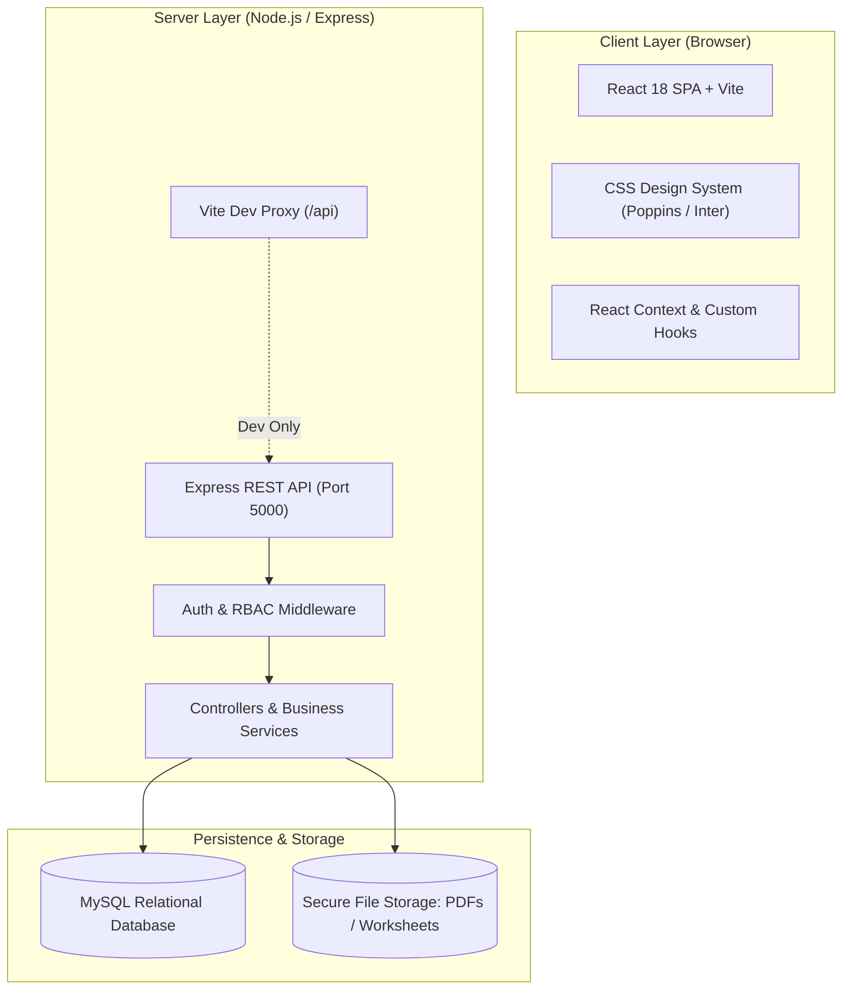
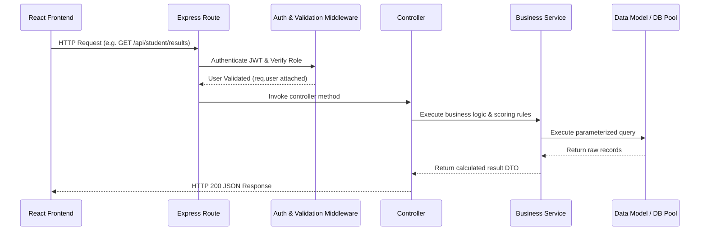
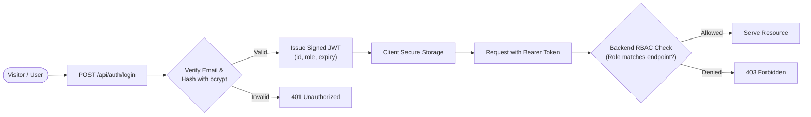
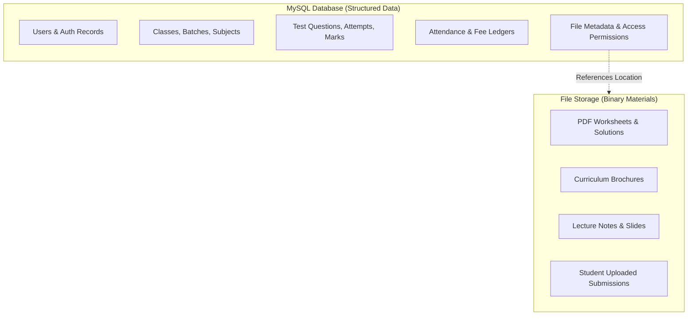

# MS Tutorials — System Architecture

> **Purpose**: Build a robust, scalable, and secure educational platform that starts as a high-converting public website and incrementally evolves into a complete Learning Management System (LMS) for Maths and Science tuition.

---

## 1. Directory Structure & Responsibilities

The codebase enforces strict separation of concerns across top-level directories:

| Directory | Layer | Purpose & Responsibility |
|---|---|---|
| `src/` | **Frontend** | React application (Vite-powered): components, layouts, public pages, role portals, hooks, and client API services. |
| `server/` | **Backend** | Node.js + Express API server: routing, controllers, business logic services, database models, middleware, and configuration. |
| `database/` | **Database** | SQL definitions: schema blueprints, schema migrations, and seed data. No application runtime logic. |
| `public/` | **Static Assets** | Publicly accessible static files: logos, public images, icons, and downloadable brochures/documents. |
| `docs/` | **Documentation** | Architectural blueprints, database designs, deployment procedures, coding constitution, and project roadmaps. |
| `tests/` | **Testing** | Automated unit, integration, and end-to-end test suites. |

```text
MS-TUTORIALS/
├── public/                 # Static assets (publicly accessible)
│   ├── images/             # Website hero images, program banners
│   ├── logo/               # Brand logos and favicons
│   ├── icons/              # Static SVG and UI icons
│   └── documents/          # Public PDF brochures, syllabus guides
├── src/                    # Frontend (React + Vite)
│   ├── components/         # Reusable UI widgets (Navbar, Footer, Button, Card, Modal)
│   ├── layouts/            # Page structures (PublicLayout, StudentLayout, AdminLayout)
│   ├── pages/              # Public pages (Home, About, Programs, Resources, Contact)
│   ├── student/            # Student portal views
│   ├── parent/             # Parent portal views
│   ├── teacher/            # Teacher portal views
│   ├── admin/              # Admin panel management views
│   ├── services/           # Frontend API client modules (authService, studentService)
│   ├── data/               # Static catalogs and mock data (courses, subjects)
│   ├── hooks/              # Reusable React hooks (useAuth, useStudent)
│   ├── utils/              # Client utility functions (dateUtils, formatCurrency)
│   └── styles/             # Design tokens, variables.css, global.css, responsive.css
├── server/                 # Backend (Node.js + Express)
│   ├── routes/             # REST API endpoint definitions
│   ├── controllers/        # HTTP request/response orchestrators
│   ├── models/             # Data models and entity abstractions
│   ├── middleware/         # Auth verification, RBAC guards, input validation, error handling
│   ├── services/           # Core domain business logic and calculations
│   └── config/             # Environment, database, and storage configurations
├── database/               # Database assets
│   ├── schema/             # Core table schema SQL files
│   ├── migrations/         # Numbered incremental migration scripts
│   └── seeds/              # Initial catalog and test data
├── docs/                   # Shared project documentation and guidelines
├── tests/                  # Automated test suites
├── .env.example            # Environment configuration template
├── .gitignore              # Version control ignore definitions
├── index.html              # Frontend HTML entry point
├── package.json            # Dependencies and npm script orchestrations
├── vite.config.js          # Vite build and development proxy configuration
└── README.md               # Quickstart and overview manual
```

---

## 2. Technology Stack



- **Frontend**: React 18 with Vite for lightning-fast HMR and optimized production bundles.
- **Design Tokens & UI**: Vanilla CSS architecture with custom properties (`variables.css`), responsive utilities (`responsive.css`), Lucide icons, and Google Fonts (*Poppins* for headings, *Inter* for body).
- **Backend API**: Node.js with Express 4, configured as a modular REST API with JSON payloads and secure CORS.
- **Relational Database**: MySQL 8 storing users, academic catalogs, enrollments, assessments, marks, fees, and audit records.
- **Binary & Media Storage**: Dedicated file storage for private materials (PDF worksheets, assignment files, class notes). Only metadata, file URLs, and access policies reside in MySQL.
- **Source Control**: Git & GitHub repository as single source of truth.
- **Production Host**: Hostinger Business Web Hosting running Node.js production service and MySQL.
- **Domain**: `mstutorials.com` (with dedicated business emails: `info@`, `admissions@`, `support@`, `admin@`).

---

## 3. Frontend Architecture

The frontend follows a feature-grouped and role-isolated directory pattern:

```text
src/
├── components/   # Pure presentational and reusable UI blocks (Button, Card, Modal, Input)
├── layouts/      # Shell wrappers with persistent header/nav/footer per audience
├── pages/        # Publicly accessible routes (Home, About, Programs, Resources, Contact)
├── student/      # Authenticated Student views (Dashboard, Tests, Results, Material)
├── parent/       # Authenticated Parent views (ChildProgress, Attendance, Fees)
├── teacher/      # Authenticated Teacher views (Classes, Attendance, Tests, Marks)
├── admin/        # Authenticated Admin views (Dashboard, Batches, Subjects, Fees)
├── services/     # Axios/fetch wrappers communicating with /api endpoints
├── data/         # Offline mock catalogs used during initial UI prototyping
├── hooks/        # Stateful hooks (useAuth, useLocalStorage, usePagination)
├── utils/        # Pure formatting, date manipulation, and calculation helpers
└── styles/       # Centralized design system variables, resets, and media queries
```

### Communication Flow
During local development, Vite proxies all requests starting with `/api` to `http://localhost:5000`, eliminating CORS friction and mirroring production URL structures.

---

## 4. Backend Architecture

The backend follows an industry-standard layered pattern:



1. **Routes (`server/routes/`)**: Define endpoint paths, HTTP verbs, and route-specific middleware chains.
2. **Middleware (`server/middleware/`)**:
   - `authMiddleware.js`: Verifies JWT authenticity and token expiry.
   - `roleMiddleware.js`: Enforces role-based permissions (Student, Parent, Teacher, Admin).
   - `errorMiddleware.js`: Catches unhandled errors and produces sanitized, secure error responses.
3. **Controllers (`server/controllers/`)**: Validate request parameters, handle HTTP status codes, and call services.
4. **Services (`server/services/`)**: Encapsulate core business rules (e.g., test evaluation, topic performance scoring, attendance aggregation).
5. **Models & DB (`server/models/`, `server/config/database.js`)**: Abstract SQL queries using parameterized statements to prevent SQL injection.

---

## 5. Security & Authentication Architecture

Authentication is stateless and token-driven:



### Security Rules:
- **No Plaintext Passwords**: All credentials hashed using `bcrypt` with appropriate salt rounds.
- **No Secrets in Source**: JWT secrets, database credentials, and API tokens read exclusively from `.env`.
- **Backend Authorization**: UI hides restricted links, but the backend **strictly enforces permissions** on every API endpoint. A parent cannot view another student's marks; a student cannot mutate test questions.
- **Input Sanitization**: All incoming data validated before processing to prevent XSS and SQL injection.

---

## 6. Role-Based Architecture & Portals

The application serves five distinct user personas:

| Persona | Accessible Routes | Primary Capabilities |
|---|---|---|
| **Public Visitor** | `/`, `/about`, `/programs`, `/learning-system`, `/resources`, `/contact` | Browse curriculum, view faculty, take sample diagnostic test, submit admission inquiries. |
| **Student** | `/student/*` | View personalized dashboard, study materials, attempt assigned tests, inspect results, view attendance. |
| **Parent** | `/parent/*` | View linked child's academic progress, attendance records, test reports, fee status, and teacher feedback. |
| **Teacher** | `/teacher/*` | Manage assigned batches, take attendance, publish assignments, create chapter tests, enter evaluation marks. |
| **Admin** | `/admin/*` | Global control: student enrollments, teacher assignments, class/batch setup, fee collections, platform analytics. |

---

## 7. Storage Architecture: Database vs. File Storage

To ensure maximum performance and maintainability, responsibilities are cleanly bifurcated:



> [!IMPORTANT]
> **Git Repository Rule**: GitHub stores **source code and configuration templates only**. Large private materials, student uploads, and binary worksheets must NEVER be committed to Git.

---

## 8. Environments & Infrastructure

### Development Environment (Local)
- **Editor & Tools**: VS Code with Antigravity AI pair programming.
- **Frontend Server**: Vite dev server at `http://localhost:5173`.
- **Backend Server**: Node.js Express at `http://localhost:5000`.
- **Version Control**: Git local commits following structured commit messages.

### Production Environment (Hostinger)
- **Host**: Hostinger Business Web Hosting.
- **Domain**: `mstutorials.com` (SSL/HTTPS enabled).
- **Backend**: Node.js runtime process managed via Hostinger application manager.
- **Frontend**: Static production build (`dist/`) served directly by the web server.
- **Database**: Hostinger MySQL managed database instance.
- **Email Infrastructure**: Hostinger Business Email (`info@mstutorials.com`, `admissions@mstutorials.com`, etc.).
