# MS Tutorials — Assignment Architecture & Domain Blueprint (Phase 5.10E-A)

> **Governing Specifications**:  
> - `docs/database.md` (Phase 5.1 — Identity Schema)  
> - `docs/authorization.md` (Phase 5.3 — RBAC Gateway)  
> - `docs/api-architecture.md` (Phase 5.4 & 5.8 — API Architecture)  
> - `docs/academic-architecture.md` (Phase 5.6 — Academic Domain Architecture)  
> - `docs/academic-database-design.md` (Phase 5.7 — Academic Master Schema)  
> - `docs/student-learning-experience-architecture.md` (Phase 5.9 — Student Experience Blueprint)  
> - `docs/student-portal-foundation-plan.md` (Phase 5.10A)  
> - `docs/student-portal-authentication-plan.md` (Phase 5.10B)  
> 
> **Status**: ARCHITECTURAL DESIGN & DOMAIN BLUEPRINT ONLY (Phase 5.10E-A)  
> **Baseline Commit**: `0a31e98` (`feat: integrate student resource library`)  
> **Implementation Level**: DESIGN ONLY. Zero database tables, migrations, backend APIs, controllers, services, repositories, or React UI components are implemented in this phase.
>
> | Category | Status Legend |
> |:---|:---|
> | **EXISTING (LOCKED)** | Implemented, verified, and locked in codebase (Phases 5.0 – 5.10D) |
> | **DESIGNED (PHASE 5.10E-A)** | Formally architected in this document for upcoming phases |
> | **FUTURE / PLANNED** | Scheduled for downstream milestone phases (Phase 5.10E-B onwards) |
> | **NOT IMPLEMENTED** | Prohibited from current implementation; explicitly out of scope |

---

## 1. Purpose

The core pedagogical philosophy of **MS Tutorials** is built upon rigorous, teacher-mentored problem solving in Mathematics and Science for secondary school students (Classes 6 through 10 across CBSE and ICSE). While theory notes and instructional walkthroughs deliver concept clarity, true mastery is forged through deliberate, structured practice and constructive feedback.

The **Assignment Subsystem** is designed to provide:
1. **Curriculum-Grounded Practice**: Targeted tasks directly linked to atomic syllabus topics, reinforcing classroom lectures.
2. **Pedagogical Workflow**: A formal interaction channel between teachers (who assign, guide, evaluate, and provide qualitative feedback) and students (who review instructions, execute problem sets, submit deliverables, and reflect on corrections).
3. **Evidence-Based Learning Feedback**: Transforming raw problem-solving attempts into qualitative diagnostic indicators that identify misconceptions, mistakes, and learning gaps before high-stakes term assessments.
4. **Accountability & Discipline**: Tracking assignment submission timeliness, completion rates, and effort without conflating daily learning activities with formal summative examinations.

> [!IMPORTANT]
> **Status**: **DESIGNED**. This document establishes the architectural blueprint. No runtime assignment code, endpoints, or database structures are currently implemented.

---

## 2. Scope

When physically realized across subsequent phases, the Assignment Subsystem will encompass:
- **Assignment Definition**: Authoring structured assignment activities with titles, multi-paragraph instructions, maximum marks, allowed submission formats, and difficulty tags.
- **Curriculum Alignment**: Binding assignments directly to the established `curriculum_nodes`, `chapters`, and `topics` hierarchy.
- **Targeting & Distribution**: Decoupling the assignment definition from recipients, enabling a single teacher-created assignment to target an entire academic class, a specific tuition batch, or designated individual students.
- **Temporal Windows & Deadlines**: Managing `available_from`, `due_at`, `close_at`, and configurable late-submission policies.
- **Student Assignment Instances**: Tracking individual student lifecycle records (`student_assignments`) distinctly from the master definition.
- **Multi-Modal Submissions**: Supporting text responses, file attachments (e.g. handwritten solution scans), external project links, and structured items.
- **Teacher Evaluation & Grading**: Providing faculty interfaces to award marks, record overall qualitative observations, and attach item-level corrections.
- **Resubmission Management**: Configurable revision workflows permitting students to address feedback and resubmit reworked solutions.
- **Student Portal & Mobile Presentation**: Responsive, accessible student interfaces within `/student/assignments`.

---

## 3. Non-Scope

The following capabilities are **STRICTLY OUT OF SCOPE** for Phase 5.10E and must not be conflated with the Assignment Subsystem:
- ❌ **Adaptive Learning Engines**: No automated algorithmic routing, dynamic difficulty shifts, or autonomous assignment sequencing.
- ❌ **AI-Generated Assignments & Autonomous Grading**: No automated LLM grading, synthetic question generation, or automated essay scoring. All evaluation is teacher-authored.
- ❌ **Full Question Bank Engine**: While assignments may optionally reference reusable items in the future, building an enterprise question bank is a separate milestone.
- ❌ **Formal Examination & Test Engine**: Periodic mock exams, term assessments, and timed test rooms belong to the assessment domain (Phase 6+) and have distinct proctoring, scoring, and percentile ledgers.
- ❌ **Parent Portal UI & Teacher Portal UI**: Faculty and guardian interfaces belong to dedicated future portal phases.
- ❌ **Automated Notification Dispatch**: Push alerts, SMS triggers, and email bulletins are handled by future notification subsystems.
- ❌ **Gamification & Badging**: No streaks, badges, points, or leaderboards.
- ❌ **Automated Plagiarism Detection**: Secondary school homework evaluation relies on teacher discernment.

---

## 4. Assignment Domain Concepts

To ensure clean relational modeling and prevent conflating definitions with runtime transactions, the architecture establishes strict boundaries between five foundational concepts:

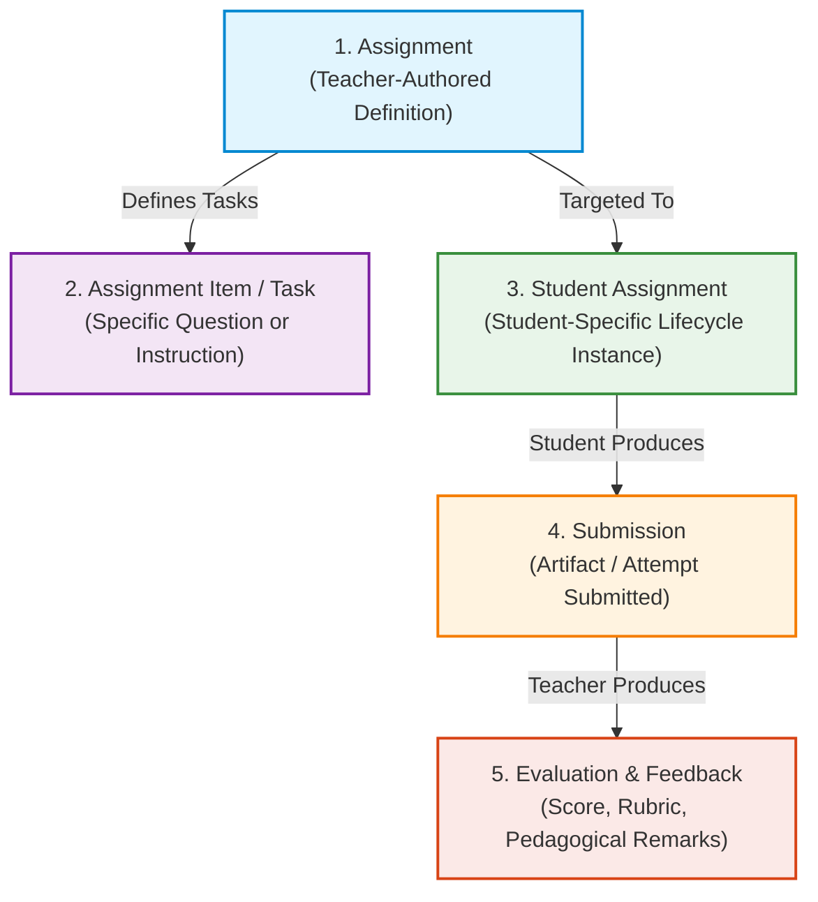

1. **Assignment (Master Definition)**:
   The authoritative pedagogical entity created by a teacher or academic admin. It specifies *what* must be done, which curriculum topics are covered, total marks, deadlines, and submission rules. It exists independently of who is assigned to complete it.
2. **Assignment Item / Task**:
   A discrete problem, question, or instructional step within an assignment. An assignment may consist of a single holistic prompt (e.g. "Complete Exercise 4.2 in your notebook and upload photos") or multiple discrete items (e.g. Question 1, Question 2, Question 3).
3. **Student Assignment (Lifecycle Instance)**:
   The personal junction record connecting a specific student to an Assignment. It holds the student's personal assignment state (e.g. `assigned`, `in_progress`, `submitted`, `evaluated`, `resubmission_required`), availability dates, and tracking metadata.
4. **Submission**:
   The tangible deliverable generated and submitted by the student at a given point in time. It encapsulates the student's answers, text responses, uploaded files, or external links. Each submission attempt is immutable once submitted.
5. **Evaluation & Feedback**:
   The authoritative review performed by a teacher on a specific submission. It records awarded marks, grading status, general feedback comments, and optional item-by-item corrections.

---

## 5. Assignment Types

Assignments vary widely across secondary school Mathematics and Science. To prevent brittle database enumerations, the architecture proposes an extensible classification model:

| Conceptual Type | Pedagogical Focus | Typical Format / Deliverable | Example Scenario |
|:---|:---|:---|:---|
| **`worksheet`** | Structured problem sets | Multi-question PDF/form, numerical solutions | CBSE Class 10 Quadratic Equations Practice Sheet |
| **`written_work`** | Derivations, proofs, long answers | Scanned handwritten notebook pages | ICSE Class 9 Archimedes Principle Derivation |
| **`numerical_practice`** | Computational drills | Step-by-step calculations | Class 10 Light: Lens Formula & Magnification Problems |
| **`conceptual_questions`**| Short-answer analytical questions | Text explanations, diagram descriptions | Class 10 Biology: Reflex Arc Function & Pathways |
| **`project`** | Investigative extended work | Multi-page report, chart, or external link | Class 8 Science: Soil Erosion Local Survey |
| **`research_activity`** | Guided literature/fact finding | Structured summary document | Class 9 History of the Periodic Table Timeline |
| **`mixed`** | Multi-modal combined assignment | Theory text + numerical scan + diagram upload | Term 1 Comprehensive Science Revision Homework |

### Separation of Assignment Type from Resource Type
A critical architectural invariant is that **Assignment Type** and **Learning Resource Type** remain separate concepts:
- A **Learning Resource** (`notes`, `worksheet`, `video`, etc.) is passive, static study material retrieved from the institutional library.
- An **Assignment** is an active learning transaction requiring student effort, timeline compliance, submission of work, and teacher evaluation.
- An assignment may *reference* or *attach* a learning resource (e.g. an assignment of type `worksheet` might link to a learning resource PDF as its problem sheet), but their domain models and tables remain completely separate.

---

## 6. Curriculum Mapping

Assignments must directly integrate with the existing MS Tutorials academic curriculum hierarchy established in Phase 5.6 and Phase 5.7:

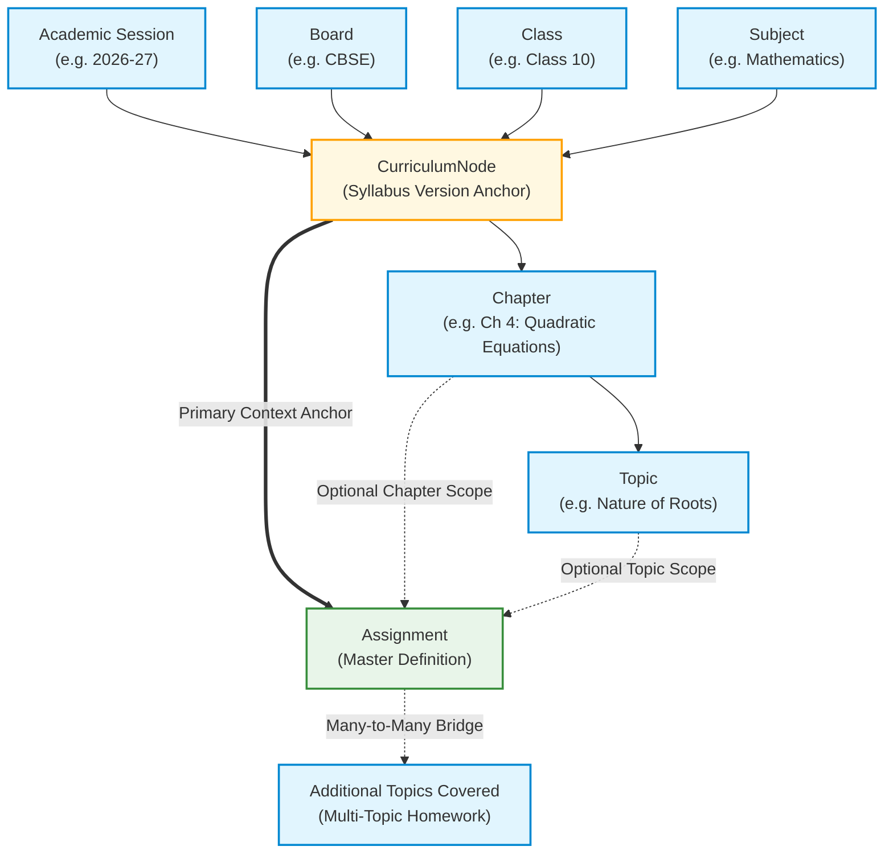

### Architectural Rules:
1. **Reuse Existing `curriculum_nodes`**: Every assignment must be anchored to a valid `curriculum_node_id`. This instantly and authoritatively resolves its Session, Board, Class, and Subject without duplicating foreign keys or allowing mismatched combinations.
2. **Flexible Granularity**:
   - **Node-Level**: Comprehensive revision assignments spanning an entire subject term.
   - **Chapter-Level**: Standard weekly assignments mapped to a specific `chapter_id`.
   - **Topic-Level**: Focused concept checks mapped to a single `topic_id`.
3. **Multi-Topic Support**: In secondary tuition, a weekend homework set frequently bridges multiple adjacent topics (e.g. *Topic 1: Factorization* and *Topic 2: Quadratic Formula*). The architecture supports multi-topic linkage via an optional junction bridge rather than artificially constraining one assignment to exactly one atomic topic.

---

## 7. Assignment Targeting Architecture

In a tuition academy, teachers author an assignment once, but distribute it along different cohort boundaries:

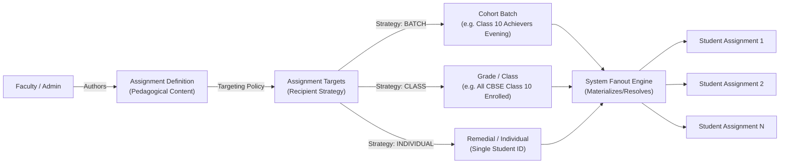

### Architectural Principles:
1. **Definition vs. Recipient Separation**:
   One `Assignment` master row describes the homework. It is associated with one or more `assignment_targets` specifying target type (`batch`, `class`, or `student`) and target UUID.
2. **Storage Efficiency & Scaling**:
   When targeting an entire batch of 30 students, the system must not duplicate problem descriptions, max marks, or instructions 30 times. The master definition remains singular.
3. **Target Materialization**:
   When an assignment transitions from `draft` to `published`, the system materializes lightweight `student_assignments` tracking rows for every student currently enrolled in the targeted scope. If a student enrolls late into a batch, an idempotent sync job generates missing assignment instances.

---

## 8. Assignment Lifecycle

The assignment system manages two complementary state machines: the **Master Assignment Lifecycle** and the **Student Assignment Lifecycle**.

### 8.1 Master Assignment Lifecycle
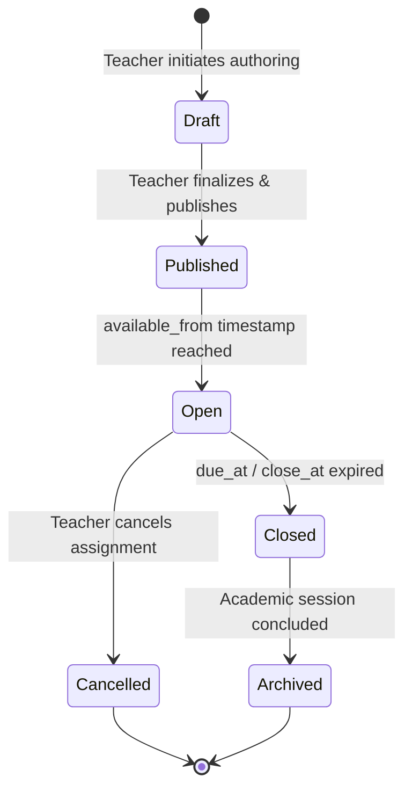

- **`Draft`**: Editable by the authoring teacher. Invisible to students.
- **`Published`**: Locked for major schema changes; recipients resolved.
- **`Open`**: Visible in student portals; submissions actively accepted.
- **`Closed`**: Due date / cut-off reached; submissions rejected (unless late policy allows).
- **`Cancelled`**: Voided by faculty. Submissions stopped; existing submissions retained for audit.
- **`Archived`**: Read-only historical record at session completion.

### 8.2 State Exclusivity vs. Derived State
- **Authoritative Stored States**: `draft`, `published`, `cancelled`, `archived`.
- **Derived States**: `open` (derived: `is_published = true AND NOW() >= available_from AND NOW() <= close_at`), `closed` (derived: `NOW() > close_at`). Deriving temporal states eliminates database polling update cron overhead.

---

## 9. Availability and Due Dates

To maintain unambiguous academic scheduling across Indian standard time:
1. **Timestamp Standards**:
   - All timestamps (`available_from`, `due_at`, `close_at`, `submitted_at`, `evaluated_at`) must be stored in UTC (`TIMESTAMP` in MySQL) and rendered in the student's localized timezone (`Asia/Kolkata` / IST by default).
2. **Temporal Boundaries**:
   - `available_from`: The precise instant the assignment becomes visible and actionable in the Student Portal.
   - `due_at`: The official target completion deadline. Submissions before this timestamp are marked on-time.
   - `close_at` (Optional): The hard cut-off. If `close_at > due_at`, a grace period exists. If `close_at` is omitted, the assignment defaults to `close_at = due_at`.
3. **Late Submission Policy**:
   Configured per assignment via a policy flag:
   - `reject`: Strictly block submissions once `due_at` has passed.
   - `allow_flagged`: Accept submissions between `due_at` and `close_at`, but automatically mark the submission record as `is_late = true`.
   - `allow_penalty`: Allow late submissions with pre-calculated mark deduction rules (future extension).

---

## 10. Student Assignment State Model

The student portal requires deterministic, honest state tracking:

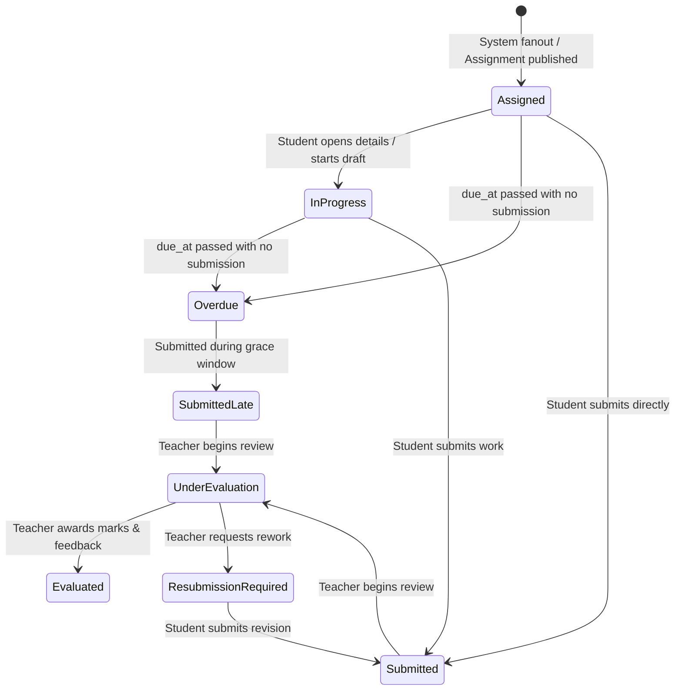

### Stored vs. Derived UI States:
- **Stored State (`status`)**:
  - `assigned`: Pending action by student.
  - `in_progress`: Draft answer or partial work saved.
  - `submitted`: Final solution submitted by student; awaiting evaluation.
  - `evaluated`: Evaluated by faculty; marks and feedback available.
  - `resubmission_required`: Returned by teacher with specific rework instructions.
- **Derived State (`display_status`)**:
  - `overdue`: Derived dynamically in the API/UI if `status IN ('assigned', 'in_progress') AND NOW() > due_at`.
  - `submitted_late`: Derived if `submitted_at > due_at`.

---

## 11. Submission Architecture

Secondary students complete assignments through various practical media:

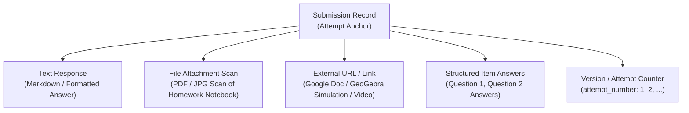

### Submission Requirements:
1. **Multi-Modal Payload**:
   The submission entity accommodates text solutions, one or more file uploads (e.g. up to 5 images of notebook pages combined or individual), and external project links.
2. **Attempt History & Immutability**:
   Once a student clicks "Submit Assignment", that submission record is cryptographically frozen (`is_final = true`). If a teacher subsequently requests a resubmission, a new submission record with `attempt_number = 2` is created, preserving full audit history of earlier work.
3. **No Premature Storage Provider Lock-in**:
   Following the Phase 5.10D boundary, file uploads record metadata (`file_url`, `file_size_bytes`, `mime_type`) without hardcoding proprietary cloud providers.

---

## 12. Evaluation Architecture

Evaluation represents the teacher's formal pedagogical assessment of a submission:

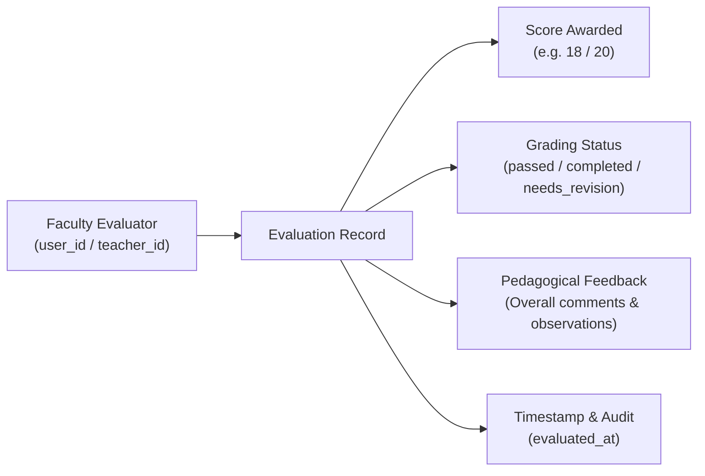

### Architectural Principles:
1. **Separation from Submission**:
   The evaluation is a distinct entity linked to a specific submission attempt. A submission can exist without an evaluation (e.g. while pending in the teacher's queue), but an evaluation cannot exist without a submission.
2. **Score Integrity**:
   - `score_awarded` must be a non-negative decimal: $0 \le \text{score\_awarded} \le \text{max\_score}$.
   - If an assignment is non-graded (e.g. practice reading or project log), evaluation records completion status (`completed`, `incomplete`) without forcing arbitrary numerical marks.
3. **Teacher Attribution**:
   Every evaluation records `evaluated_by` (linking to `teachers.id`) and `evaluated_at`. For security and privacy, student-facing APIs expose the teacher's display name while withholding internal administrative IDs.

---

## 13. Feedback Architecture

Effective learning requires constructive, actionable feedback rather than a solitary number:

1. **General Assignment Feedback**:
   High-level observations regarding overall conceptual clarity, neatness, mathematical presentation, and adherence to board formatting standards (e.g. *"Excellent derivation steps in Question 3; ensure you write final SI units in Question 5 to avoid losing board marks."*).
2. **Item-Level / Question-Level Feedback (Future Extension)**:
   For assignments composed of discrete structured questions, the architecture accommodates optional line-item feedback (`submission_item_feedback`), identifying the exact step where an error occurred.
3. **Pedagogical Non-Prescription**:
   General feedback is mandatory for returned or revised assignments; item-level feedback is optional to keep teacher evaluation workflows rapid and lightweight.

---

## 14. Resubmission Architecture

When a student submits incomplete work or demonstrates significant misunderstandings, teachers need a mechanism to request rework:

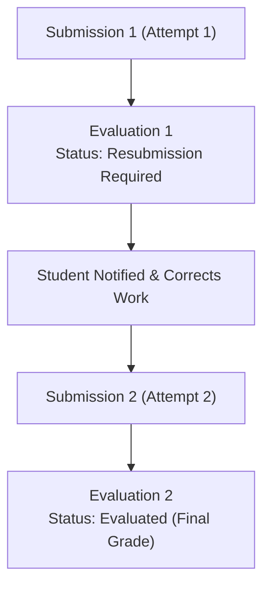

### Resubmission Policies:
Each assignment configures a `resubmission_policy`:
- `none`: Single submission only. No revisions permitted.
- `single`: At most one resubmission permitted if requested by faculty.
- `multiple`: Up to $N$ resubmissions allowed until satisfactory completion.

### Versioning Rules:
- The Student Portal always displays the latest submission by default, while providing an expandable drawer to review previous submission attempts and historical teacher remarks.
- Assignment completion metrics consider the latest evaluated attempt.

---

## 15. Marks and Academic Performance Boundary

A vital principle of the MS Tutorials academic architecture is the strict boundary between **Formative Practice** and **Summative Assessment**:

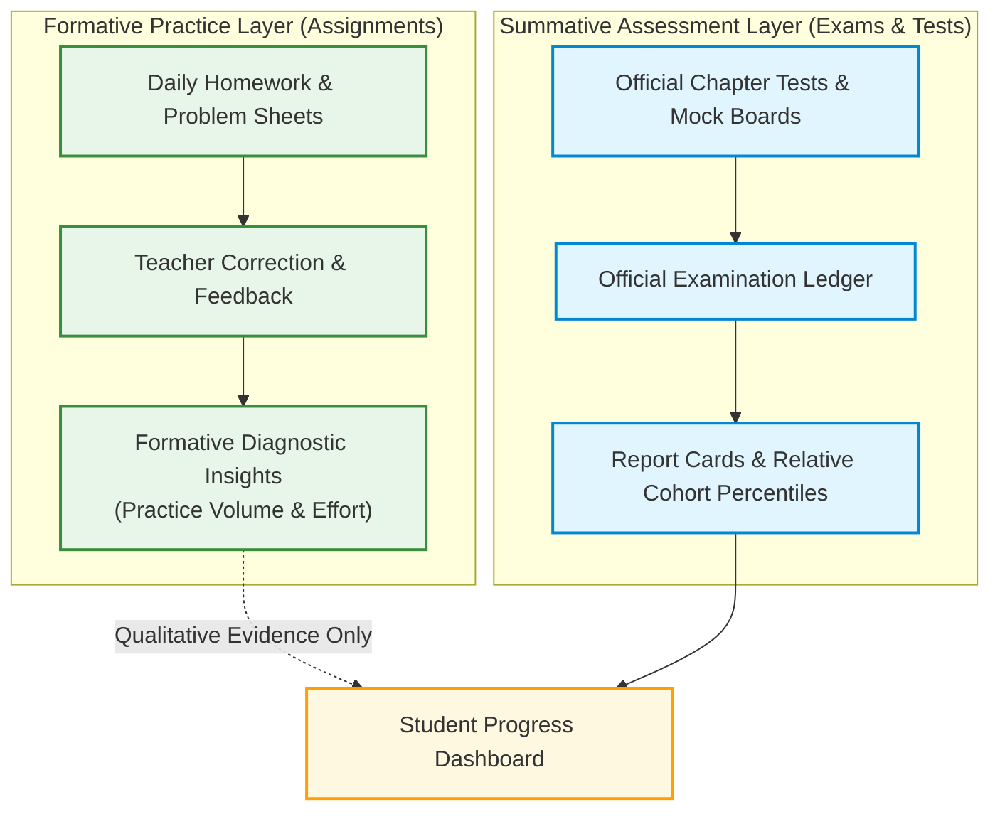

> [!IMPORTANT]
> **Boundary Rule**: Assignment scores must **NOT** automatically inject into official examination marks ledgers. Assignments serve as low-stakes learning practice. Conflating homework completion with formal board exam scores distorts diagnostic analytics.

---

## 16. Question Bank Relationship

In future phases, MS Tutorials will introduce a centralized Question Bank. The Assignment architecture anticipates this without creating premature coupling:

1. **Standalone Assignment Items (Current Design)**:
   Assignment items are defined inline within the assignment (title, prompt text, marks, reference attachments).
2. **Referenced Question Bank Items (Future Extension)**:
   Assignment items may optionally store a nullable `question_bank_item_id`. If populated, the prompt and standard solution are inherited from the bank; if null, the item operates in standalone mode.
3. **Zero Duplication**:
   Teachers will be able to mix standalone creative prompts with standardized past-board questions.

---

## 17. Learning Resource Relationship

The learning resource catalog (Phase 5.8D / 5.10D) and the assignment subsystem interact synergistically while maintaining database decoupling:

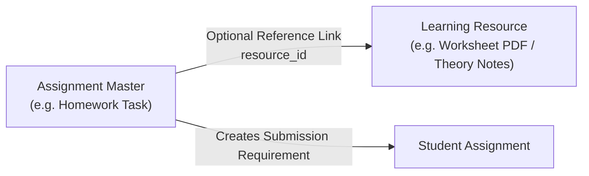

- **Reference, Never Merge**: An assignment can link to an existing `learning_resource_id` (e.g. *"Refer to Study Notes RN-2601 while solving this problem set"*).
- The `learning_resources` table remains the single source of truth for instructional assets; `assignments` remains the single source of truth for student task workflows.

---

## 18. Teacher Ownership & Role Authorization

Assignment operations are governed by strict role-based access control (RBAC):

1. **Assignment Authoring**: Restricted to users with role `teacher` or `admin`.
2. **Cohort Scoping**:
   - A teacher may only assign tasks to batches or classes for which they are designated faculty.
   - A teacher can view and evaluate submissions only for students belonging to their assigned batches.
3. **Admin Supervision**:
   - Users with role `admin` have supervisory read and audit access across all institute assignments.
   - `superadmin` can edit or reassign tasks across departments; `staff` permissions adhere to established departmental boundaries.

---

## 19. Student Security Invariants

The assignment subsystem enforces zero-trust data isolation:
- **Strict User-Scoped Queries**: All student-facing queries derive identity exclusively from `req.user.id`. The client cannot pass `studentId` or query other students' assignments.
- **Submission Isolation**: Attempting to view or submit an assignment belonging to another student returns `404 NOT_FOUND` (preventing ID enumeration).
- **Evaluation Confidentiality**: Teacher feedback, scores, and marked scans are strictly confidential between the student, the evaluating teacher, and authorized institute staff.
- **In-Memory & Cookie Security**: Preserves locked Phase 5.10B/5.10C standards: zero browser storage of tokens, HttpOnly refresh cookies, and in-memory access tokens.

---

## 20. Parent Portal Future Access

The parent domain (established in Phase 5.1 and 5.5) will eventually incorporate a read-only assignment monitoring view:
- **Linked Child Visibility**: A parent can view assignments, due dates, submission statuses, and teacher remarks *only* for verified children linked in `parent_student`.
- **Read-Only Invariant**: Parents can never submit, edit, or delete assignments or submissions.
- **Current Status**: **FUTURE / NOT IMPLEMENTED**. No parent assignment endpoints or UI views are constructed in this phase.

---

## 21. Future Notification Integration

Assignments will serve as key event triggers for future communication channels:
- **Event: Assignment Assigned**: Dispatched to student when an assignment transitions to `open`.
- **Event: Deadline Reminder**: Dispatched 24 hours prior to `due_at` if status remains `assigned` or `in_progress`.
- **Event: Submission Received**: Instant confirmation to student upon successful upload.
- **Event: Feedback Published**: Dispatched when teacher completes evaluation.
- **Current Status**: **FUTURE / NOT IMPLEMENTED**.

---

## 22. Database Design (Conceptual Blueprint)

> ⚠️ **IMPORTANT**: This schema is **CONCEPTUAL ONLY**. No DDL scripts, migrations, or tables are created in Phase 5.10E-A.

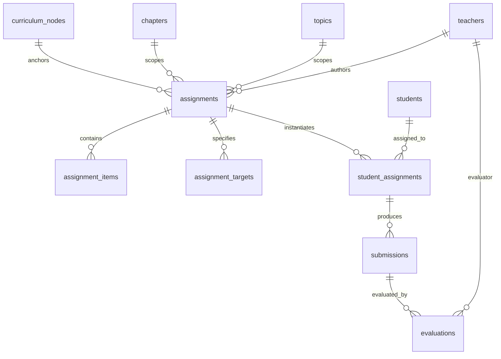

### Proposed Conceptual Entities:

#### 1. `assignments` (Authoritative Master Definition)
- `id`: UUID (Primary Key).
- `curriculum_node_id`: UUID (FK -> `curriculum_nodes.id`). Resolves Session, Board, Class, Subject.
- `chapter_id`: UUID (FK -> `chapters.id`, Nullable). Specific chapter scope.
- `topic_id`: UUID (FK -> `topics.id`, Nullable). Primary atomic concept scope.
- `title`: VARCHAR(200). Human-readable assignment title.
- `description`: TEXT. Rich pedagogical instructions.
- `assignment_type`: VARCHAR(30). `worksheet`, `written_work`, `numerical_practice`, etc.
- `max_score`: DECIMAL(5,2). Maximum obtainable marks (nullable for non-graded tasks).
- `available_from`: TIMESTAMP. When assignment becomes visible.
- `due_at`: TIMESTAMP. Official completion deadline.
- `close_at`: TIMESTAMP. Cut-off after which no submissions are accepted.
- `late_policy`: VARCHAR(20). `reject`, `allow_flagged`, `allow_penalty`.
- `resubmission_policy`: VARCHAR(20). `none`, `single`, `multiple`.
- `max_resubmissions`: TINYINT UNSIGNED. Cap on revision cycles.
- `status`: VARCHAR(20). `draft`, `published`, `cancelled`, `archived`.
- `created_by`: UUID (FK -> `users.id` / `teachers.id`). Author faculty.
- `created_at`, `updated_at`: Standard audit timestamps.

#### 2. `assignment_items` (Discrete Tasks / Questions — Optional Breakdown)
- `id`: UUID (Primary Key).
- `assignment_id`: UUID (FK -> `assignments.id` ON DELETE CASCADE).
- `sequence_order`: SMALLINT UNSIGNED. Question ordering.
- `item_type`: VARCHAR(30). `text_prompt`, `numerical`, `upload_prompt`, `link_prompt`.
- `prompt_text`: TEXT. Specific question instruction.
- `max_score`: DECIMAL(5,2). Marks allocated to this item.
- `reference_resource_id`: UUID (FK -> `learning_resources.id`, Nullable).

#### 3. `assignment_targets` (Recipient Targeting Policy)
- `id`: UUID (Primary Key).
- `assignment_id`: UUID (FK -> `assignments.id` ON DELETE CASCADE).
- `target_type`: VARCHAR(20). `batch`, `class`, `student`.
- `target_id`: VARCHAR(36). UUID of corresponding `batches.id`, `classes.id`, or `students.id`.

#### 4. `student_assignments` (Student Personal Lifecycle Instance)
- `id`: UUID (Primary Key).
- `assignment_id`: UUID (FK -> `assignments.id` ON DELETE CASCADE).
- `student_id`: UUID (FK -> `students.id` ON DELETE CASCADE).
- `status`: VARCHAR(30). `assigned`, `in_progress`, `submitted`, `evaluated`, `resubmission_required`.
- `first_opened_at`: TIMESTAMP NULL. Audit when student first viewed the task.
- `current_attempt`: TINYINT UNSIGNED DEFAULT 1. Active submission attempt.
- `final_score`: DECIMAL(5,2) NULL. Latest evaluated score.
- `is_completed`: BOOLEAN DEFAULT FALSE. Completion flag for rapid progress aggregation.

#### 5. `submissions` (Student Deliverable Attempts)
- `id`: UUID (Primary Key).
- `student_assignment_id`: UUID (FK -> `student_assignments.id` ON DELETE CASCADE).
- `attempt_number`: TINYINT UNSIGNED DEFAULT 1.
- `text_response`: TEXT NULL. Typed solution or notes.
- `file_url`: VARCHAR(500) NULL. Uploaded deliverable URL (scan/PDF).
- `file_size_bytes`: BIGINT UNSIGNED NULL.
- `mime_type`: VARCHAR(100) NULL.
- `external_link`: VARCHAR(500) NULL. External project link.
- `submitted_at`: TIMESTAMP DEFAULT CURRENT_TIMESTAMP.
- `is_late`: BOOLEAN DEFAULT FALSE. Automatic indicator if `submitted_at > due_at`.
- `is_final`: BOOLEAN DEFAULT TRUE. Locked once submitted.

#### 6. `evaluations` (Teacher Assessment & Review)
- `id`: UUID (Primary Key).
- `submission_id`: UUID (FK -> `submissions.id` ON DELETE CASCADE).
- `evaluated_by`: UUID (FK -> `teachers.id`). Evaluating faculty.
- `score_awarded`: DECIMAL(5,2) NULL. Marks awarded.
- `grading_status`: VARCHAR(30). `evaluated`, `resubmission_required`, `needs_improvement`.
- `feedback`: TEXT. Comprehensive pedagogical comments and correction remarks.
- `evaluated_at`: TIMESTAMP DEFAULT CURRENT_TIMESTAMP.

---

## 23. Comprehensive Entity Relationship Diagram

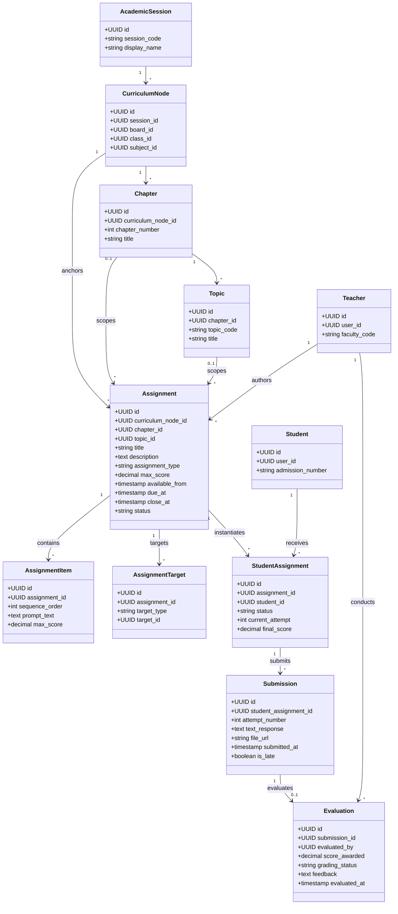

---

## 24. Future API Architecture (Illustrative Only)

> ⚠️ **NOTICE**: The following endpoints are **CONCEPTUAL DESIGNS ONLY**. They do NOT exist in the current codebase.

### Student Assignment Endpoints (Future Phase 5.10E-D)
- `GET /api/v1/student/assignments`: Paginated list of student's personal assignments, filterable by `status` (`pending`, `submitted`, `evaluated`), `subjectId`, `chapterId`.
- `GET /api/v1/student/assignments/:id`: Comprehensive detail of a specific assignment instance, including instructions, items, due dates, submission history, and evaluation feedback.
- `POST /api/v1/student/assignments/:id/submissions`: Submit student deliverable (text, files, links) for the active attempt.
- `GET /api/v1/student/assignments/:id/submissions`: Retrieve historical submission attempts and associated feedback.

### Teacher Assignment Endpoints (Future Phase 5.10E-G / Phase 7+)
- `POST /api/v1/teacher/assignments`: Create a new assignment definition.
- `PUT /api/v1/teacher/assignments/:id`: Update draft assignment.
- `POST /api/v1/teacher/assignments/:id/publish`: Publish assignment and trigger recipient fanout.
- `GET /api/v1/teacher/assignments/:id/submissions`: Review student submission queue for an assignment.
- `POST /api/v1/teacher/submissions/:id/evaluate`: Submit score, evaluation status, and qualitative feedback.

### Admin Assignment Endpoints (Future Phase 7+)
- `GET /api/v1/admin/assignments`: Supervisory institutional overview.
- `DELETE /api/v1/admin/assignments/:id`: Void or archive assignments in emergency.

---

## 25. Student Portal Integration Blueprint

Within the Student Portal navigation shell (`/student/*`), assignments will occupy the dedicated route `/student/assignments`:

```mermaid
flowchart TD
    Dashboard["/student/dashboard<br/>(Assignments Summary Card)"] --> Lib["/student/assignments<br/>(Assignments Queue & Filter Bar)"]

    Lib --> Detail["/student/assignments/:id<br/>(Task Briefing & Instructions)"]

    Detail --> StateBranch{Current Student State}

    StateBranch -->|Assigned / In Progress| Workspace["Submission Workspace<br/>(Answer Editor / File Upload / Link)"]
    Workspace --> ActionSubmit["Click Submit -> Validation -> Freeze Submission"]

    StateBranch -->|Submitted (Pending Review)| Pending["Awaiting Faculty Evaluation<br/>(Read-Only Preview of Deliverables)"]

    StateBranch -->|Evaluated| ResultView["Evaluation Report Card<br/>(Score Awarded, Badges, Qualitative Feedback)"]

    StateBranch -->|Resubmission Required| Resubmit["Revision Workspace<br/>(View Teacher Notes + Submit Attempt 2)"]
```

---

## 26. Teacher Portal Integration Blueprint (Future)

Teachers will follow a streamlined authoring and evaluation workflow:
1. **Curriculum Selection**: Select Session, Board, Class, Subject, Chapter, and Topic.
2. **Assignment Authoring**: Input title, pedagogical instructions, max marks, and upload reference sheets.
3. **Target Allocation**: Select one or more teaching batches (e.g. *Class 10 Achievers Evening*).
4. **Publishing**: Set `available_from` and `due_at`. Click Publish.
5. **Grading Desk**: View submission inbox sorted by submission timestamp; preview scanned notebooks side-by-side with rubric; enter marks, write feedback, and click Return to Student.

---

## 27. Admin Integration Blueprint (Future)

Institutional administrators ensure curriculum coverage and homework cadence:
- **Pacing Analytics**: Monitor whether homework frequency aligns with syllabus milestones across all faculty.
- **Completion Audits**: Inspect institute-wide submission rates to identify struggling cohorts.
- **Departmental Filtering**: Science and Maths HODs oversee department-specific homework assignments.

---

## 28. Progress & Learning Intelligence Relationship

Assignments serve as active diagnostic touchpoints within the established **MS Tutorials Six-Step Learning Cycle**:

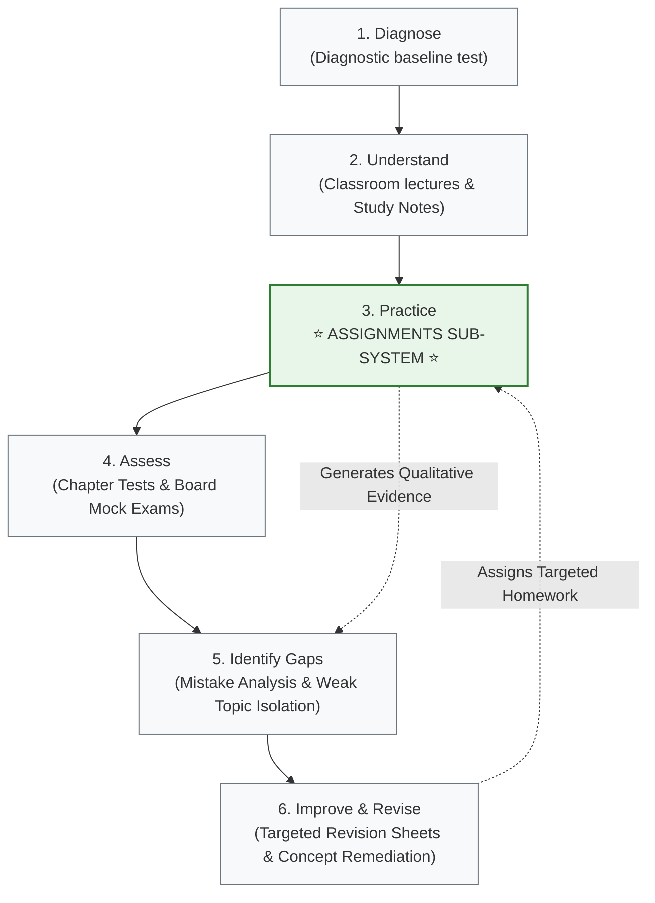

> [!CAUTION]
> **Learning Cycle Invariant**:
> - The official MS Tutorials learning cycle consists of **exactly six steps**.
> - **Do NOT add "Mastery" as a seventh official step.**
> - Assignments belong firmly to **Step 3: Practice**, providing empirical data that fuels **Step 5: Identify Gaps**.
> - Assignments do not replace the formal **Assess** phase (Step 4), which is governed by timed, proctored examinations.

---

## 29. Data Integrity Invariants

Future database implementations must enforce the following integrity rules:
1. **Academic Scope Compatibility**: An assignment target batch must match the `session_id`, `board_id`, and `class_id` of the assignment's anchor `curriculum_node_id`.
2. **Temporal Consistency**: `available_from < due_at <= close_at`.
3. **Score Boundaries**: $0 \le \text{score\_awarded} \le \text{max\_score}$.
4. **Immutability of Historical Submissions**: Once a submission attempt has been evaluated, its records and files cannot be modified or replaced.
5. **Single Active Instance**: A student cannot have duplicate active `student_assignments` instances for the same master assignment.

---

## 30. Auditability and Governance

To support dispute resolution and academic compliance:
- **Timestamp Tracking**: Authoritative UTC recording for `created_at`, `published_at`, `first_opened_at`, `submitted_at`, and `evaluated_at`.
- **Identity Privacy**: Student audit records expose teacher full names while withholding administrative identifiers, database hashes, or internal staff metadata.
- **Soft Deletion & Archival**: Cancelled assignments and superseded attempts are never hard-deleted; they are flagged to maintain complete academic dispute records.

---

## 31. Future File Delivery and Upload Architecture

Building on the Phase 5.10D delivery boundary:
- **Student Uploads**: Students will upload handwritten notebook scans via secure multipart streams.
- **Storage Infrastructure**: Uploads will target private object storage buckets (e.g. AWS S3 or Cloudflare R2) via short-lived pre-signed URLs generated by backend APIs.
- **Safety**: Uploads will be strictly validated for permitted MIME types (`image/jpeg`, `image/png`, `application/pdf`) and file size limits ($\le 15\text{ MB}$ per scan).
- **Current Status**: **FUTURE / NOT IMPLEMENTED**.

---

## 32. Performance and Scaling Considerations

- **Fanout vs. Query Optimization**: Using lightweight junction records (`student_assignments`) prevents duplicating heavy assignment text across thousands of students.
- **Indexing Strategy**: Indexes on `(student_id, status)`, `(assignment_id, status)`, and `(curriculum_node_id, created_at)` will ensure sub-50ms dashboard query latencies.
- **Pagination**: All assignment collection endpoints will implement cursor or offset pagination (defaulting to 20 items per page).

---

## 33. Universal Accessibility (a11y)

Future frontend assignment screens must comply with WCAG 2.1 Level AA:
- Explicit form `<label>` associations for answer textareas and file inputs.
- Clear ARIA attributes (`aria-live="polite"` for upload progress, `role="status"` for due date countdowns).
- High-contrast visual indicators for overdue vs. submitted tasks that do not rely on color alone.
- Seamless keyboard navigation across tabbed question items.

---

## 34. Responsive User Experience

Recognizing that homework is often photographed and uploaded from smartphones:
- **Mobile First**: File upload components must support direct camera capture on mobile devices (`capture="environment"`).
- **Tablet / Desktop Splitting**: Desktop views present the question prompt on the left pane and the answer workspace/scanned document viewer on the right pane.

---

## 35. Deterministic UI State Handling

The assignment UI will handle seven distinct operational states without crashing or showing blank layouts:
1. **Loading State**: Accessible skeleton cards and spinners while queries resolve.
2. **Empty State (No Assignments)**: Friendly illustration indicating all homework is completed.
3. **Unenrolled State**: Notice explaining that active batch enrollment is required for assignments.
4. **Overdue / Expired State**: Clear badges indicating deadline expiration and applicable late policies.
5. **Submitted / Under Review State**: Reassuring notice that work is submitted and faculty review is pending.
6. **Returned for Revision State**: Prominent callout highlighting faculty rework instructions.
7. **Error State**: Non-technical error messages with manual retry buttons.

---

## 36. Implementation Roadmap

The Assignment Subsystem will be executed across clean, incremental phases:

```mermaid
flowchart LR
    P1["Phase 5.10E-A<br/>Architecture & Design<br/>(CURRENT PHASE)"] -->
    P2["Phase 5.10E-B<br/>Database Schema & Migrations"] -->
    P3["Phase 5.10E-C<br/>Backend APIs & Repositories"] -->
    P4["Phase 5.10E-D<br/>Student Assignment Portal UI"] -->
    P5["Phase 5.10E-E<br/>Submission & Upload Engine"] -->
    P6["Phase 5.10E-F<br/>Teacher Evaluation & Feedback"] -->
    P7["Phase 5.10E-G<br/>Progress & Analytics Bridge"]

    classDef current fill:#e8f5e9,stroke:#2e7d32,stroke-width:2px;
    classDef future fill:#ffffff,stroke:#757575,stroke-width:1px,stroke-dasharray: 4 4;

    class P1 current;
    class P2,P3,P4,P5,P6,P7 future;
```

- **Phase 5.10E-A (Current)**: Architecture & Domain Blueprint Specification (DOCUMENTATION ONLY).
- **Phase 5.10E-B**: Relational Schema DDL & Database Migrations (`assignments`, `assignment_targets`, `student_assignments`, `submissions`, `evaluations`).
- **Phase 5.10E-C**: Backend Assignment APIs, Services, and Scoped Access Control.
- **Phase 5.10E-D**: Student Assignment Portal Frontend (`/student/assignments` listing & details).
- **Phase 5.10E-E**: Student Submission System (Text responses & file upload integration).
- **Phase 5.10E-F**: Teacher Evaluation, Grading, and Feedback Workflows.
- **Phase 5.10E-G**: Diagnostic Progress & Learning Cycle Integration.

---

## 37. Acceptance Criteria Checklist

The Phase 5.10E-A assignment architecture is complete when all of the following criteria are met:
- [x] Existing Phase 5.1 identity architecture (`users`, `students`, `teachers`, `admins`) is respected without modifications.
- [x] Existing Phase 5.6/5.7 academic hierarchy (`curriculum_nodes`, `chapters`, `topics`, `batches`, `student_enrollments`) is reused without creating a parallel hierarchy.
- [x] Assignments are clearly decoupled from static learning resources (`learning_resources`).
- [x] Master assignment definitions are separated from student assignment lifecycle instances.
- [x] Student submissions are structurally separated from teacher evaluations.
- [x] Resubmission policies and versioning models are specified.
- [x] Curriculum mapping supports node, chapter, topic, and multi-topic scopes.
- [x] Cohort targeting (class, batch, student) is defined without data duplication.
- [x] Student data isolation and zero-trust security invariants are documented.
- [x] Teacher and admin authorization boundaries are documented.
- [x] Formative practice marks are kept strictly separate from formal summative exam scores.
- [x] Official MS Tutorials six-step learning cycle is maintained without inventing a seventh "Mastery" step.
- [x] Adaptive learning and AI engines are explicitly marked as out of scope.
- [x] Future database entities and illustrative API endpoints are documented.
- [x] Zero application code, database tables, or backend routes are introduced in this phase.
