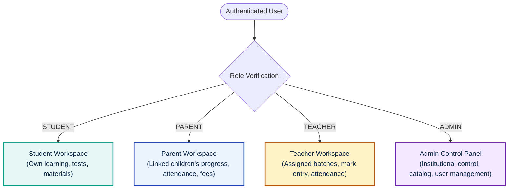
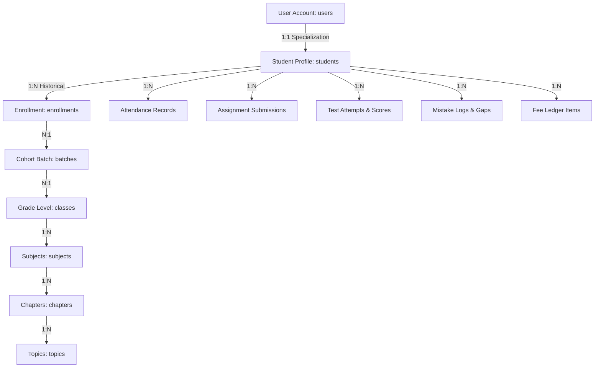
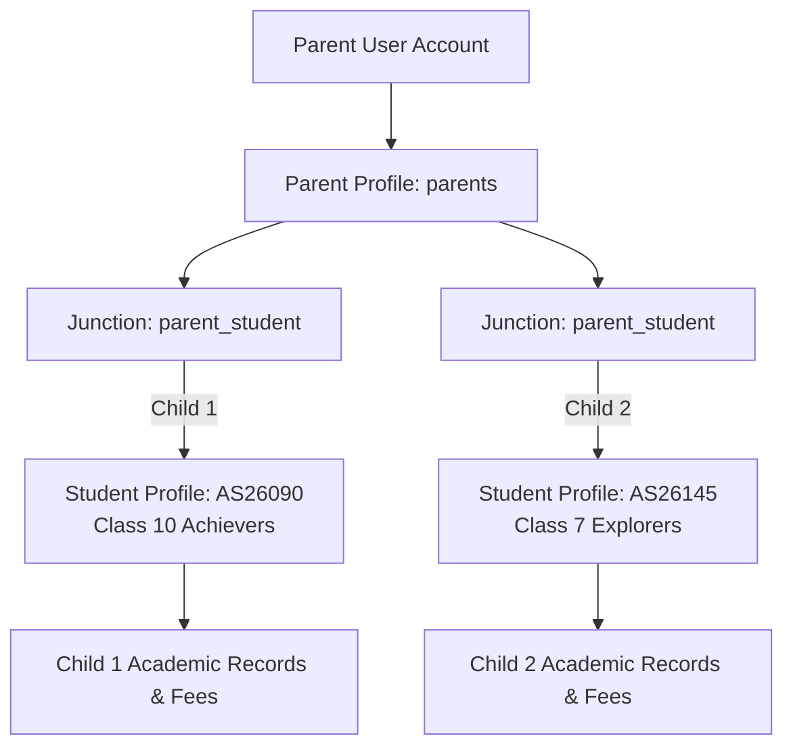
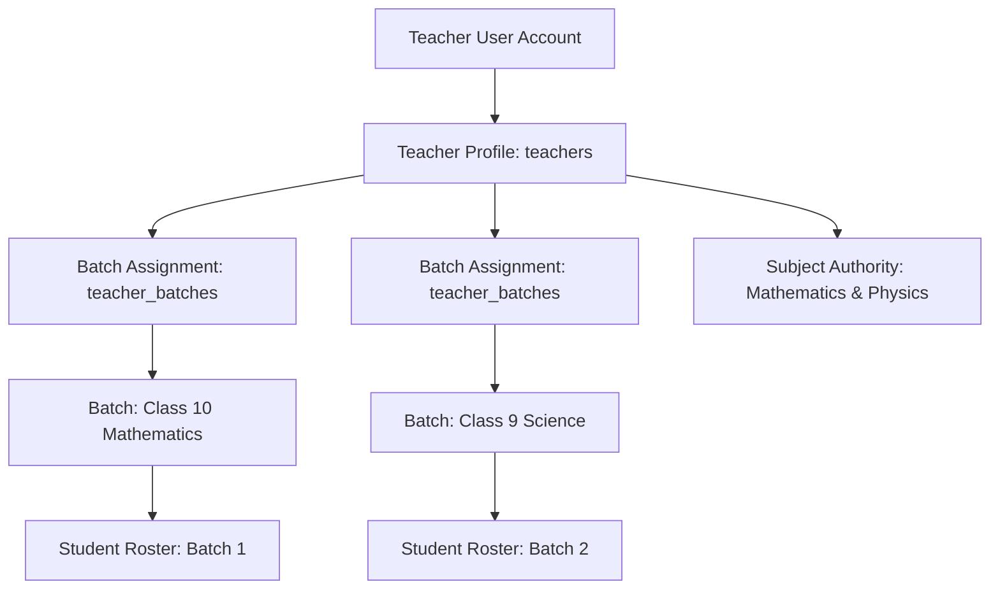
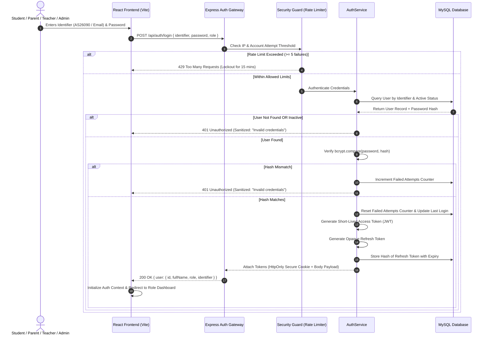
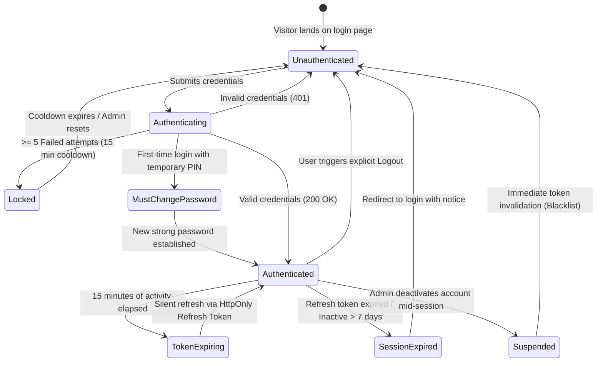
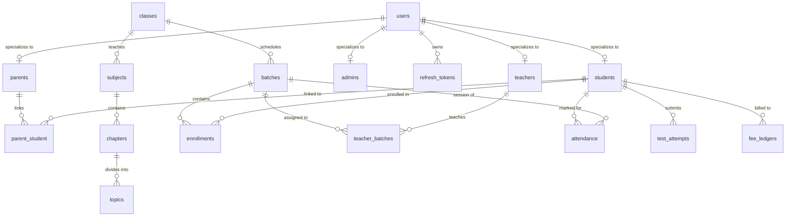
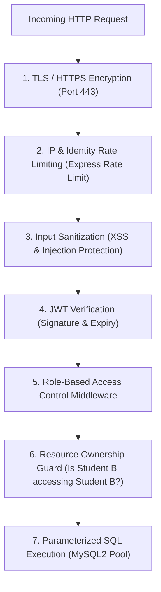
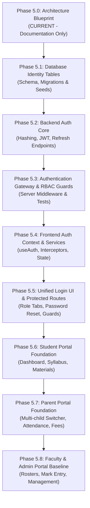

# MS Tutorials — Authentication & User-System Architecture Blueprint

> **Phase**: 5.0 (Architecture & Documentation Baseline)  
> **Status**: APPROVED BLUEPRINT (DOCUMENTATION ONLY)  
> **Target Release**: Future LMS & Portal Foundation (Phases 5.1 – 5.8)  
> **Governing Constitution**: `docs/AI_CODING_GUIDE.md` | `docs/architecture.md` | `docs/database.md`  
> **Public Website Baseline**: Locked at commit `f99cbf5` (`/`, `/about`, `/programs`, `/learning-system`, `/resources`, `/contact`)  

---

## 1. Executive Charter & Purpose

This document establishes the comprehensive technical blueprint for the MS Tutorials identity, authentication, session management, and role-based access control (RBAC) architecture. 

It defines the architectural contract governing how **Students**, **Parents**, **Teachers**, and **Administrators** securely authenticate, access their respective functional workspaces, and interact with academic data without compromising data privacy, operational simplicity, or system performance.

### Strict Non-Implementation Boundary
> [!IMPORTANT]
> **Phase 5.0 is Documentation and Architectural Planning ONLY.**
> - **DO NOT** write application code, routes, or controllers.
> - **DO NOT** create login UI forms or mutate existing React pages.
> - **DO NOT** execute SQL scripts, migrations, or database table creation.
> - **DO NOT** install additional npm packages or security libraries prematurely.
> - **DO NOT** alter the locked Public Website V1 routes or components.
> 
> Real implementation begins only in subsequent sub-phases (5.1 onwards) after explicit user review and approval of this blueprint.

---

## 2. User Roles & Authorization Matrix

The MS Tutorials platform serves four authenticated personas, each possessing distinct educational objectives, administrative responsibilities, and data access scopes.



### 2.1 Persona Definitions & Boundaries

#### A. STUDENT
- **Purpose**: Engage in structured mathematics and science learning, submit assignments, attempt chapter evaluations, track personal progress, and review mistakes.
- **Allowed Access**:
  - Personal profile and enrolled academic track (Class 6–10).
  - Curriculum study notes, formula sheets, explanation videos, and assigned worksheets.
  - Assigned diagnostic tests and chapter evaluations.
  - Own test results, scorecards, topic accuracy, and personal error logs.
  - Own attendance history and institutional announcements.
- **Strictly Forbidden Access**:
  - Peer student records, test submissions, or score rankings.
  - Unenrolled batch resources or unassigned test question banks.
  - Test answer keys before official evaluation release.
  - Fee configuration, billing ledgers, or payment mutation.
  - Attendance marking or class roster manipulation.
  - Any administrative setting or user credential data.

#### B. PARENT
- **Purpose**: Maintain transparent, continuous visibility into their child’s academic growth, test performance, attendance consistency, fee status, and mentor recommendations.
- **Allowed Access**:
  - Personal parent profile and contact details.
  - Linked child's academic progress report, attendance records, and test results.
  - In a multi-child family: switch between linked children enrolled at MS Tutorials.
  - Student fee dues, payment history receipts, and invoice statements for linked children.
  - Direct mentor remarks, teacher feedback, and institutional circulars.
- **Strictly Forbidden Access**:
  - Academic records, attendance, or fees of non-linked students.
  - Direct submission or alteration of student worksheets or test attempts.
  - Teacher workspaces, class rosters, or gradebook modifications.
  - Institutional administrative settings or other parent profiles.

#### C. TEACHER / ACADEMIC MENTOR
- **Purpose**: Conduct classroom instruction, mark session attendance, assign homework worksheets, create/conduct chapter tests, enter evaluation marks, and provide student diagnostic feedback.
- **Allowed Access**:
  - Personal faculty profile and assigned teaching schedule.
  - Roster of students enrolled within their assigned classes and batches.
  - Attendance marking tools for scheduled sessions in assigned batches.
  - Assignment creation, worksheet publishing, and question bank authoring for assigned subjects.
  - Test creation, subjective answer evaluation, and mark entry for assigned students.
  - Topic-level gap identification and student progress analytics for assigned cohorts.
- **Strictly Forbidden Access**:
  - Batches, classes, or students not assigned to their academic responsibility (unless granted cross-batch relief).
  - Student fee records, financial accounting, or institutional billing data.
  - Global user management (cannot create/delete admin or teacher accounts).
  - System-level configuration, database settings, or environment keys.

#### D. SYSTEM ADMINISTRATOR (ADMIN)
- **Purpose**: Maintain institutional continuity, oversee student enrollments, assign faculty, configure class/batch taxonomies, manage fee schedules, and audit platform security.
- **Allowed Access**:
  - Complete user management (create, activate, suspend, reset passwords for students, parents, teachers, staff).
  - Academic structure management (Classes, Batches, Subjects, Chapters, Topics).
  - Enrollment workflows (admitting students, linking parents, assigning batches).
  - Fee management (fee structure setup, ledger auditing, offline receipt generation).
  - Resource library governance (curriculum validation, bulk file management).
  - System audit logs, security reports, and platform backup coordination.
- **Strictly Forbidden Access**:
  - Plaintext passwords (passwords are one-way hashed; admins can only trigger resets).
  - Direct manipulation of evaluated historical test logs without an audit trail.

---

### 2.2 Comprehensive Capability & Permission Matrix

| Functional Domain | Student | Parent | Teacher | Admin |
|:---|:---:|:---:|:---:|:---:|
| **View Own Profile** | ✅ Yes | ✅ Yes | ✅ Yes | ✅ Yes |
| **Edit Contact Details** | ⚠️ Request Only | ⚠️ Request Only | ⚠️ Request Only | ✅ Full |
| **View Study Material** | ✅ Enrolled Only | ❌ No | ✅ Assigned Subjects | ✅ Full Catalog |
| **Download Worksheets** | ✅ Enrolled Only | ❌ No | ✅ Assigned Subjects | ✅ Full Catalog |
| **Attempt Online Tests** | ✅ Assigned Only | ❌ No | ❌ No | ❌ No |
| **View Test Results** | ✅ Own Results | ✅ Linked Child | ✅ Assigned Batch | ✅ All Results |
| **View Error Analysis / Gaps**| ✅ Own Gaps | ✅ Linked Child | ✅ Assigned Students | ✅ Global Insights |
| **View Attendance History** | ✅ Own History | ✅ Linked Child | ✅ Assigned Batches | ✅ Full Institute |
| **Mark Attendance** | ❌ No | ❌ No | ✅ Assigned Batches | ✅ Full Institute |
| **Create Tests & Questions** | ❌ No | ❌ No | ✅ Assigned Subjects | ✅ Full Institute |
| **Grade / Evaluate Tests** | ❌ No | ❌ No | ✅ Assigned Batches | ✅ Override Authority |
| **Publish Homework / Tasks**| ❌ No | ❌ No | ✅ Assigned Batches | ✅ Full Authority |
| **View Fee Statements** | ⚠️ Read Only | ✅ Linked Child | ❌ No | ✅ Full Financials |
| **Record Fee Payments** | ❌ No | ❌ No | ❌ No | ✅ Full Authority |
| **Manage Batches & Classes** | ❌ No | ❌ No | ❌ No | ✅ Full Authority |
| **User Management (CRUD)** | ❌ No | ❌ No | ❌ No | ✅ Full Authority |
| **System Audit Logs** | ❌ No | ❌ No | ❌ No | ✅ Superadmin Only |

*Legend: ✅ Allowed | ❌ Strictly Denied | ⚠️ Conditional / Read-only scope*

---

## 3. Identity Model & Identification Taxonomy

A reliable identity architecture prevents user confusion and simplifies authentication for young learners who may not possess personal email addresses.

### 3.1 Student Identification Taxonomy (`AS26090`)

The established MS Tutorials student ID structure is defined as follows:

```text
       A S   2 6   0 9   0
       ──┬── ──┬── ──┬── ─┬─
         │     │     │    └── Student sequence number
         │     │     └─────── Class joined in that year (e.g. Class 09 / Class 9)
         │     └───────────── Joining year (e.g. 2026)
         └─────────────────── Student identifier / category / initial-based prefix
```

Therefore:
```text
AS | 26 | 09 | 0
   |    |    |
   |    |    └── Student sequence
   |    └────── Class at joining
   └─────────── Joining year
```

1. **Prefix (`AS`)**:
   - Student identifier, category, or initial-based prefix established for enrolled students at MS Tutorials.
   - Prevents collision with inquiry records or administrative identifiers.
2. **Joining Year (`26`)**:
   - Represents the two-digit academic session year of admission (`2026`).
   - Ensures natural chronological grouping across annual enrollment cycles.
3. **Class at Joining (`09`)**:
   - Represents the grade level of the student at the time of admission (e.g., `09` for Class 9, `10` for Class 10, `08` for Class 8, `06` for Class 6).
4. **Student Sequence (`0`)**:
   - Sequential identifier index assigned to the student for that joining cohort.

### 3.2 Global Multi-Role Identifier Standards

To eliminate ambiguity across all user types, MS Tutorials adopts a unified, deterministic identifier convention across the four personas:

| User Role | Prefix | Format Pattern | Example Identifier | Semantic Breakdown |
|:---|:---:|:---:|:---:|:---|
| **Student** | `AS` | `AS{YY}{Class}{Seq}` | `AS26090` | Student Prefix (`AS`), Joining Year (`26`), Class at Joining (`09`), Sequence (`0`) |
| **Parent** | `PR` | `PR{YY}{Class}{Seq}` | `PR26090` | Parent Prefix (`PR`), Linked Child Joining Year (`26`), Class (`09`), Sequence (`0`) |
| **Teacher** | `TR` | `TR{YY}{##}` | `TR2604` | Teacher Faculty Prefix (`TR`), Joining Year (`26`), Faculty Sequence (`04`) |
| **Admin** | `AD` | `AD{##}` | `AD01` | System Administrator Prefix (`AD`), Staff Sequence (`01`) |

> [!NOTE]
> **Parent Identifier Linking**: A parent's primary identifier defaults to matching their enrolled child's numerical index (`PR26090` links to `AS26090`). In multi-child scenarios, the database relationship junction (`parent_student`) associates additional siblings (`AS26071`, `AS27082`) to the same unique `parent_id`.

---

## 4. Account Hierarchies & Relational Chains

Authentication does not operate in isolation; it anchors the academic data hierarchy.

### 4.1 Student Account Hierarchy



- A **Student User** belongs to exactly one `students` profile.
- A **Student** can hold active enrollments in a primary grade batch (e.g., *Class 10 Achievers Morning Batch*) and an optional specialized track (e.g., *Remedial Mathematics Evening Clinic*).
- All downstream learning interactions (assessments, mistake reviews, attendance) cascade from the verified `student_id`.

---

### 4.2 Parent Account & Multi-Child Architecture

In coaching institutions, families frequently enroll multiple siblings (e.g., an older child in Class 10 and a younger sibling in Class 7). The architecture must natively support both single-child and multi-child households without requiring parents to manage multiple login credentials.



- **`parent_student` Junction Table**:
  - Maps `parent_id` (FK) to `student_id` (FK).
  - Records the verified guardianship relationship (`Father`, `Mother`, `Legal Guardian`).
  - Flags primary emergency contact status.
- **Parent Portal Session Behavior**:
  - Upon logging in, the Parent dashboard presents an active child context.
  - If multiple children are linked, an accessible switcher dropdown allows seamless toggling between Child 1 and Child 2.
  - The server validates that every API query requesting a student's data verifies `WHERE parent_id = req.user.parentId AND student_id = requestedStudentId`.

---

### 4.3 Teacher Account Hierarchy



- Teachers are assigned to specific subject-batch intersections.
- A Teacher has view and mark-entry rights strictly over students enrolled in their assigned cohorts.

---

### 4.4 Administrator Hierarchy (System Admin vs. Staff)

To uphold the principle of least privilege, the administrative domain is split into two operational tiers:

1. **System Administrator (`superadmin`)**:
   - Full control over database operations, environment configurations, security policies, faculty provisioning, and financial records.
   - Access to unredacted system audit logs.
2. **Academic Office Staff (`staff`)**:
   - Day-to-day administrative authority: registering incoming student inquiries, processing admissions, linking parent accounts, issuing duplicate receipts, and scheduling batches.
   - Denied access to database credential configurations, server logs, or faculty salary ledgers.

---

## 5. Authentication Flow & Lifecycle State Machine

The authentication lifecycle governs how credentials are submitted, verified, tokenized, and renewed.



### 5.1 Comprehensive Lifecycle States



---

## 6. Session Management & Token Strategy Analysis

A rigorous session strategy must balance security against the practical operating conditions of students accessing coaching materials across desktop web and mobile browsers.

### 6.1 Architectural Trade-Off Analysis

| Strategy | Mechanism | Security Strengths | Practical Weaknesses | Verdict for MS Tutorials |
|:---|:---|:---|:---|:---|
| **Option A: Pure Session Cookies** | Express session with Redis or MySQL session store. | Easy immediate server revocation; zero client-side token handling. | Stateful; increases DB query load on every asset request; horizontal scaling overhead. | Evaluated as higher DB coupling than stateless verification. |
| **Option B: Pure Stateless JWT (LocalStorage)** | Long-lived JWT stored in browser `localStorage` or `sessionStorage`. | Fully stateless; simple to implement across endpoints. | **Vulnerable to XSS theft**; impossible to revoke tokens before expiry if account compromised. | **Strictly Rejected (Violates Security Constitution)** |
| **Option C: Hybrid Short-Lived JWT + HttpOnly Refresh Token** | Short-lived Access JWT in memory + Long-lived Refresh Token in an `HttpOnly`, `SameSite=Strict`, `Secure` Cookie. | Access token immune to CSRF; Refresh token immune to XSS; Server controls revocation in DB. | Requires silent token-refresh endpoint handling in React. | **RECOMMENDED & SELECTED** (The hybrid approach is proposed as a balance between short-lived access credentials, server-controlled refresh-token revocation, and maintainable authenticated API requests. Final implementation should validate this approach against the deployed Hostinger/Node.js environment.) |

### 6.2 The Selected Hybrid Strategy (Option C)

> [!NOTE]
> **Configurable Implementation Defaults**: Token durations specified below (proposed 15 minutes for access tokens, proposed 7 days for refresh tokens) represent initial engineering baselines rather than permanent architectural requirements. Final expiration thresholds and inactivity timeouts will be validated and tuned during implementation and load testing.

1. **Short-Lived Access Token (JWT)**:
   - **Lifespan**: Proposed 15 minutes *(Configurable implementation default)*.
   - **Storage**: Kept exclusively in React memory (React State / Context). Never saved to `localStorage` or `sessionStorage`.
   - **Payload**: Minimal non-sensitive identity data:
     ```json
     {
       "sub": "usr_9f8b7a6c",
       "role": "student",
       "identifier": "AS26090",
       "name": "Rahul Sharma",
       "classId": "cls_10",
       "iat": 1774580000,
       "exp": 1774580900
     }
     ```
2. **Long-Lived Refresh Token**:
   - **Lifespan**: Proposed 7 days *(Configurable implementation default; or until explicit logout/revocation)*.
   - **Transmission**: Automatically stored and delivered via an **`HttpOnly`**, **`Secure`**, **`SameSite=Strict`** cookie.
   - **Persistence**: A SHA-256 hash of the active refresh token is stored in the MySQL `refresh_tokens` table.
   - **Silent Re-authentication**: An Axios/fetch response interceptor transparently requests `/api/auth/refresh` upon receiving a 401 response, obtaining a fresh 15-minute access token without interrupting the student's exam or reading session.

---

## 7. Login Identifier Strategy & Evaluation

Coaching institutes cater to students ranging from Class 6 (age 11) to Class 10 (age 16). Forcing middle-school students to authenticate using a personal corporate-style email address introduces severe user friction and high support overhead.

### 7.1 Identifier Evaluation Matrix

| Identifier Candidate | Feasibility for Students | Feasibility for Parents | Feasibility for Teachers/Admin | Architectural Recommendation |
|:---|:---:|:---:|:---:|:---|
| **Student Admission No** (`AS26090`) | **Excellent**: Printed on ID card, fee receipts, and homework diaries. | **Good**: Known to parents as child's reference. | N/A | **Primary Student Identifier** |
| **Email Address** (`parent@example.com`) | **Poor**: Many Class 6–8 students do not own personal email. | **Excellent**: Parents use personal/work email daily. | **Excellent**: Standard for faculty and staff. | **Primary Parent/Teacher/Admin Identifier**; Optional recovery for students. |
| **Mobile Number / SMS OTP** | **Deferred**: Sibling collisions; mobile often held by parent. | High. | High. | **Deferred for initial authentication implementation.** Initial auth strictly relies on identifier/email + password. SMS/OTP may be evaluated later as an optional secondary verification mechanism. |
| **Self-Selected Username** (`rahul_maths`) | **Poor**: Frequently forgotten; high risk of impersonation. | Poor. | Poor. | Rejected. |

### 7.2 Initial Authentication Identifier Standard

For the initial authentication implementation, credentials are strictly defined as:
- **Students**: **Student ID** (`AS26090`) + Password.
- **Parents**: **Registered Parent Email** + Password.
- **Teachers & Admins**: **Institutional Email** (`faculty@mstutorials.com`) + Password.

```text
Incoming Identifier Resolution:
├── Matches pattern /^AS\d{5}$/i   ──► Look up student by admission_number (e.g. AS26090)
└── Matches pattern /@/             ──► Look up parent, teacher, or admin by verified email
```

*(Note: SMS/OTP is deferred for the initial rollout and no third-party SMS gateway is added at this stage).*

---

## 8. Password & Account Recovery Lifecycle

Security must remain rock-solid without causing dead-ends when a student or parent forgets their credentials.

### 8.1 First-Time Account Activation

```mermaid
flowchart LR
    A[Student Admitted<br/>Office Generates AS26090] --> B[Admin Issues<br/>Temporary Activation PIN]
    B --> C[Student Visits<br/>/student/login]
    C --> D[Submits ID + PIN]
    D --> E[Forced Password Setup Screen<br/>(Min 8 chars, 1 uppercase, 1 digit)]
    E --> F[Account Activated<br/>Directs to Dashboard]
```

1. Upon enrollment, the administration generates the student record with an initial status of `'pending_activation'` and a one-time random 6-character activation PIN.
2. The student or parent visits the portal, enters the ID and PIN, and is immediately forced to establish a private, strong password.
3. The temporary PIN expires after 48 hours or immediately upon first successful password creation.

### 8.2 Password Recovery Architecture (Proposal)

> [!IMPORTANT]
> **Identity Verification Rules**:
> - A **Student ID alone must never be sufficient** to reset an account or issue temporary credentials.
> - For younger students, an academic coordinator or administrator must **verify the student's identity through an established operational process** (e.g., verifying registered guardian phone records, checking admission documentation, or direct in-person parental communication).
> - Any temporary credentials generated during assisted recovery **must require an immediate forced password change** upon first login.
> - This entire recovery workflow remains an architectural proposal for future implementation.

1. **Self-Service Recovery (Parents & Faculty)**:
   - When implemented, user navigates to `/forgot-password`.
   - Submits registered email. The server generates a cryptographically secure random token (stored as a SHA-256 hash in `password_resets` table with a 30-minute expiry).
   - An email is dispatched with a single-use recovery link: `https://mstutorials.com/reset-password?token={rawToken}`.
   - Upon submission of the new password, the reset token is consumed and all active refresh tokens for the user are invalidated.
2. **Coordinator/Admin-Assisted Recovery (Younger Students)**:
   - Middle-school students who do not possess a personal email account require assisted recovery.
   - Academic staff verify guardian identity via recorded contact channels before generating a temporary recovery credential.
   - Upon successful login with the temporary credential, the student is immediately forced to create a new private password before accessing the dashboard.

---

## 9. Protected Route & Workspace Hierarchy

The frontend architecture establishes clean, role-isolated route boundaries.

### 9.1 Route Mapping & Protection Classification

```text
PUBLIC (Unprotected — Locked Public Website V1)
├── /                              (Home Page)
├── /about                         (About Page)
├── /programs                      (Programs Page)
├── /learning-system               (Learning System Page)
├── /resources                     (Resources Page)
└── /contact                       (Contact Page)

AUTHENTICATION ENTRY POINTS (Publicly Accessible)
├── /student/login                 (Student Admission No / Password)
├── /parent/login                  (Parent Email / Password)
├── /teacher/login                 (Faculty Email / Password)
├── /admin/login                   (Admin Portal Login)
├── /forgot-password               (Self-service reset request)
└── /reset-password                (Token-verified password change)

PROTECTED WORKSPACES (Requires Valid JWT + Role Matching Guard)
├── /student/*                     [ROLE: STUDENT]
│   ├── /student/dashboard         (Announcements, active tasks, attendance summary)
│   ├── /student/materials         (Chapter notes, worksheets, explanation videos)
│   ├── /student/assignments       (Homework tasks, submission upload)
│   ├── /student/tests             (Active test attempts, timed exam engine)
│   ├── /student/results           (Scorecards, question reviews, error logs)
│   ├── /student/progress          (Topic mastery curves, gap closure tracking)
│   └── /student/profile           (Personal details, batch details)
│
├── /parent/*                      [ROLE: PARENT]
│   ├── /parent/dashboard          (Multi-child switcher, recent marks, attendance alert)
│   ├── /parent/performance        (Detailed test scores, subject-wise analytics)
│   ├── /parent/attendance         (Monthly attendance calendar, session logs)
│   ├── /parent/fees               (Fee schedules, paid receipts, dues breakdown)
│   └── /parent/feedback           (Mentor feedback, teacher meeting requests)
│
├── /teacher/*                     [ROLE: TEACHER]
│   ├── /teacher/dashboard         (Today's schedule, quick attendance, pending grading)
│   ├── /teacher/batches           (Assigned class cohorts, student rosters)
│   ├── /teacher/attendance        (Session attendance entry)
│   ├── /teacher/assignments       (Create and distribute homework worksheets)
│   ├── /teacher/tests             (Assemble chapter evaluations, question selection)
│   ├── /teacher/evaluation        (Mark entry, subjective grading rubrics)
│   └── /teacher/analytics         (Class concept gap heatmaps)
│
└── /admin/*                       [ROLE: ADMIN]
    ├── /admin/dashboard           (Institutional overview, enrollment stats)
    ├── /admin/students            (Student admissions, profile CRUD, batch linking)
    ├── /admin/parents             (Parent linking, contact directory)
    ├── /admin/teachers            (Faculty provisioning, subject allocations)
    ├── /admin/curriculum          (Classes, Batches, Subjects, Chapters, Topics)
    ├── /admin/resources           (Global repository governance)
    ├── /admin/fees                (Fee master setup, payment recording, ledger audit)
    └── /admin/audit-logs          (Security access records, admin mutation history)
```

---

## 10. Conceptual Database Schema & Relational Blueprint

The identity system anchors all downstream academic modules. Below is the conceptual entity-relationship architecture planned for implementation in **Phase 5.1 & Phase 11**.



### 10.1 Core Identity Tables (Conceptual Specifications)

#### 1. `users` (Base Identity & Credentials)
- `id` (VARCHAR(36) UUID, PK): Immutable global user identifier.
- `identifier` (VARCHAR(100), UNIQUE): Admission number (`AS26090`) or Email (`parent@example.com`).
- `email` (VARCHAR(255), UNIQUE, Nullable for young students): Contact and recovery email.
- `phone` (VARCHAR(20), Nullable): Contact phone number.
- `password_hash` (VARCHAR(255)): Salted bcrypt one-way hash (cost factor: 12).
- `role` (ENUM('student', 'parent', 'teacher', 'admin')): Immutable role authorization discriminator.
- `full_name` (VARCHAR(150)): Legal name for academic reporting.
- `status` (ENUM('pending_activation', 'active', 'suspended', 'archived')): Access lifecycle flag.
- `failed_login_attempts` (TINYINT DEFAULT 0): Brute-force throttling counter.
- `locked_until` (TIMESTAMP Nullable): Temporary lockout timestamp.
- `last_login_at` (TIMESTAMP Nullable): Audit tracking.
- `created_at`, `updated_at` (TIMESTAMP).

#### 2. `students` (Student Profile Extension)
- `id` (VARCHAR(36) UUID, PK).
- `user_id` (VARCHAR(36), FK -> `users.id` ON DELETE CASCADE, UNIQUE).
- `admission_number` (VARCHAR(20), UNIQUE): Canonical student ID (e.g. `AS26090`).
- `date_of_birth` (DATE Nullable).
- `gender` (ENUM('male', 'female', 'other') Nullable).
- `school_name` (VARCHAR(200) Nullable): Current school attended.
- `board` (ENUM('CBSE', 'ICSE', 'State_Board', 'Other')): School curriculum.
- `academic_track` (ENUM('Explorers', 'Achievers', 'Foundation', 'Remedial')): Primary pedagogical stream.
- `address_text` (TEXT Nullable).
- `created_at`, `updated_at`.

#### 3. `parents` (Parent Profile Extension)
- `id` (VARCHAR(36) UUID, PK).
- `user_id` (VARCHAR(36), FK -> `users.id` ON DELETE CASCADE, UNIQUE).
- `parent_code` (VARCHAR(20), UNIQUE): Canonical parent code (e.g. `PR26090`).
- `occupation` (VARCHAR(100) Nullable).
- `alternate_phone` (VARCHAR(20) Nullable).
- `emergency_contact_phone` (VARCHAR(20) Nullable).
- `created_at`, `updated_at`.

#### 4. `parent_student` (Relational Linkage Junction)
- `id` (BIGINT AUTO_INCREMENT, PK).
- `parent_id` (VARCHAR(36), FK -> `parents.id` ON DELETE CASCADE).
- `student_id` (VARCHAR(36), FK -> `students.id` ON DELETE CASCADE).
- `relationship_type` (ENUM('father', 'mother', 'guardian')).
- `is_primary_contact` (BOOLEAN DEFAULT TRUE).
- `created_at` (TIMESTAMP).
- **Index**: `UNIQUE KEY uq_parent_student (parent_id, student_id)`.

#### 5. `teachers` (Faculty Profile Extension)
- `id` (VARCHAR(36) UUID, PK).
- `user_id` (VARCHAR(36), FK -> `users.id` ON DELETE CASCADE, UNIQUE).
- `faculty_code` (VARCHAR(20), UNIQUE): Canonical faculty ID (e.g. `TR2604`).
- `qualification` (VARCHAR(150)): Degrees & academic credentials.
- `specialization` (VARCHAR(100)): Primary subject mastery (e.g. "Pure Mathematics & Mechanics").
- `joining_date` (DATE).
- `created_at`, `updated_at`.

#### 6. `refresh_tokens` (Secure Session Persistence)
- `id` (VARCHAR(36) UUID, PK).
- `user_id` (VARCHAR(36), FK -> `users.id` ON DELETE CASCADE).
- `token_hash` (VARCHAR(64), UNIQUE): SHA-256 hash of the issued refresh token.
- `device_fingerprint` (VARCHAR(255) Nullable): User-Agent and client indicator.
- `ip_address` (VARCHAR(45)): Client IP for fraud detection.
- `expires_at` (TIMESTAMP): Expiry timestamp (7 days from issue).
- `revoked_at` (TIMESTAMP Nullable): Manual revocation timestamp.
- `created_at` (TIMESTAMP).

---

## 11. Security Architecture & Threat Mitigation

To protect young learners' data and institutional assets, security rules are enforced at every architectural tier:



### 11.1 Security Implementation Standards (For Future Phases)
1. **Password Storage**: Passwords hashed using **`bcrypt`** with a work factor of **12 salt rounds**. Plaintext passwords are never logged, transmitted in responses, or saved.
2. **Cookie Flags**:
   - `HttpOnly = true` (Prevents client-side scripts from reading the token via XSS).
   - `Secure = true` (Guarantees cookies are only transmitted across HTTPS).
   - `SameSite = 'Strict'` (Prevents Cross-Site Request Forgery attacks).
3. **Database Injection Defense**: Parameterized queries using native prepared statements (`?` placeholders in `mysql2/promise`). Zero string concatenation in SQL queries.
4. **Brute-Force Throttling**:
   - Max 5 failed attempts per identifier within a 15-minute window.
   - Account automatically enters a temporary locked state (`locked_until = NOW() + 15 MIN`) upon threshold breach.
5. **Horizontal Isolation Enforcement**:
   - Every database query for student data verifies the caller's verified session identity.
   - Example rule: A parent query to `/api/parent/results?studentId=AS26114` executes:
     `SELECT * FROM test_attempts WHERE student_id = ? AND student_id IN (SELECT student_id FROM parent_student WHERE parent_id = ?)`
   - Passing an unauthorized `studentId` returns a sanitized `403 Forbidden` error.

---

## 12. Error Scenarios & Failure Handling Matrix

| Scenario / Edge Case | System Detection Point | User Experience | Server Action & Log |
|:---|:---|:---|:---|
| **Wrong Password** | Password hash verification mismatch. | Clear error: *"Invalid credentials. Please verify your ID and password."* | Increments `failed_login_attempts`. Does not reveal if identifier exists. |
| **Account Locked (Threshold)** | `failed_login_attempts >= 5`. | Notice: *"Account temporarily locked due to multiple failed attempts. Try again in 15 minutes."* | Sets `locked_until` timestamp. Logs security warning event. |
| **Account Deactivated** | User status is `'suspended'` or `'archived'`. | Notice: *"Your account is deactivated. Please contact MS Tutorials administration."* | Rejects authentication. Revokes all active refresh tokens. |
| **Expired Access Token** | JWT `exp` timestamp passed. | Zero disruption: silent refresh takes place in background. | Interceptor exchanges refresh cookie for a new 15-min JWT. |
| **Expired Refresh Token** | Refresh token `expires_at` passed. | Redirects user to `/login` with notification: *"Session expired. Please log in again."* | Deletes cookie; removes DB token hash; logs session termination. |
| **Role Impersonation** | Student attempts accessing `/admin/users`. | Redirects to `/student/dashboard` with warning: *"Unauthorized area."* | Backend middleware returns `403 Forbidden`; records audit log. |
| **Multi-Child Sibling Switch** | Parent selects second child from switcher. | Dashboard re-renders with second child’s cards; child name clearly tagged. | Context state updates; subsequent API calls pass selected `student_id`. |
| **Unlinked Student Query** | Malicious client requests `/api/parent/student/AS99999`. | Generic error: *"Requested student records not found."* | Server-side foreign key ownership check rejects query with `403`. |
| **Transferred / Shifted Batch** | Student moves from morning to evening batch. | Historical marks preserved; upcoming schedule reflects new batch. | `enrollments` table records transfer date; teacher access updates automatically. |

---

## 13. Progressive Implementation Sequence (Phases 5.0 to 5.8)

To maintain absolute system stability, the authentication and user system rollout will proceed in eight disciplined, atomic phases:



1. **Phase 5.0 (Current)**: Architectural blueprint & security specification lock (Documentation only).
2. **Phase 5.1 (Database Identity Scaffolding)**: Implement MySQL schema files for `users`, `students`, `parents`, `parent_student`, `teachers`, and `refresh_tokens`.
3. **Phase 5.2 (Backend Auth Core)**: Implement `bcrypt` password hashing, token utilities, login controller, and refresh rotation endpoints.
4. **Phase 5.3 (RBAC Middleware & Guards)**: Implement Express authorization guards (`requireAuth`, `requireRole`) and unit smoke tests.
5. **Phase 5.4 (Client Auth Infrastructure)**: Implement React `AuthContext`, silent refresh interceptors, and session lifecycle hooks.
6. **Phase 5.5 (Login & Password UI)**: Build accessible login views (`/student/login`, `/parent/login`, `/teacher/login`, `/admin/login`) reusing established design system components.
7. **Phase 5.6 (Student Portal Shell)**: Scaffold authenticated student views (`/student/dashboard`, `/student/materials`, `/student/results`).
8. **Phase 5.7 (Parent Portal Shell)**: Scaffold parent views with multi-child switcher (`/parent/dashboard`, `/parent/attendance`, `/parent/fees`).
9. **Phase 5.8 (Teacher & Admin Workspaces)**: Scaffold faculty grading tools and institutional administration dashboards.

---

## 14. Architectural Decision Records (ADRs)

| ADR ID | Architectural Decision | Rationale | Alternatives Considered | Future Impact |
|:---|:---|:---|:---|:---|
| **ADR-01** | **Role Hierarchy Model** | Adopt 4 discrete personas: Student, Parent, Teacher, Admin with explicit table extensions. | Single monolithic user table with nullable columns for all roles. | Clean relational boundary; prevents schema pollution and simplifies data isolation. |
| **ADR-02** | **Student Identifier Format** | Retain canonical pattern `AS{YY}{Class}{Seq}` (e.g. `AS26090` = AS + Year 26 + Class 09 + Seq 0). | Random UUIDs or forced personal email addresses. | Young learners easily remember admission numbers; preserves joining year, class level, and sequence printed on physical materials. |
| **ADR-03** | **Multi-Identifier Login** | Allow students to log in with Admission ID; parents/teachers with Email. | Forcing email login for all personas. | Eliminates digital divide for young students lacking email accounts. |
| **ADR-04** | **Hybrid Token Strategy** | Propose short-lived in-memory Access JWT + HttpOnly SameSite=Strict Secure Refresh Token with DB revocation tracking, balancing security and Hostinger/Node.js operational practicality. | Pure localStorage JWT; Stateful session cookies. | Protects credentials against XSS and CSRF while maintaining token revocation; final approach to be validated in the deployed Hostinger/Node.js environment. |
| **ADR-05** | **Server-Side Authorization** | Strictly enforce permissions at backend API controller level; UI route hiding is cosmetic only. | Frontend-only route guards. | Guarantees zero unauthorized data leaks via direct API inspection or curl queries. |
| **ADR-06** | **Parent-Child Junction** | Use dedicated `parent_student` junction table to model M:N family relationships. | Storing single `parent_id` foreign key on the `students` table. | Naturally supports multi-child families and dual-parent/guardian emergency contacts. |
| **ADR-07** | **Zero Public Website Disruption** | Public Website V1 (`f99cbf5`) is permanently frozen; portals mount under discrete subpaths. | Merging portal views into existing public pages. | Preserves SEO, conversion rates, and performance of the public institutional website. |
| **ADR-08** | **Environment Secret Segregation** | All JWT keys, DB passwords, and service tokens read exclusively from `.env` on the server. | Hardcoding default fallbacks in source code. | Protects repository against credential leaks; enables continuous deployment on Hostinger. |

---

## 15. Sign-Off & Verification Checklist

- [x] **Project Rules Respected**: Inspection completed before drafting; zero application code or database mutations performed.
- [x] **Public Website V1 Frozen**: Existing locked public routes (`/`, `/about`, `/programs`, `/learning-system`, `/resources`, `/contact`) remain untouched.
- [x] **Identity Model Deconstructed**: Explicit meaning of `AS26090` documented without breaking existing conventions.
- [x] **Persona Matrix Defined**: Comprehensive 4-role capability matrix detailed with clear privacy boundaries.
- [x] **Security Blueprint Hardened**: Password hashing, cookie flags, rate limiting, and horizontal isolation principles established.
- [x] **Implementation Sequencing Established**: Rational step-by-step roadmap from Phase 5.0 to 5.8 clearly planned.

*Standing by for user architectural review and formal approval before commencing Phase 5.1.*
