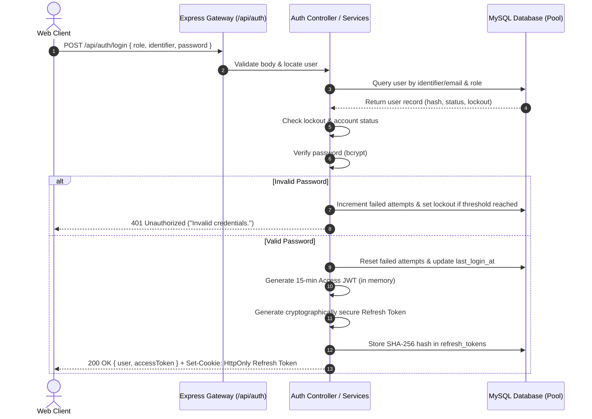

# MS Tutorials — Backend Authentication Core (Phase 5.2)

> **Governing Blueprint**: `docs/authentication-architecture.md` (Phase 5.0)<br/>
> **Status**: Implemented & Verified (Backend Services & Tests)<br/>
> **Scope**: Authentication Core API & Services ONLY (No UI, No Portals, No RBAC middleware yet)

---

## 1. Overview & Architecture

Phase 5.2 establishes the backend foundation for MS Tutorials' hybrid authentication model. It implements password hashing, user lookup, token generation, refresh token persistence, and role-aware login endpoints.



---

## 2. API Endpoints

### `POST /api/auth/login`
- **Request Body**:
  ```json
  {
    "role": "student | parent | teacher | admin",
    "identifier": "AS26090 | email@example.com",
    "password": "user_password"
  }
  ```
- **Responses**:
  - `200 OK`:
    ```json
    {
      "user": {
        "id": "usr_uuid",
        "role": "student",
        "identifier": "AS26090",
        "name": "Student Full Name"
      },
      "accessToken": "eyJhbGciOiJIUzI1NiIsIn..."
    }
    ```
    *Header*: `Set-Cookie: ms_refresh_token=<raw_token>; HttpOnly; Path=/api/auth; SameSite=Strict; Max-Age=604800`
  - `400 Bad Request`: Missing or malformed parameters.
  - `401 Unauthorized`: Generic sanitized authentication failure (preventing user enumeration).

### `POST /api/auth/refresh`
- **Request**: Cookie `ms_refresh_token` attached.
- **Process**: Hashes incoming token with SHA-256, queries `refresh_tokens`, validates expiration, revocation, and active user status.
- **Responses**:
  - `200 OK`: `{ "accessToken": "new_jwt_access_token" }`
  - `401 Unauthorized`: Token missing, expired, revoked, or user inactive (clears cookie).

### `POST /api/auth/logout`
- **Request**: Cookie `ms_refresh_token` attached.
- **Process**: Sets `revoked_at = CURRENT_TIMESTAMP` for the token hash in MySQL; clears cookie.
- **Responses**:
  - `200 OK`: `{ "message": "Logged out successfully." }`

### `GET /api/health`
- **Process**: Performs live application and MySQL pool health ping.
- **Response**:
  ```json
  {
    "status": "healthy | operational",
    "service": "MS Tutorials Backend API",
    "environment": "development | production",
    "database": {
      "connected": true,
      "status": "operational"
    },
    "timestamp": "2026-09-26T14:50:00.000Z"
  }
  ```

---

## 3. Configuration & Environment Variables

All settings are centralized in `server/config/environment.js` with production validation:

| Variable | Default (Dev) | Description |
|:---|:---:|:---|
| `PORT` | `5000` | Backend API port. |
| `NODE_ENV` | `development` | Runtime environment (`development` / `production`). |
| `DB_HOST` | `localhost` | MySQL host. |
| `DB_USER` | `root` | MySQL user. |
| `DB_PASSWORD` | `""` | MySQL password. |
| `DB_NAME` | `ms_tutorials_db` | MySQL database name. |
| `DB_PORT` | `3306` | MySQL port. |
| `DB_CONNECTION_LIMIT` | `10` | Pool connection limit. |
| `JWT_SECRET` | *(Strict in Prod)* | Secret key for signing access JWTs. Throws fatal error in production if placeholder is detected. |
| `JWT_ACCESS_EXPIRES_IN` | `15m` | Configurable access token lifetime. |
| `REFRESH_TOKEN_EXPIRES_IN_DAYS`| `7` | Configurable refresh token expiration. |
| `REFRESH_TOKEN_COOKIE_NAME` | `ms_refresh_token` | Name of the HttpOnly cookie. |
| `MAX_FAILED_LOGIN_ATTEMPTS` | `5` | Maximum failed attempts before lockout. |
| `LOCKOUT_DURATION_MINUTES` | `15` | Duration of temporary account lockout. |
| `BCRYPT_SALT_ROUNDS` | `12` | Bcrypt work factor for password hashing. |
| `COOKIE_SECURE` | `false` (Dev) / `true` (Prod)| Sets `Secure` flag on refresh cookie. |
| `COOKIE_SAMESITE` | `strict` | CSRF protection for cookie transmission. |

---

## 4. Key Security Decisions

1. **Zero Raw Refresh Token Storage**: The raw token exists solely in client memory/HttpOnly cookie. MySQL persists strictly the 64-character SHA-256 hash (`refresh_tokens.token_hash`).
2. **Timing Attack Resistance**: Bcrypt comparison verifies candidate passwords in constant time.
3. **Enumeration Protection**: Login failures return generic `"Invalid credentials."` to avoid revealing whether an identifier exists.
4. **Brute-Force Lockout**: 5 failed login attempts trigger an automatic 15-minute lockout (`locked_until`).
5. **Sanitized Logging**: Database errors, stack traces, password hashes, and tokens are scrubbed from server logs and client responses.
6. **Graceful Database Fallback**: Server starts and provides operational health responses even when MySQL is temporarily offline during testing or maintenance.
