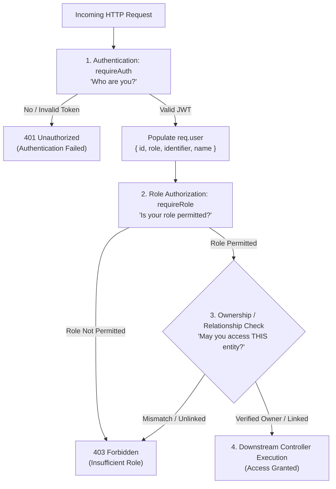

# MS Tutorials — Authorization & RBAC Gateway (Phase 5.3)

> **Governing Blueprint**: `docs/authentication-architecture.md` (Phase 5.0)<br/>
> **Status**: Implemented & Verified (Middleware, Protected Endpoints & Test Suite)<br/>
> **Scope**: Authentication Verification & Role/Ownership Authorization Gateway ONLY

---

## 1. Authentication vs. Authorization

The MS Tutorials backend enforces strict separation between authentication and authorization:



- **Authentication (`401 Unauthorized`)**: Confirms identity. Triggered when the client provides no token, an expired token, an invalid cryptographic signature, or a malformed Bearer header.
- **Authorization (`403 Forbidden`)**: Confirms permissions. Triggered when an authenticated user lacks the role, attempts to inspect another student's private records, or queries an unlinked child.

---

## 2. The Four Discrete Roles

In alignment with Phase 5.0, only the 4 canonical roles exist:

| Role | Domain Scope | Primary Business Identifier |
|:---|:---|:---|
| **`student`** | Own profile, enrolled batches, own test submissions and grades. | Admission number (`AS26090`). |
| **`parent`** | Linked children's progress, attendance, and fee ledgers. | Registered email (`parent@example.com`). |
| **`teacher`** | Assigned cohorts, student rosters, grading, attendance marking. | Institutional email (`faculty@mstutorials.com`). |
| **`admin`** | Full institutional authority, user CRUD, curriculum governance. | Institutional email (`admin@mstutorials.com`). |

*No arbitrary permission strings or client-manipulated roles are stored or accepted.*

---

## 3. Middleware Architecture

### 3.1 `requireAuth` (`server/middleware/authMiddleware.js`)
- **Extraction**: Reads `Authorization: Bearer <token>` from HTTP headers.
- **Validation**: Verifies JWT signature and expiry via `verifyAccessToken()`.
- **Claim Checks**: Ensures `decoded.type === 'access'`, `sub` (user UUID), and `role` are present.
- **Request Context**: Attaches sanitized identity to `req.user`:
  ```json
  {
    "id": "usr_9f8b7a6c",
    "role": "student",
    "identifier": "AS26090",
    "name": "Rahul Sharma"
  }
  ```
- **Security**: Strips password hashes, secrets, and internal security metadata. Never queries the database on every asset request.

### 3.2 `requireRole(...allowedRoles)` (`server/middleware/roleMiddleware.js`)
- Enforces role-level boundaries:
  ```js
  router.get('/admin/users', requireAuth, requireRole('admin'), listUsers);
  router.get('/academic/review', requireAuth, requireRole('teacher', 'admin'), reviewResource);
  ```
- Throws 403 Forbidden if `req.user.role` is not present in `allowedRoles`.

### 3.3 Ownership & Relationship Checks (`server/middleware/ownershipMiddleware.js`)
Role-based access alone is insufficient to prevent horizontal privilege escalation.

1. **`requireSelf(paramName)`**:
   - Ensures an authenticated user can only access their own user profile (e.g., `req.params.userId === req.user.id`).
   - Admins bypass with institutional inspection authority.
2. **`requireStudentSelf(studentParam)`**:
   - Ensures a student can only access their own student records (`students.user_id = req.user.id`).
   - Blocks Student A from inspecting Student B's test scores or mistake logs.
3. **`requireParentOfStudent(studentParam)`**:
   - Evaluates whether the authenticated parent has an authorized record in the `parent_student` relational junction table for the requested child:
     ```sql
     SELECT 1
     FROM parent_student ps
     JOIN parents p ON ps.parent_id = p.id
     JOIN students s ON ps.student_id = s.id
     WHERE p.user_id = ?
       AND (s.id = ? OR s.user_id = ? OR s.admission_number = ?)
     LIMIT 1
     ```
   - Automatically supports multi-child families (Parent A accesses Child 1 and Child 2) while blocking unlinked children (Child 3).
4. **`requireTeacherAssignment()`**:
   - Architectural extension hook: establishes the pattern to verify teacher batch/subject assignments once academic tables are implemented in subsequent phases.

---

## 4. Protected Route: `GET /api/auth/me`

- **Endpoint**: `GET /api/auth/me`
- **Protection**: `requireAuth`
- **Purpose**: Allows frontend applications (Phase 5.4 onwards) to retrieve current session context on page load or silent token renewal.
- **Sample 200 Response**:
  ```json
  {
    "user": {
      "id": "usr_9f8b7a6c",
      "role": "student",
      "identifier": "AS26090",
      "name": "Rahul Sharma"
    }
  }
  ```
- **Error Response**: `401 Unauthorized` if unauthenticated.

---

## 5. Security Principles Enforced

1. **Never Trust Client-Supplied Roles**: Authorization decisions rely exclusively on the verified server-side JWT signature (`req.user.role`). Client payloads attempting self-promotion are ignored.
2. **Never Trust Client-Supplied User IDs**: Target IDs in route params or bodies are checked against server-verified database relationships.
3. **100% Parameterized SQL**: All relationship lookups use parameterized queries (`?`) via `mysql2/promise`.
4. **Zero Credential / Token Logging**: Authorization failures never output access tokens, refresh tokens, or passwords to logs.
