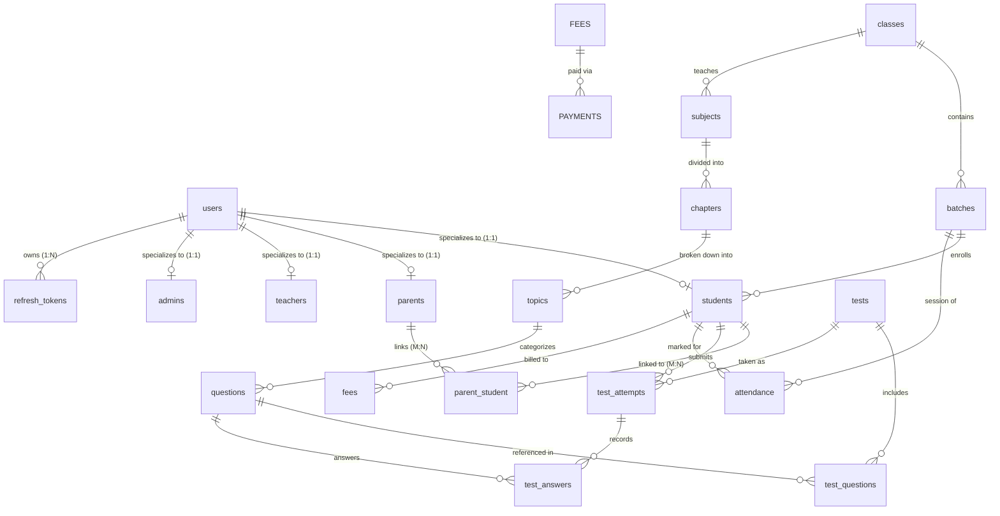

# MS Tutorials — Database Design & Schema Architecture

> [!NOTE]
> **Phase 5.1 Status**: Core identity and authentication tables (`users`, `students`, `parents`, `teachers`, `admins`, `parent_student`, `refresh_tokens`) are implemented in `database/schema/identity.sql` and `database/migrations/001_create_identity_tables.sql`. Downstream academic structure, resources, assessments, attendance, and fee tables remain planned for subsequent phases.

---

## 1. Design Principles
1. **Third Normal Form (3NF)**: Normalize entities to minimize redundancy and prevent update anomalies.
2. **Strict Foreign Key Constraints**: Enforce referential integrity on all relational boundaries with cascade or restrict rules explicitly declared.
3. **Audit Fields**: Every core table includes `created_at TIMESTAMP DEFAULT CURRENT_TIMESTAMP` and `updated_at TIMESTAMP DEFAULT CURRENT_TIMESTAMP ON UPDATE CURRENT_TIMESTAMP`.
4. **Appropriate Indexing**: Unique indexes on identifiers, emails, and codes; composite indexes on query paths (e.g., `(parent_id, student_id)`).
5. **Separation of Sensitive Data**: Plaintext passwords are never saved. Only salted bcrypt hashes exist in the `users` table; refresh tokens are stored exclusively as SHA-256 hashes in `refresh_tokens`.

---

## 2. Entity Groups & Tables

---

### Group A: Identity & Authentication (Implemented in Phase 5.1)

Identity tables are implemented in `database/schema/identity.sql` and `database/migrations/001_create_identity_tables.sql`:

1. **`users`** (Central Authentication Identity)
   - `id`: `VARCHAR(36) PRIMARY KEY` (UUID)
   - `identifier`: `VARCHAR(100) NOT NULL UNIQUE` (Student admission number e.g. `AS26090`, or verified email)
   - `email`: `VARCHAR(255) NULL UNIQUE` (Nullable for young students; unique recovery contact)
   - `phone`: `VARCHAR(20) NULL`
   - `password_hash`: `VARCHAR(255) NOT NULL` (Salted bcrypt one-way hash)
   - `role`: `ENUM('student', 'parent', 'teacher', 'admin') NOT NULL`
   - `full_name`: `VARCHAR(150) NOT NULL`
   - `status`: `ENUM('pending_activation', 'active', 'inactive', 'suspended') NOT NULL DEFAULT 'active'`
   - `failed_login_attempts`: `TINYINT UNSIGNED NOT NULL DEFAULT 0`
   - `locked_until`: `DATETIME NULL`
   - `last_login_at`: `DATETIME NULL`
   - `created_at`, `updated_at`: `TIMESTAMP`
   - Indexes: `idx_users_role`, `idx_users_status`, `uq_users_identifier`, `uq_users_email`

2. **`students`** (Student Profile Extension)
   - `id`: `VARCHAR(36) PRIMARY KEY` (UUID)
   - `user_id`: `VARCHAR(36) NOT NULL UNIQUE` (FK -> `users.id` ON DELETE CASCADE)
   - `admission_number`: `VARCHAR(20) NOT NULL UNIQUE` (Canonical format: `AS{YY}{Class}{Seq}`, e.g. `AS26090` = AS | 26 | 09 | 0)
   - `date_of_birth`: `DATE NULL`
   - `gender`: `ENUM('male', 'female', 'other') NULL`
   - `school_name`: `VARCHAR(200) NULL`
   - `board`: `ENUM('CBSE', 'ICSE', 'State_Board', 'Other') NULL`
   - `academic_track`: `ENUM('Explorers', 'Achievers', 'Foundation', 'Remedial') NULL`
   - `address_text`: `TEXT NULL`
   - `created_at`, `updated_at`: `TIMESTAMP`
   - Indexes: `idx_students_admission_number`, `idx_students_board`, `idx_students_academic_track`

3. **`parents`** (Parent Profile Extension)
   - `id`: `VARCHAR(36) PRIMARY KEY` (UUID)
   - `user_id`: `VARCHAR(36) NOT NULL UNIQUE` (FK -> `users.id` ON DELETE CASCADE)
   - `parent_code`: `VARCHAR(20) NOT NULL UNIQUE` (Canonical format: `PR26090`)
   - `occupation`: `VARCHAR(100) NULL`
   - `alternate_phone`: `VARCHAR(20) NULL`
   - `emergency_contact_phone`: `VARCHAR(20) NULL`
   - `created_at`, `updated_at`: `TIMESTAMP`
   - Indexes: `idx_parents_parent_code`

4. **`teachers`** (Faculty Profile Extension)
   - `id`: `VARCHAR(36) PRIMARY KEY` (UUID)
   - `user_id`: `VARCHAR(36) NOT NULL UNIQUE` (FK -> `users.id` ON DELETE CASCADE)
   - `faculty_code`: `VARCHAR(20) NOT NULL UNIQUE` (Canonical format: `TR2604`)
   - `qualification`: `VARCHAR(150) NULL`
   - `specialization`: `VARCHAR(150) NULL`
   - `joining_date`: `DATE NULL`
   - `created_at`, `updated_at`: `TIMESTAMP`
   - Indexes: `idx_teachers_faculty_code`

5. **`admins`** (Administrative Profile Extension)
   - `id`: `VARCHAR(36) PRIMARY KEY` (UUID)
   - `user_id`: `VARCHAR(36) NOT NULL UNIQUE` (FK -> `users.id` ON DELETE CASCADE)
   - `admin_code`: `VARCHAR(20) NOT NULL UNIQUE` (Canonical format: `AD01`)
   - `access_level`: `ENUM('superadmin', 'staff') NOT NULL DEFAULT 'staff'`
   - `department`: `VARCHAR(100) NULL`
   - `created_at`, `updated_at`: `TIMESTAMP`
   - Indexes: `idx_admins_access_level`

6. **`parent_student`** (Parent-Student Relational Junction)
   - `id`: `BIGINT UNSIGNED NOT NULL AUTO_INCREMENT PRIMARY KEY`
   - `parent_id`: `VARCHAR(36) NOT NULL` (FK -> `parents.id` ON DELETE CASCADE)
   - `student_id`: `VARCHAR(36) NOT NULL` (FK -> `students.id` ON DELETE CASCADE)
   - `relationship_type`: `ENUM('father', 'mother', 'guardian') NOT NULL`
   - `is_primary_contact`: `BOOLEAN NOT NULL DEFAULT TRUE`
   - `created_at`, `updated_at`: `TIMESTAMP`
   - Constraints: `UNIQUE KEY uq_parent_student (parent_id, student_id)`
   - Indexes: `idx_parent_student_parent`, `idx_parent_student_student`

7. **`refresh_tokens`** (Secure Session Store)
   - `id`: `VARCHAR(36) PRIMARY KEY` (UUID)
   - `user_id`: `VARCHAR(36) NOT NULL` (FK -> `users.id` ON DELETE CASCADE)
   - `token_hash`: `VARCHAR(64) NOT NULL UNIQUE` (SHA-256 hash of refresh token; never raw token)
   - `device_fingerprint`: `VARCHAR(255) NULL`
   - `ip_address`: `VARCHAR(45) NULL`
   - `expires_at`: `DATETIME NOT NULL`
   - `revoked_at`: `DATETIME NULL`
   - `created_at`: `TIMESTAMP`
   - Indexes: `idx_refresh_tokens_user_id`, `idx_refresh_tokens_expires_at`, `idx_refresh_tokens_revoked_at`

---

### Group B: Academic Structure
- **`classes`**: Grade levels (e.g., Class 8, Class 9, Class 10, Class 11, Class 12).
  - Columns: `id` (PK), `name`, `code` (UNIQUE), `description`.
- **`batches`**: Cohorts per class (e.g., Morning Batch 2026, Weekend Batch).
  - Columns: `id` (PK), `class_id` (FK -> `classes.id`), `name`, `academic_year`, `start_date`, `end_date`, `max_students`.
- **`subjects`**: Core study subjects (e.g., Mathematics, Physics, Chemistry, Biology).
  - Columns: `id` (PK), `class_id` (FK -> `classes.id`), `name`, `code`.
- **`chapters`**: Units within a subject (e.g., "Quadratic Equations", "Optics").
  - Columns: `id` (PK), `subject_id` (FK -> `subjects.id`), `chapter_number`, `title`, `description`.
- **`topics`**: Granular learning concepts within a chapter (e.g., "Factoring Method", "Snell's Law").
  - Columns: `id` (PK), `chapter_id` (FK -> `chapters.id`), `topic_number`, `title`, `description`.

---

### Group C: Resources & Assignments
- **`resources`**: Study materials and reference files.
  - Columns: `id` (PK), `title`, `resource_type` (`'pdf' | 'worksheet' | 'notes' | 'video_link'`), `file_path`, `file_size_bytes`, `class_id` (FK), `subject_id` (FK), `chapter_id` (FK nullable), `topic_id` (FK nullable), `uploaded_by` (FK -> `users.id`), `created_at`.
- **`assignments`**: Teacher-published homework and tasks.
  - Columns: `id` (PK), `batch_id` (FK -> `batches.id`), `subject_id` (FK -> `subjects.id`), `title`, `description`, `attachment_url`, `due_date`, `created_by` (FK -> `teachers.id`), `created_at`.

---

### Group D: Assessment & Question Bank
- **`questions`**: Individual question bank items tagged down to the topic.
  - Columns: `id` (PK), `topic_id` (FK -> `topics.id`), `question_type` (`'mcq' | 'numerical' | 'subjective'`), `difficulty` (`'easy' | 'medium' | 'hard'`), `content` (TEXT), `options_json` (JSON, nullable for MCQ), `correct_answer` (TEXT), `explanation` (TEXT), `marks` (INT), `created_by` (FK -> `teachers.id`).
- **`tests`**: Scheduled diagnostic or periodic assessments.
  - Columns: `id` (PK), `batch_id` (FK -> `batches.id`, nullable for open diagnostics), `title`, `test_type` (`'diagnostic' | 'chapter_test' | 'mock_exam'`), `duration_minutes`, `total_marks`, `passing_marks`, `start_time`, `end_time`, `is_published` (BOOLEAN).
- **`test_questions`**: Junction linking questions to tests with ordering.
  - Columns: `id` (PK), `test_id` (FK -> `tests.id`), `question_id` (FK -> `questions.id`), `question_order` (INT), `marks_allocated` (INT).
- **`test_attempts`**: A student's test session submission.
  - Columns: `id` (PK), `test_id` (FK -> `tests.id`), `student_id` (FK -> `students.id`), `started_at`, `submitted_at`, `total_score_obtained` (DECIMAL), `status` (`'in_progress' | 'submitted' | 'evaluated'`).
- **`test_answers`**: Individual student response per question.
  - Columns: `id` (PK), `attempt_id` (FK -> `test_attempts.id`), `question_id` (FK -> `questions.id`), `student_answer` (TEXT), `is_correct` (BOOLEAN), `marks_awarded` (DECIMAL), `evaluated_by` (FK -> `teachers.id`, nullable).

---

### Group E: Operations
- **`attendance`**: Daily attendance records.
  - Columns: `id` (PK), `batch_id` (FK -> `batches.id`), `student_id` (FK -> `students.id`), `session_date` (DATE), `status` (`'present' | 'absent' | 'late' | 'excused'`), `remarks`, `marked_by` (FK -> `teachers.id`).
- **`fees`**: Fee structures assigned to students.
  - Columns: `id` (PK), `student_id` (FK -> `students.id`), `batch_id` (FK -> `batches.id`), `total_amount` (DECIMAL), `due_date` (DATE), `status` (`'pending' | 'partially_paid' | 'paid' | 'overdue'`).
- **`payments`**: Payment transaction history.
  - Columns: `id` (PK), `fee_id` (FK -> `fees.id`), `amount_paid` (DECIMAL), `payment_date` (DATETIME), `payment_mode` (`'cash' | 'upi' | 'bank_transfer' | 'cheque'`), `transaction_ref`, `receipt_number` (UNIQUE), `recorded_by` (FK -> `admins.id`).
- **`announcements`**: Broadcast messages.
  - Columns: `id` (PK), `target_role` (`'all' | 'students' | 'parents' | 'teachers'`), `batch_id` (FK nullable), `title`, `body` (TEXT), `published_at`, `created_by` (FK -> `users.id`).
- **`teacher_feedback`**: Qualitative feedback provided by teachers to parents/students.
  - Columns: `id` (PK), `student_id` (FK -> `students.id`), `teacher_id` (FK -> `teachers.id`), `feedback_text` (TEXT), `category` (`'academic' | 'discipline' | 'participation'`), `created_at`.

---

## 3. Academic Performance Pipeline (The Learning Graph)

The schema's hierarchical mapping is intentionally architected to power automated analytics and personalized learning in Phases 13 through 16:

$$\begin{aligned}
\text{Subject} &\longrightarrow \text{Chapter} \longrightarrow \text{Topic} \\
&\longrightarrow \text{Question (Topic-tagged)} \\
&\longrightarrow \text{Test} \longrightarrow \text{Attempt} \longrightarrow \text{Result} \\
&\longrightarrow \text{Topic Performance (Accuracy \%)} \\
&\longrightarrow \text{Strength / Weakness Classification} \\
&\longrightarrow \text{Personalized Revision Recommendations}
\end{aligned}$$

### How It Connects:
1. Every **Question** is tied directly to a **Topic**.
2. When a student completes a **Test Attempt**, their **Test Answers** are scored per question.
3. Aggregating `is_correct` grouped by `topic_id` produces a deterministic **Topic Accuracy %**.
4. Low accuracy (<60%) on repeated attempts classifies a topic as **Weak**.
5. The recommendation engine queries `resources` specifically matching that `topic_id` to generate an automated, transparent revision plan.
