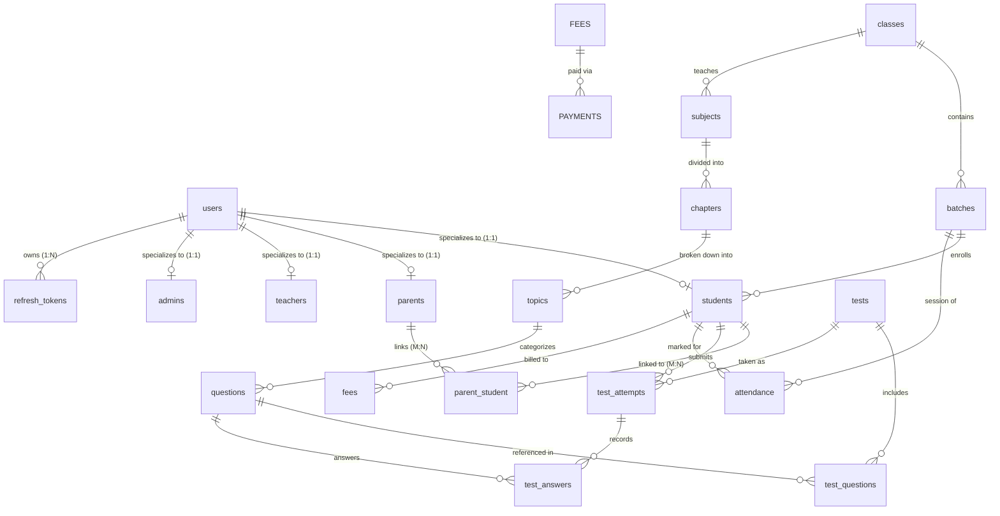

# MS Tutorials — Database Design & Schema Architecture

> [!NOTE]
> **Implementation Status**:
> - **Phase 5.1 (Identity & Authentication)**: 7 tables (`users`, `students`, `parents`, `teachers`, `admins`, `parent_student`, `refresh_tokens`) implemented in `database/schema/identity.sql` and `database/migrations/001_create_identity_tables.sql`.
> - **Phase 5.7A (Academic Core Domain)**: 11 tables (`academic_sessions`, `boards`, `classes`, `programs`, `subjects`, `curriculum_nodes`, `chapters`, `topics`, `batches`, `student_enrollments`, `learning_resources`) implemented in `database/schema/academic.sql` and `database/migrations/002_create_academic_tables.sql`.
> - **Future Phases**: Assessments (quizzes, question banks, attempts), attendance, and fee systems remain planned for subsequent phases.

---

## 1. Design Principles
1. **Third Normal Form (3NF)**: Normalize entities to minimize redundancy and prevent update anomalies.
2. **Strict Foreign Key Constraints**: Enforce referential integrity on all relational boundaries with cascade or restrict rules explicitly declared.
3. **Audit Fields**: Every core table includes `created_at TIMESTAMP DEFAULT CURRENT_TIMESTAMP` and `updated_at TIMESTAMP DEFAULT CURRENT_TIMESTAMP ON UPDATE CURRENT_TIMESTAMP`.
4. **Appropriate Indexing**: Unique indexes on identifiers, emails, and codes; composite indexes on query paths (e.g., `(parent_id, student_id)`).
5. **Separation of Sensitive Data**: Plaintext passwords are never saved. Only salted bcrypt hashes exist in the `users` table; refresh tokens are stored exclusively as SHA-256 hashes in `refresh_tokens`.

---

## 2. Entity Groups & Tables

---

### Group A: Identity & Authentication (Implemented in Phase 5.1)

Identity tables are implemented in `database/schema/identity.sql` and `database/migrations/001_create_identity_tables.sql`:

1. **`users`** (Central Authentication Identity)
   - `id`: `VARCHAR(36) PRIMARY KEY` (UUID)
   - `identifier`: `VARCHAR(100) NOT NULL UNIQUE` (Student admission number e.g. `AS26090`, or verified email)
   - `email`: `VARCHAR(255) NULL UNIQUE` (Nullable for young students; unique recovery contact)
   - `phone`: `VARCHAR(20) NULL`
   - `password_hash`: `VARCHAR(255) NOT NULL` (Salted bcrypt one-way hash)
   - `role`: `ENUM('student', 'parent', 'teacher', 'admin') NOT NULL`
   - `full_name`: `VARCHAR(150) NOT NULL`
   - `status`: `ENUM('pending_activation', 'active', 'inactive', 'suspended') NOT NULL DEFAULT 'active'`
   - `failed_login_attempts`: `TINYINT UNSIGNED NOT NULL DEFAULT 0`
   - `locked_until`: `DATETIME NULL`
   - `last_login_at`: `DATETIME NULL`
   - `created_at`, `updated_at`: `TIMESTAMP`
   - Indexes: `idx_users_role`, `idx_users_status`, `uq_users_identifier`, `uq_users_email`

2. **`students`** (Student Profile Extension)
   - `id`: `VARCHAR(36) PRIMARY KEY` (UUID)
   - `user_id`: `VARCHAR(36) NOT NULL UNIQUE` (FK -> `users.id` ON DELETE CASCADE)
   - `admission_number`: `VARCHAR(20) NOT NULL UNIQUE` (Canonical format: `AS{YY}{Class}{Seq}`, e.g. `AS26090` = AS | 26 | 09 | 0)
   - `date_of_birth`: `DATE NULL`
   - `gender`: `ENUM('male', 'female', 'other') NULL`
   - `school_name`: `VARCHAR(200) NULL`
   - `board`: `ENUM('CBSE', 'ICSE', 'State_Board', 'Other') NULL`
   - `academic_track`: `ENUM('Explorers', 'Achievers', 'Foundation', 'Remedial') NULL`
   - `address_text`: `TEXT NULL`
   - `created_at`, `updated_at`: `TIMESTAMP`
   - Indexes: `idx_students_admission_number`, `idx_students_board`, `idx_students_academic_track`

3. **`parents`** (Parent Profile Extension)
   - `id`: `VARCHAR(36) PRIMARY KEY` (UUID)
   - `user_id`: `VARCHAR(36) NOT NULL UNIQUE` (FK -> `users.id` ON DELETE CASCADE)
   - `parent_code`: `VARCHAR(20) NOT NULL UNIQUE` (Canonical format: `PR26090`)
   - `occupation`: `VARCHAR(100) NULL`
   - `alternate_phone`: `VARCHAR(20) NULL`
   - `emergency_contact_phone`: `VARCHAR(20) NULL`
   - `created_at`, `updated_at`: `TIMESTAMP`
   - Indexes: `idx_parents_parent_code`

4. **`teachers`** (Faculty Profile Extension)
   - `id`: `VARCHAR(36) PRIMARY KEY` (UUID)
   - `user_id`: `VARCHAR(36) NOT NULL UNIQUE` (FK -> `users.id` ON DELETE CASCADE)
   - `faculty_code`: `VARCHAR(20) NOT NULL UNIQUE` (Canonical format: `TR2604`)
   - `qualification`: `VARCHAR(150) NULL`
   - `specialization`: `VARCHAR(150) NULL`
   - `joining_date`: `DATE NULL`
   - `created_at`, `updated_at`: `TIMESTAMP`
   - Indexes: `idx_teachers_faculty_code`

5. **`admins`** (Administrative Profile Extension)
   - `id`: `VARCHAR(36) PRIMARY KEY` (UUID)
   - `user_id`: `VARCHAR(36) NOT NULL UNIQUE` (FK -> `users.id` ON DELETE CASCADE)
   - `admin_code`: `VARCHAR(20) NOT NULL UNIQUE` (Canonical format: `AD01`)
   - `access_level`: `ENUM('superadmin', 'staff') NOT NULL DEFAULT 'staff'`
   - `department`: `VARCHAR(100) NULL`
   - `created_at`, `updated_at`: `TIMESTAMP`
   - Indexes: `idx_admins_access_level`

6. **`parent_student`** (Parent-Student Relational Junction)
   - `id`: `BIGINT UNSIGNED NOT NULL AUTO_INCREMENT PRIMARY KEY`
   - `parent_id`: `VARCHAR(36) NOT NULL` (FK -> `parents.id` ON DELETE CASCADE)
   - `student_id`: `VARCHAR(36) NOT NULL` (FK -> `students.id` ON DELETE CASCADE)
   - `relationship_type`: `ENUM('father', 'mother', 'guardian') NOT NULL`
   - `is_primary_contact`: `BOOLEAN NOT NULL DEFAULT TRUE`
   - `created_at`, `updated_at`: `TIMESTAMP`
   - Constraints: `UNIQUE KEY uq_parent_student (parent_id, student_id)`
   - Indexes: `idx_parent_student_parent`, `idx_parent_student_student`

7. **`refresh_tokens`** (Secure Session Store)
   - `id`: `VARCHAR(36) PRIMARY KEY` (UUID)
   - `user_id`: `VARCHAR(36) NOT NULL` (FK -> `users.id` ON DELETE CASCADE)
   - `token_hash`: `VARCHAR(64) NOT NULL UNIQUE` (SHA-256 hash of refresh token; never raw token)
   - `device_fingerprint`: `VARCHAR(255) NULL`
   - `ip_address`: `VARCHAR(45) NULL`
   - `expires_at`: `DATETIME NOT NULL`
   - `revoked_at`: `DATETIME NULL`
   - `created_at`: `TIMESTAMP`
   - Indexes: `idx_refresh_tokens_user_id`, `idx_refresh_tokens_expires_at`, `idx_refresh_tokens_revoked_at`

---

### Group B: Academic Core & Operations (Implemented in Phase 5.7A)

The academic core domain is implemented in `database/schema/academic.sql` and `database/migrations/002_create_academic_tables.sql`:

1. **`academic_sessions`** (Institutional Calendar & Session Continuity)
   - `id`: `VARCHAR(36) PRIMARY KEY` (UUID)
   - `session_code`: `VARCHAR(20) NOT NULL UNIQUE` (e.g. `'2026-27'`)
   - `display_name`: `VARCHAR(100) NOT NULL` (e.g. `'Academic Year 2026-2027'`)
   - `start_date`, `end_date`: `DATE NOT NULL`
   - `status`: `ENUM('upcoming', 'active', 'completed') NOT NULL DEFAULT 'upcoming'`
   - `created_at`, `updated_at`: `TIMESTAMP`
   - Indexes: `uq_academic_sessions_code`, `idx_academic_sessions_status`

2. **`boards`** (Governing Educational Boards)
   - `id`: `VARCHAR(36) PRIMARY KEY` (UUID)
   - `code`: `VARCHAR(20) NOT NULL UNIQUE` (e.g. `'CBSE'`, `'ICSE'`)
   - `name`: `VARCHAR(150) NOT NULL` (e.g. `'Central Board of Secondary Education'`)
   - `description`: `TEXT NULL`
   - `status`: `ENUM('active', 'inactive') NOT NULL DEFAULT 'active'`
   - `created_at`, `updated_at`: `TIMESTAMP`
   - Indexes: `uq_boards_code`, `idx_boards_status`

3. **`classes`** (Academic Grade Standards)
   - `id`: `VARCHAR(36) PRIMARY KEY` (UUID)
   - `grade_number`: `TINYINT UNSIGNED NOT NULL UNIQUE` (e.g. `6`, `7`, `8`, `9`, `10`)
   - `code`: `VARCHAR(20) NOT NULL UNIQUE` (e.g. `'CLASS_09'`)
   - `display_name`: `VARCHAR(50) NOT NULL` (e.g. `'Class 9'`)
   - `stage`: `ENUM('middle_school', 'secondary') NOT NULL DEFAULT 'secondary'`
   - `status`: `ENUM('active', 'inactive') NOT NULL DEFAULT 'active'`
   - `created_at`, `updated_at`: `TIMESTAMP`
   - Indexes: `uq_classes_grade_number`, `uq_classes_code`, `idx_classes_stage`, `idx_classes_status`

4. **`programs`** (Reusable Pedagogical Tracks)
   - `id`: `VARCHAR(36) PRIMARY KEY` (UUID)
   - `code`: `VARCHAR(30) NOT NULL UNIQUE` (e.g. `'achievers'`, `'explorers'`, `'foundation'`, `'remedial'`)
   - `name`: `VARCHAR(100) NOT NULL` (e.g. `'Achievers Board Excellence'`)
   - `description`: `TEXT NULL`
   - `target_stage`: `ENUM('middle_school', 'secondary', 'all') NOT NULL DEFAULT 'secondary'`
   - `status`: `ENUM('active', 'inactive') NOT NULL DEFAULT 'active'`
   - `created_at`, `updated_at`: `TIMESTAMP`
   - Indexes: `uq_programs_code`, `idx_programs_target_stage`, `idx_programs_status`

5. **`subjects`** (Academic Disciplines with Self-Referencing Disciplinary Components)
   - `id`: `VARCHAR(36) PRIMARY KEY` (UUID)
   - `code`: `VARCHAR(30) NOT NULL UNIQUE` (e.g. `'MATH'`, `'SCIENCE'`, `'PHYSICS'`, `'CHEMISTRY'`, `'BIOLOGY'`)
   - `name`: `VARCHAR(100) NOT NULL`
   - `parent_subject_id`: `VARCHAR(36) NULL` (Self-referencing FK -> `subjects.id` ON DELETE SET NULL; enables Science $\rightarrow$ Physics/Chemistry/Biology)
   - `color_code`: `VARCHAR(10) NULL` (Hex color for UI theme)
   - `status`: `ENUM('active', 'inactive') NOT NULL DEFAULT 'active'`
   - `created_at`, `updated_at`: `TIMESTAMP`
   - Constraints: `fk_subjects_parent`
   - Indexes: `uq_subjects_code`, `idx_subjects_parent`, `idx_subjects_status`

6. **`curriculum_nodes`** (Physical Relational Bridge)
   - `id`: `VARCHAR(36) PRIMARY KEY` (UUID)
   - `session_id`: `VARCHAR(36) NOT NULL` (FK -> `academic_sessions.id` ON DELETE RESTRICT)
   - `board_id`: `VARCHAR(36) NOT NULL` (FK -> `boards.id` ON DELETE RESTRICT)
   - `class_id`: `VARCHAR(36) NOT NULL` (FK -> `classes.id` ON DELETE RESTRICT)
   - `subject_id`: `VARCHAR(36) NOT NULL` (FK -> `subjects.id` ON DELETE RESTRICT)
   - `syllabus_version`: `VARCHAR(20) NOT NULL DEFAULT 'v1.0'`
   - `is_active`: `BOOLEAN NOT NULL DEFAULT TRUE`
   - `created_at`, `updated_at`: `TIMESTAMP`
   - Constraints: `uq_curriculum_node_context (session_id, board_id, class_id, subject_id, syllabus_version)`, `fk_cn_session`, `fk_cn_board`, `fk_cn_class`, `fk_cn_subject`
   - Indexes: `idx_cn_lookup (board_id, class_id, subject_id)`, `idx_cn_session`, `idx_cn_is_active`

7. **`chapters`** (Curriculum Units)
   - `id`: `VARCHAR(36) PRIMARY KEY` (UUID)
   - `curriculum_node_id`: `VARCHAR(36) NOT NULL` (FK -> `curriculum_nodes.id` ON DELETE RESTRICT)
   - `chapter_number`: `SMALLINT UNSIGNED NOT NULL`
   - `title`: `VARCHAR(200) NOT NULL`
   - `description`: `TEXT NULL`
   - `estimated_teaching_hours`: `DECIMAL(4,1) NULL`
   - `status`: `ENUM('active', 'inactive') NOT NULL DEFAULT 'active'`
   - `created_at`, `updated_at`: `TIMESTAMP`
   - Constraints: `uq_chapters_sequence (curriculum_node_id, chapter_number)`, `uq_chapters_id_node (id, curriculum_node_id)`, `fk_chapters_cn`
   - Indexes: `idx_chapters_node`, `idx_chapters_status`

8. **`topics`** (Atomic Concept Units)
   - `id`: `VARCHAR(36) PRIMARY KEY` (UUID)
   - `chapter_id`: `VARCHAR(36) NOT NULL` (FK -> `chapters.id` ON DELETE RESTRICT)
   - `sequence_order`: `SMALLINT UNSIGNED NOT NULL`
   - `topic_code`: `VARCHAR(50) NOT NULL` (e.g. `'CBSE-09-MATH-CH02-TOP03'`; unique within chapter)
   - `title`: `VARCHAR(200) NOT NULL`
   - `description`: `TEXT NULL`
   - `status`: `ENUM('active', 'inactive') NOT NULL DEFAULT 'active'`
   - `created_at`, `updated_at`: `TIMESTAMP`
   - Constraints: `uq_topics_chapter_sequence (chapter_id, sequence_order)`, `uq_topics_chapter_code (chapter_id, topic_code)`, `uq_topics_id_chapter (id, chapter_id)`, `fk_topics_chapter`
   - Indexes: `idx_topics_chapter`, `idx_topics_code`, `idx_topics_status`

9. **`batches`** (Operational Cohorts)
   - `id`: `VARCHAR(36) PRIMARY KEY` (UUID)
   - `session_id`: `VARCHAR(36) NOT NULL` (FK -> `academic_sessions.id` ON DELETE RESTRICT)
   - `class_id`: `VARCHAR(36) NOT NULL` (FK -> `classes.id` ON DELETE RESTRICT)
   - `program_id`: `VARCHAR(36) NOT NULL` (FK -> `programs.id` ON DELETE RESTRICT)
   - `board_id`: `VARCHAR(36) NULL` (FK -> `boards.id` ON DELETE SET NULL; NULL for combined/foundation cohorts)
   - `code`: `VARCHAR(30) NOT NULL`
   - `name`: `VARCHAR(150) NOT NULL`
   - `schedule_description`: `VARCHAR(255) NULL`
   - `max_students`: `SMALLINT UNSIGNED NOT NULL DEFAULT 30`
   - `status`: `ENUM('upcoming', 'active', 'completed', 'cancelled') NOT NULL DEFAULT 'active'`
   - `created_at`, `updated_at`: `TIMESTAMP`
   - Constraints: `uq_batches_session_code (session_id, code)`, `uq_batches_context (id, session_id, class_id, program_id)`, `fk_batches_session`, `fk_batches_class`, `fk_batches_program`, `fk_batches_board`
   - Indexes: `idx_batches_session_class`, `idx_batches_board`, `idx_batches_program`, `idx_batches_status`

10. **`student_enrollments`** (Authoritative Student Academic Progression)
    - `id`: `VARCHAR(36) PRIMARY KEY` (UUID)
    - `student_id`: `VARCHAR(36) NOT NULL` (FK -> `students.id` ON DELETE RESTRICT)
    - `session_id`: `VARCHAR(36) NOT NULL` (FK -> `academic_sessions.id` ON DELETE RESTRICT)
    - `board_id`: `VARCHAR(36) NOT NULL` (FK -> `boards.id` ON DELETE RESTRICT)
    - `class_id`: `VARCHAR(36) NOT NULL` (FK -> `classes.id` ON DELETE RESTRICT)
    - `program_id`: `VARCHAR(36) NOT NULL` (FK -> `programs.id` ON DELETE RESTRICT)
    - `batch_id`: `VARCHAR(36) NULL` (FK -> `batches.id` ON DELETE SET NULL)
    - `enrollment_date`: `DATE NOT NULL`
    - `status`: `ENUM('active', 'completed', 'withdrawn', 'suspended') NOT NULL DEFAULT 'active'`
    - `roll_number`: `VARCHAR(20) NULL`
    - `created_at`, `updated_at`: `TIMESTAMP`
    - **Context Integrity & Board Authority**:
      - `fk_enr_batch_context`: Composite FK `(batch_id, session_id, class_id, program_id) REFERENCES batches(id, session_id, class_id, program_id)` prevents a student enrollment from referencing a batch whose academic session, class, or program differs from the student's enrollment.
      - `board_id` is excluded from `fk_enr_batch_context` because `batches.board_id` is nullable (allowing combined/foundation cohorts).
      - `student_enrollments.board_id` remains the authoritative student academic board context; `batch.board_id` is optional cohort metadata and must never override enrollment context.
      - If `batch.board_id` is populated, application/service validation ensures it agrees with the enrollment board.
    - Constraints: `uq_student_session_class (student_id, session_id, class_id)`, `fk_enr_student`, `fk_enr_session`, `fk_enr_board`, `fk_enr_class`, `fk_enr_program`, `fk_enr_batch`, `fk_enr_batch_context`
    - Indexes: `idx_enr_student`, `idx_enr_batch`, `idx_enr_session_status`, `idx_enr_board_class`

---

### Group C: Learning Resources & Educational Assets (Implemented in Phase 5.7A)

11. **`learning_resources`** (Instructional Assets with 3-Tier Contextual Integrity)
    - `id`: `VARCHAR(36) PRIMARY KEY` (UUID)
    - `title`: `VARCHAR(200) NOT NULL`
    - `description`: `TEXT NULL`
    - `resource_type`: `ENUM('notes', 'worksheet', 'important_questions', 'video', 'question_bank', 'summary_sheet') NOT NULL`
    - `curriculum_node_id`: `VARCHAR(36) NOT NULL` (FK -> `curriculum_nodes.id` ON DELETE RESTRICT; REQUIRED)
    - `chapter_id`: `VARCHAR(36) NULL` (FK -> `chapters.id`; OPTIONAL)
    - `topic_id`: `VARCHAR(36) NULL` (FK -> `topics.id`; OPTIONAL)
    - `storage_type`: `ENUM('local', 'cloud_s3', 'cdn', 'external_link') NOT NULL DEFAULT 'local'`
    - `file_url`: `VARCHAR(500) NOT NULL`
    - `file_size_bytes`: `BIGINT UNSIGNED NULL`
    - `mime_type`: `VARCHAR(100) NULL`
    - `duration_seconds`: `INT UNSIGNED NULL`
    - `difficulty_level`: `ENUM('foundation', 'standard', 'advanced') NOT NULL DEFAULT 'standard'`
    - `is_published`: `BOOLEAN NOT NULL DEFAULT FALSE`
    - `uploaded_by`: `VARCHAR(36) NOT NULL` (FK -> `users.id` ON DELETE RESTRICT)
    - `created_at`, `updated_at`: `TIMESTAMP`
    - **Contextual Integrity Constraints**:
      - `chk_learning_resources_hierarchy`: `CHECK (topic_id IS NULL OR chapter_id IS NOT NULL)` ensures a topic cannot be specified without its parent chapter.
      - `fk_res_chapter_node`: `FOREIGN KEY (chapter_id, curriculum_node_id) REFERENCES chapters (id, curriculum_node_id) ON DELETE RESTRICT ON UPDATE CASCADE` enforces chapter belongs to the curriculum node.
      - `fk_res_topic_chapter`: `FOREIGN KEY (topic_id, chapter_id) REFERENCES topics (id, chapter_id) ON DELETE RESTRICT ON UPDATE CASCADE` enforces topic belongs to the chapter.
      - `fk_res_cn`: `FOREIGN KEY (curriculum_node_id) REFERENCES curriculum_nodes (id) ON DELETE RESTRICT ON UPDATE CASCADE`
      - `fk_res_user`: `FOREIGN KEY (uploaded_by) REFERENCES users (id) ON DELETE RESTRICT ON UPDATE CASCADE`
    - Indexes: `idx_res_topic`, `idx_res_chapter`, `idx_res_node`, `idx_res_type`, `idx_res_published`, `idx_res_uploaded_by`

*(Note: Teacher assignment workflows remain planned for future operations phases).*

---

### Group D: Assessment & Question Bank
- **`questions`**: Individual question bank items tagged down to the topic.
  - Columns: `id` (PK), `topic_id` (FK -> `topics.id`), `question_type` (`'mcq' | 'numerical' | 'subjective'`), `difficulty` (`'easy' | 'medium' | 'hard'`), `content` (TEXT), `options_json` (JSON, nullable for MCQ), `correct_answer` (TEXT), `explanation` (TEXT), `marks` (INT), `created_by` (FK -> `teachers.id`).
- **`tests`**: Scheduled diagnostic or periodic assessments.
  - Columns: `id` (PK), `batch_id` (FK -> `batches.id`, nullable for open diagnostics), `title`, `test_type` (`'diagnostic' | 'chapter_test' | 'mock_exam'`), `duration_minutes`, `total_marks`, `passing_marks`, `start_time`, `end_time`, `is_published` (BOOLEAN).
- **`test_questions`**: Junction linking questions to tests with ordering.
  - Columns: `id` (PK), `test_id` (FK -> `tests.id`), `question_id` (FK -> `questions.id`), `question_order` (INT), `marks_allocated` (INT).
- **`test_attempts`**: A student's test session submission.
  - Columns: `id` (PK), `test_id` (FK -> `tests.id`), `student_id` (FK -> `students.id`), `started_at`, `submitted_at`, `total_score_obtained` (DECIMAL), `status` (`'in_progress' | 'submitted' | 'evaluated'`).
- **`test_answers`**: Individual student response per question.
  - Columns: `id` (PK), `attempt_id` (FK -> `test_attempts.id`), `question_id` (FK -> `questions.id`), `student_answer` (TEXT), `is_correct` (BOOLEAN), `marks_awarded` (DECIMAL), `evaluated_by` (FK -> `teachers.id`, nullable).

---

### Group E: Operations
- **`attendance`**: Daily attendance records.
  - Columns: `id` (PK), `batch_id` (FK -> `batches.id`), `student_id` (FK -> `students.id`), `session_date` (DATE), `status` (`'present' | 'absent' | 'late' | 'excused'`), `remarks`, `marked_by` (FK -> `teachers.id`).
- **`fees`**: Fee structures assigned to students.
  - Columns: `id` (PK), `student_id` (FK -> `students.id`), `batch_id` (FK -> `batches.id`), `total_amount` (DECIMAL), `due_date` (DATE), `status` (`'pending' | 'partially_paid' | 'paid' | 'overdue'`).
- **`payments`**: Payment transaction history.
  - Columns: `id` (PK), `fee_id` (FK -> `fees.id`), `amount_paid` (DECIMAL), `payment_date` (DATETIME), `payment_mode` (`'cash' | 'upi' | 'bank_transfer' | 'cheque'`), `transaction_ref`, `receipt_number` (UNIQUE), `recorded_by` (FK -> `admins.id`).
- **`announcements`**: Broadcast messages.
  - Columns: `id` (PK), `target_role` (`'all' | 'students' | 'parents' | 'teachers'`), `batch_id` (FK nullable), `title`, `body` (TEXT), `published_at`, `created_by` (FK -> `users.id`).
- **`teacher_feedback`**: Qualitative feedback provided by teachers to parents/students.
  - Columns: `id` (PK), `student_id` (FK -> `students.id`), `teacher_id` (FK -> `teachers.id`), `feedback_text` (TEXT), `category` (`'academic' | 'discipline' | 'participation'`), `created_at`.

---

## 3. Academic Performance Pipeline (The Learning Graph)

The schema's hierarchical mapping is intentionally architected to power automated analytics and personalized learning in Phases 13 through 16:

$$\begin{aligned}
\text{Subject} &\longrightarrow \text{Chapter} \longrightarrow \text{Topic} \\
&\longrightarrow \text{Question (Topic-tagged)} \\
&\longrightarrow \text{Test} \longrightarrow \text{Attempt} \longrightarrow \text{Result} \\
&\longrightarrow \text{Topic Performance (Accuracy \%)} \\
&\longrightarrow \text{Strength / Weakness Classification} \\
&\longrightarrow \text{Personalized Revision Recommendations}
\end{aligned}$$

### How It Connects:
1. Every **Question** is tied directly to a **Topic**.
2. When a student completes a **Test Attempt**, their **Test Answers** are scored per question.
3. Aggregating `is_correct` grouped by `topic_id` produces a deterministic **Topic Accuracy %**.
4. Low accuracy (<60%) on repeated attempts classifies a topic as **Weak**.
5. The recommendation engine queries `resources` specifically matching that `topic_id` to generate an automated, transparent revision plan.
