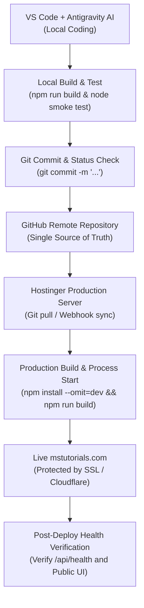

# MS Tutorials — Deployment & DevOps Workflow

This document establishes the end-to-end deployment lifecycle for the MS Tutorials platform, bridging local development on VS Code + Antigravity to the production deployment on Hostinger Business Hosting (`mstutorials.com`).

---

## 1. Golden Deployment Flow



---

## 2. Infrastructure Separation of Concerns

To prevent architectural degradation, remember the clear separation of duties:

| Entity | Role in Infrastructure | What it Contains | What it MUST NEVER Contain |
|---|---|---|---|
| **GitHub** | Source Code & Version Control | Source code, configuration templates (`.env.example`), documentation, SQL schemas. | Passwords, production API keys, live `.env`, binary student PDFs, large media files. |
| **MySQL** | Application Data Persistence | Relational records: users, enrollments, test marks, attendance, fee records, file metadata. | Binary video files, PDFs, filesystem assets. |
| **File Storage** | Binary & Private Asset Store | Large PDFs, lesson worksheets, lecture handouts, student assignment submissions. | Application source code, database tables. |
| **Hostinger** | Production Runtime Environment | Node.js runtime process, static SPA web server, SSL certificates, email routing. | Untracked exploratory code drafts. |

---

## 3. Environment Variables Strategy

Environment variables isolate runtime secrets across environments:

| Variable | Local Development | Production (Hostinger) | Security Rule |
|---|---|---|---|
| `PORT` | `5000` | Assigned by Hostinger Node Manager | Do not hardcode |
| `NODE_ENV` | `development` | `production` | Enables production optimizations |
| `VITE_API_BASE_URL` | `http://localhost:5000/api` | `https://mstutorials.com/api` | Baked at build time |
| `DB_HOST` | `localhost` | Hostinger MySQL host | Secret |
| `DB_USER` | `root` | Hostinger DB username | Secret |
| `DB_PASSWORD` | *(local pass)* | Hostinger secure password | Secret |
| `DB_NAME` | `ms_tutorials_db` | Hostinger database name | Secret |
| `JWT_SECRET` | *(dev placeholder)* | 64+ char cryptographically random hex | Extreme Secret — Never commit |

> [!CAUTION]
> **Strict Security Directive**: The `.env` file must never be added to Git. Only `.env.example` is committed to GitHub. On Hostinger, environment variables are configured directly via Hostinger's Environment Variables panel or in a private `.env` placed on the server via SSH/File Manager.

---

## 4. Step-by-Step Deployment Procedure

### Step 1: Local Verification
Before pushing any code, always execute local automated checks:
```bash
# Verify frontend bundle builds cleanly
npm run build

# Verify backend health route boots and answers
node server/server.js
```

### Step 2: Git Commit & Push
```bash
git status
git add .
git commit -m "Descriptive module commit message"
git push origin master
```

### Step 3: Deployment on Hostinger
1. **Repository Link**: In Hostinger's Git Management tool, link the GitHub repository to the target directory.
2. **Build & Dependency Installation**:
   ```bash
   npm install --omit=dev
   npm run build
   ```
3. **Application Restart**: Restart the Node.js application via the Hostinger Node.js Dashboard to apply backend updates.

### Step 4: Verification Checklist
- [ ] Visit `https://mstutorials.com/` — check HTTP 200, clean layout, working styling.
- [ ] Visit `https://mstutorials.com/api/health` — ensure status returns `healthy`.
- [ ] Verify SSL certificate shows a valid secure padlock.
- [ ] Verify browser console shows zero JavaScript uncaught exceptions.

---

## 5. Rollback & Emergency Fallback Strategies

### Fast Rollback via Git
If a regression or critical bug is discovered after deployment:
```bash
# Revert to the previous known good commit
git revert HEAD --no-edit
git push origin master
# Trigger redeploy on Hostinger
```

### Emergency ZIP / SFTP Fallback
If GitHub integration or Hostinger Git deployment is temporarily unavailable during an urgent incident:
1. Run local production build: `npm run build`.
2. Package the following safe files into an archive:
   - `dist/` (compiled frontend)
   - `server/` (backend source)
   - `package.json`
   - `package-lock.json`
3. Upload via Hostinger File Manager or SFTP directly into the application directory.
4. Restart the Node.js daemon via the control panel.
