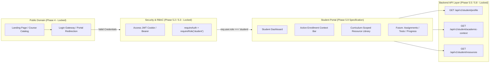
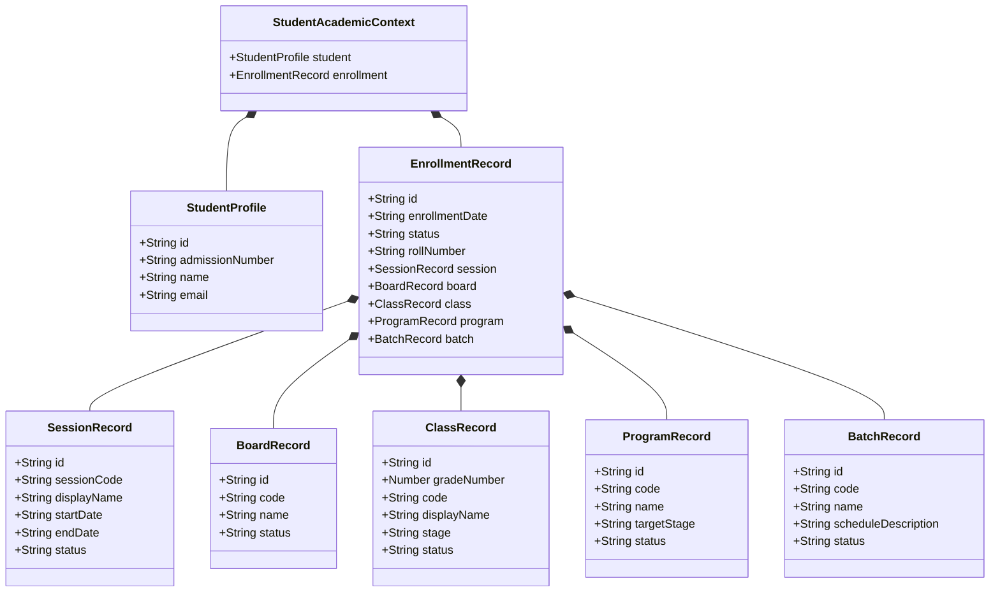
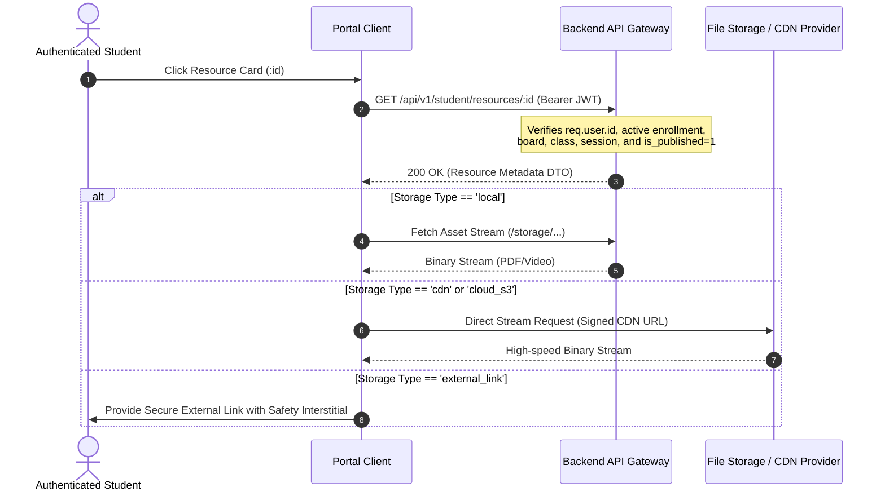
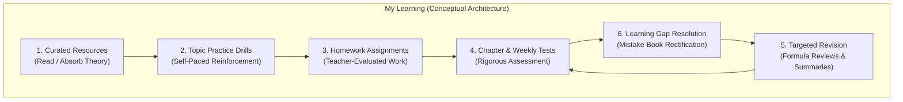
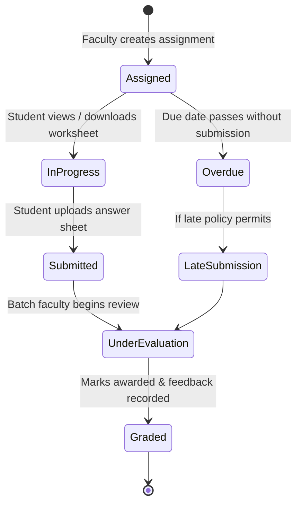
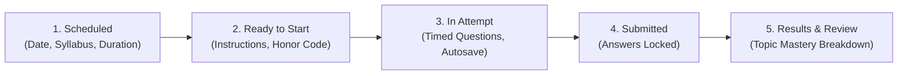
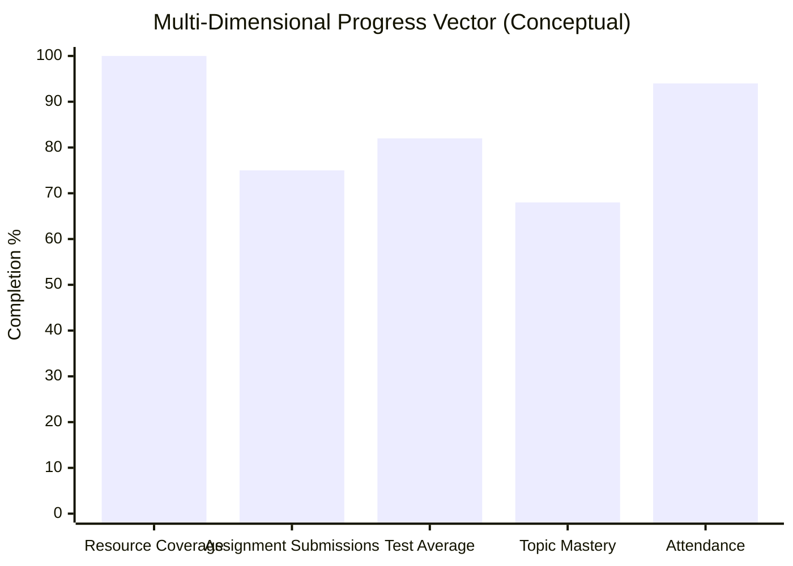
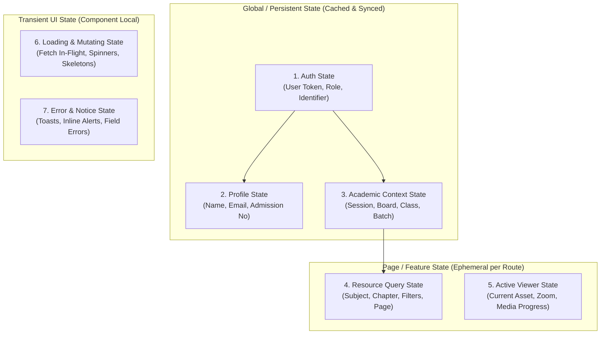
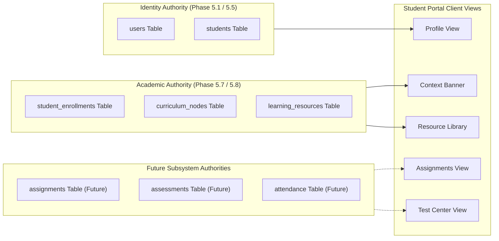
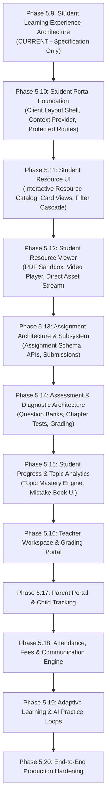

# MS Tutorials — Student Learning Experience Architecture (Phase 5.9)

> **Governing Specifications**: `docs/authentication-architecture.md` (Phase 5.0), `docs/database.md` (Phase 5.1), `docs/authorization.md` (Phase 5.3), `docs/api-architecture.md` (Phase 5.4 & 5.8), `docs/academic-architecture.md` (Phase 5.6), `docs/academic-database-design.md` (Phase 5.7)  
> **Status**: ARCHITECTURAL SPECIFICATION & BLUEPRINT ONLY (Phase 5.9)  
> **Baseline Commit**: `54e452e` (`feat: implement student learning resources API`)  
> **Scope**: Specification ONLY. Zero application code, database tables, migrations, backend endpoints, or UI components are created or modified in this phase.

---

## 1. Purpose and Scope

### 1.1 Purpose of the Student Portal
The **MS Tutorials Student Portal** is the dedicated, authenticated digital workspace for enrolled students in Grades 6 through 10 pursuing curriculum excellence in Mathematics and Science across CBSE and ICSE boards. It transitions the student from a passive consumer of public website marketing content into an active, focused academic learner.

The portal's primary purpose is to deliver an individualized, context-aware pedagogical journey where students can:
1. Ground their daily study in their authoritative institutional context (Academic Session, Board, Grade, Program Track, and Cohort Batch).
2. Access curated, verified instructional assets (theory notes, practice worksheets, question banks, video walkthroughs, and summary formula sheets) scoped strictly to their syllabus.
3. Track assignments, test performances, and topic masteries as downstream learning transaction capabilities are phased in.
4. Maintain a clear, distraction-free view of institutional announcements, faculty feedback, and attendance records.

### 1.2 What Phase 5.9 Covers
Phase 5.9 establishes the formal **front-to-back architectural blueprint** for the future Student Portal. Specifically, it specifies:
- Information architecture, navigational hierarchy, and responsive UI structural layouts.
- Data integration protocols connecting UI views to existing locked Phase 5.8 APIs (`/api/v1/student/academic-context`, `/api/v1/student/resources`, `/api/v1/student/profile`).
- Strict security, authentication, and contextual authorization boundaries.
- Client-side state orchestration, deterministic loading/empty/error states, and offline/network resiliency rules.
- Conceptual blueprints for future subsystems (Assignments, Assessments, Diagnostic Progress, and Attendance).
- Clear mapping of current implementation status versus planned and future phases.

### 1.3 What Phase 5.9 Does NOT Implement
To preserve strict phase isolation and codebase stability, Phase 5.9 enforces the following absolute constraints:
- ❌ **No Code**: Zero React components, CSS stylesheets, client hooks, or frontend routes are implemented.
- ❌ **No Database Changes**: Zero DDL scripts, SQL migrations, table additions, or schema mutations.
- ❌ **No API Additions or Modifications**: Zero Express route alterations, controller edits, or backend modifications.
- ❌ **No Mock Data / Seed Insertion**: Zero artificial rows or fake records added to database tables.
- ❌ **No Dependency Additions**: Zero npm packages or third-party libraries installed.
- ❌ **No Deployment / Git Pushes**: No remote repository commits, pushes, or hosting deployments.

### 1.4 Relationship to Public Website V1 & Backend API Architecture


1. **Public Website V1 (`f99cbf5`)**: Remains completely decoupled. The public marketing website acts only as the discovery layer and ingress point for student authentication.
2. **Backend Architecture (`docs/api-architecture.md`)**: The Student Portal is a client consumer of the RESTful API endpoints established in Phase 5.5 (`/api/v1/student/profile`), Phase 5.8C (`/api/v1/student/academic-context`), and Phase 5.8D (`/api/v1/student/resources`). The portal adheres to existing HTTP status codes, error envelopes, and pagination standards without exception.

---

## 2. Student Portal Principles

The Student Portal architecture is governed by ten foundational design principles:

1. **Student-First Cognitive Clarity**:
   Secondary school students (ages 11–16) require intuitive, low-distraction user interfaces. Cognitive friction is minimized by presenting clean typography, obvious visual hierarchies, high contrast, and direct pathways to study materials.
2. **Academic-Context-Driven Experience**:
   Every learning view is inextricably bound to the student's authoritative academic context (e.g. CBSE Class 10 Achievers 2026–27). The interface dynamically reflects this context and never requires the student to re-select their grade or board.
3. **Secure Identity-Derived Access**:
   All student requests derive authorization strictly from the authenticated user token (`req.user.id`). The client never transmits, selects, or tampers with student IDs to access resources.
4. **Strict Reuse of Locked APIs**:
   The portal must integrate with previously tested and locked endpoints. It never invents undocumented endpoints, bypasses middleware layers, or duplicates business logic in client code.
5. **Clean Separation of Concerns**:
   Presentation (UI components), application state (custom hooks/services), data fetching (API clients), and domain validation are partitioned cleanly to facilitate long-term maintainability.
6. **Mobile-Responsive Parity**:
   Recognizing that students frequently study on smartphones and tablets, all features maintain functional parity across viewports—from 360px handheld screens to 4K desktop monitors.
7. **Universal Accessibility (a11y)**:
   Compliance with WCAG 2.1 Level AA standards: fully navigable via keyboard, explicit ARIA landmarks, screen-reader-compatible form controls, and accessible color contrast.
8. **Honest System States**:
   The portal never generates synthetic analytics, placeholder grades, simulated attendance figures, or fake progress bars. If a data service is not yet implemented or active, the interface communicates that reality transparently.
9. **Progressive Extensibility**:
   The portal shell and navigation are engineered to accommodate upcoming subsystems (Assignments, Assessments, Diagnostic Analytics, Mistake Log) without requiring structural refactoring.
10. **Zero Trust Client Architecture**:
    Client-side state is treated purely as a reflection of server-side truth. All authorization, status verification, and publication checks remain strictly enforced at the database and API gateway tiers.

---

## 3. Student Portal Information Architecture

```text
Student Portal (/student/*)
├── Dashboard (/student/dashboard) [ARCHITECTURALLY PLANNED]
│   ├── Context Overview Bar (Session, Board, Class, Program, Batch)
│   ├── Quick Continue Learning
│   ├── Published Resource Highlights
│   └── System Notices & Schedule
├── My Learning (/student/learning/*)
│   ├── Resources (/student/resources) [SUPPORTED BY BACKEND API]
│   │   ├── Curriculum Hierarchy Filter (Subject, Chapter, Topic)
│   │   ├── Attribute Filters (Resource Type, Difficulty)
│   │   └── Resource Detail View (/student/resources/:id)
│   ├── Assignments (/student/assignments) [FUTURE PHASE - MARKED UNAVAILABLE]
│   └── Tests & Results (/student/tests) [FUTURE PHASE - MARKED UNAVAILABLE]
├── My Progress (/student/progress) [FUTURE PHASE - MARKED UNAVAILABLE]
│   ├── Chapter & Topic Mastery
│   └── Mistake Book & Weak Areas
├── Attendance (/student/attendance) [FUTURE PHASE - MARKED UNAVAILABLE]
│   └── Batch Session Log & Percentage
├── Communication (/student/communication/*)
│   ├── Messages (/student/messages) [FUTURE PHASE - MARKED UNAVAILABLE]
│   └── Announcements (/student/announcements) [FUTURE PHASE - MARKED UNAVAILABLE]
├── Profile & Academic Context (/student/profile) [SUPPORTED BY BACKEND API]
│   ├── Personal Identity (Name, Email, Admission No, Role)
│   └── Current Enrollment Context Details
└── Settings (/student/settings) [ARCHITECTURALLY PLANNED]
    └── Preferences, Password Security & Active Sessions
```

### Module Availability Strategy
To preserve platform credibility:
- **Active / Functional Modules**:
  - `Profile`: Powered by `GET /api/v1/student/profile`.
  - `Academic Context`: Powered by `GET /api/v1/student/academic-context`.
  - `Resources`: Powered by `GET /api/v1/student/resources` and `GET /api/v1/student/resources/:id`.
- **Planned / Shell Modules**:
  - `Dashboard`: Orchestrates available context and resource highlights; displays honest "upcoming" placeholders for pending subsystems.
  - `Settings`: Manages client-side preferences and account security.
- **Unavailable / Future Modules**:
  - `Assignments`, `Tests & Results`, `My Progress`, `Attendance`, `Messages`: Clearly flagged in navigation with a subtle `"Coming Soon"` or `"Phase-in"` badge, or hidden completely until their corresponding backend APIs are verified and locked.

---

## 4. Student Dashboard Architecture

The Student Dashboard (`/student/dashboard`) serves as the home base upon successful authentication. It aggregates institutional status and surfaces prioritized learning actions.

```mermaid
flowchart TD
    subgraph DashboardLayout["Student Dashboard (/student/dashboard)"]
        W[1. Welcome & Active Academic Context Banner]
        QA[2. Quick Actions Bar]
        subgraph MainContent["Primary Grid (2/3 Width)"]
            RC[3. Recent / Featured Study Resources]
            UA[4. Upcoming Assignments Widget<br/>(Future Data Contract)]
            UT[5. Scheduled Tests Widget<br/>(Future Data Contract)]
        end
        subgraph SideContent["Secondary Rail (1/3 Width)"]
            AS[6. Attendance Summary Card<br/>(Future Data Contract)]
            AN[7. Institutional Announcements<br/>(Future Data Contract)]
            MB[8. Academic Mentorship Contacts]
        end
    end
    W --> QA
    QA --> MainContent
    QA --> SideContent
```

### 4.1 Dashboard Widget Specifications & Data Contracts

| Widget Area | Purpose | Data Source / API Contract | Behavior When Backend Is Pending |
|:---|:---|:---|:---|
| **1. Welcome & Context Banner** | Displays student name, canonical admission number, and active academic enrollment (Session, Board, Class, Program, Batch). | **Existing API**: `GET /api/v1/student/academic-context` | If unenrolled (`enrollment === null`), renders prompt to contact academic registrar. |
| **2. Quick Actions** | Direct navigation shortcuts (e.g., "Browse Mathematics Notes", "View Practice Sheets", "Check Profile"). | Client Routing | Fully functional; targets supported `/student/resources` filtered views. |
| **3. Recent Resources** | Surfaces the latest 4 published learning resources matching the student's active enrollment. | **Existing API**: `GET /api/v1/student/resources?page=1&pageSize=4` | If 0 resources exist, displays clean empty state: *"No resources uploaded yet for your curriculum."* |
| **4. Upcoming Assignments** | Lists active homework assignments with due dates and submission statuses. | **Future API**: `GET /api/v1/student/assignments?status=pending` | Displays informational placeholder: *"Online Assignment Submissions will activate in upcoming academic term."* Zero fake data. |
| **5. Scheduled Tests** | Informs student of upcoming diagnostic, weekly, or chapter assessments. | **Future API**: `GET /api/v1/student/assessments?status=upcoming` | Displays informational placeholder: *"Test schedules will be posted here by faculty."* Zero fake data. |
| **6. Attendance Summary** | Shows cumulative attendance percentage and total classes attended for the assigned batch. | **Future API**: `GET /api/v1/student/attendance/summary` | Displays card indicating batch attendance recording commences with center sessions. |
| **7. Announcements** | Center-wide or batch-specific administrative notices. | **Future API**: `GET /api/v1/student/announcements` | Hidden or shows standard institute support contact details. |

---

## 5. Academic Context Integration

### 5.1 Single Source of Academic Truth
The portal integrates with the locked Phase 5.8C endpoint:
`GET /api/v1/student/academic-context`

The portal stores this payload in a global **Academic Context Store** initialized during application bootstrap.



### 5.2 Consumption Rules Across Portal Features
1. **Persistent Header Context Chip**:
   A prominent contextual badge in the application navbar displays:
   `[ CBSE ] [ Class 10 ] [ 2026–27 ] [ Achievers ] [ Batch EV1 ]`
2. **Authoritative Board Primacy**:
   `enrollment.board.code` is treated as authoritative. Optional cohort batch metadata (`batch.code`) never overrides the student's curriculum board.
3. **Automatic Filtering Alignment**:
   When navigating to the Resource Library, the portal automatically requests resources aligned with this active context. The student is never asked: *"Please select your Board or Grade"*.
4. **Graceful Handling of Unenrolled Students**:
   If `enrollment` is `null`:
   - An alert banner is pinned to the portal: *"Your student account is active, but you are not currently enrolled in an active academic session. Please contact administration."*
   - Study resource lists display an honest empty state (`0 total resources`).

---

## 6. Resource Library Experience

The Resource Library (`/student/resources`) interfaces directly with the locked Phase 5.8D API:
`GET /api/v1/student/resources`

### 6.1 UI Filtering & Search Strategy
The interface provides high-efficiency narrowing controls that map strictly to supported query parameters:

```text
[ Academic Context: CBSE Class 10 (2026-27) ]
-----------------------------------------------------------------------------------------
Filter by Subject:   [ All Subjects ▼ ]  (Maps to ?subjectId=)
Filter by Chapter:   [ All Chapters ▼ ]  (Maps to ?chapterId=)
Filter by Topic:     [ All Topics   ▼ ]  (Maps to ?topicId=)
Resource Type:       (•) All  ( ) Notes  ( ) Worksheet  ( ) Questions  ( ) Video  ( ) Summary
Difficulty Level:    [ All Levels ▼ ]    (foundation | standard | advanced)
-----------------------------------------------------------------------------------------
Showing 1 - 20 of 42 Published Learning Resources                      Page [ 1 ] of 3 ▶
```

#### Mapping to Phase 5.8D Parameters:
| UI Control | Type | Query Parameter | Values / Constraints |
|:---|:---|:---|:---|
| **Subject Selector** | Dropdown | `subjectId` | UUID string (resolved from curriculum nodes for active context) |
| **Chapter Selector** | Dropdown | `chapterId` | UUID string (cascades dynamically based on selected subject) |
| **Topic Selector** | Dropdown | `topicId` | UUID string (cascades dynamically based on selected chapter) |
| **Resource Type Pills** | Tab / Segmented | `resourceType` | `'notes'`, `'worksheet'`, `'important_questions'`, `'video'`, `'question_bank'`, `'summary_sheet'` |
| **Difficulty Tier** | Dropdown | `difficultyLevel` | `'foundation'`, `'standard'`, `'advanced'` |
| **Pagination** | Pager Controls | `page`, `pageSize` | `page` $\ge 1$, `pageSize` (fixed at 20; max 100) |

### 6.2 Deterministic Ordering Invariant
The UI strictly respects the server-enforced ordering:
`ORDER BY lr.created_at DESC, lr.id ASC`
The portal does **not** inject client-side sorting drop-downs (e.g., "Sort by title" or "Sort by size") because the locked Phase 5.8D backend enforces server-side deterministic ordering.

### 6.3 Resource Card Presentation
Each learning resource is displayed as a clean card containing explicit metadata:
- **Badge 1 (Resource Type)**: Clear visual indicator with thematic iconography (e.g., 📝 Notes, 📄 Worksheet, ❓ Question Bank, 🎥 Video, 📊 Summary Sheet).
- **Badge 2 (Difficulty Tier)**: Distinctive styling for `foundation` (emerald), `standard` (sapphire), and `advanced` (amber).
- **Title & Description**: Complete title and concise pedagogical scope.
- **Hierarchy Trail**: Breadcrumb string indicating attachment level:
  - Subject-Level: `Mathematics`
  - Chapter-Level: `Mathematics > Chapter 02: Polynomials`
  - Topic-Level: `Mathematics > Chapter 02: Polynomials > Topic 03: Factorization`
- **Asset Meta**: MIME type badge (e.g. `PDF`, `MP4`), formatted file size (e.g., `245 KB`, `18.2 MB`), and duration for video assets (e.g., `14 mins`).
- **Primary CTA**: Clean action button: `"Open Resource"` or `"View Practice Sheet"`.

---

## 7. Resource Detail & Asset Viewer Architecture

The Resource Detail route (`/student/resources/:id`) interfaces with the locked Phase 5.8D metadata endpoint:
`GET /api/v1/student/resources/:id`

> [!NOTE]
> These are planned client-side handling strategies. Actual file delivery, authorization, download headers, signed URLs, and storage-provider behavior will be defined during implementation. Phase 5.8D establishes read-only metadata retrieval; asset delivery mechanisms will be implemented in future phases.

### 7.1 Separation of Resource Metadata vs. File Delivery
The diagram below illustrates the planned client-side asset retrieval flow. These are planned client-side handling strategies. Actual file delivery, authorization, download headers, signed URLs, and storage-provider behavior will be defined during implementation.



### 7.2 Planned Client-Side Viewer Strategy by MIME Type

These are planned client-side handling strategies. Actual file delivery, authorization, download headers, signed URLs, and storage-provider behavior will be defined during implementation.

| Media Category | MIME Types | UI Rendering Strategy | Fallback / Security Control |
|:---|:---|:---|:---|
| **Portable Document** | `application/pdf` | Embedded sandbox PDF viewer (`<iframe sandbox>` or PDF.js canvas) with zoom, jump-to-page, and search. | Direct secure download option; print styles applied. |
| **Video Walkthrough** | `video/mp4`, `video/webm` | Custom accessible HTML5 video player with playback rate controls (0.75x, 1x, 1.25x, 1.5x), captions support, and scrub bar. | No autoplay; full keyboard controls (`Space` to pause, `M` to mute). |
| **External Link** | `text/html` / URLs | Modal safety interstitial: *"You are opening an external educational link authorized by MS Tutorials."* | Opens in `_blank` with `rel="noopener noreferrer"`. |
| **Unsupported / Archive** | `application/zip`, etc. | Informational card with file size, verified MIME badge, and download action. | Scanned before client handover. |

### 7.3 Edge State Handling
- **Missing Asset / 404**: When an asset URL fails or is purged, displays a clean recovery screen: *"This study material is currently being updated by faculty. Please check back shortly."*
- **Unauthorized Context (404/403)**: If a student pastes a resource ID belonging to another board or class standard, the API returns `404 NOT_FOUND`. The portal presents the standard not-found state without leaking the existence of the resource.

---

## 8. Student Learning Activity Model

The portal conceptualizes student academic engagement across six interconnected activity vectors under the future **"My Learning"** workspace:



### Activity Definitions:
1. **Curated Resources (Active Baseline - Phase 5.8D)**: Foundational instructional assets provided by faculty.
2. **Topic Practice (Future Conceptual)**: Ungraded atomic drills designed to build fluency in Math calculations and Science principles.
3. **Homework Assignments (Future Conceptual)**: Structured problem sets with hard submission deadlines evaluated by batch teachers.
4. **Chapter & Milestone Tests (Future Conceptual)**: Proctored or timed assessments measuring curriculum retention.
5. **Targeted Revision (Future Conceptual)**: Rapid-recall formula sheets, key definitions, and concept diagrams revisited prior to exams.
6. **Learning Gap Resolution (Future Conceptual)**: Systematic correction of historical errors cataloged in the student's personal mistake book.

---

## 9. Future Assignments Integration

> ⚠️ **NOTICE**: The specifications in this section define client requirements for downstream phases. **Zero assignment database tables, routes, or controllers exist in Phase 5.9.**

### 9.1 Required Assignment Lifecycle


### 9.2 Future Assignment Data Contract (Conceptual)
When implemented in subsequent phases, the assignment endpoint (`GET /api/v1/student/assignments`) must supply:
- `id`: Assignment UUID.
- `title`, `description`: Problem set requirements.
- `curriculumContext`: Linked Subject, Chapter, and Topic IDs.
- `assignedDate`, `dueDate`: ISO timestamps.
- `maxScore`: Maximum obtainable marks.
- `submission`:
  - `status`: `'assigned'`, `'submitted'`, `'graded'`, `'overdue'`.
  - `submittedAt`: Timestamp of submission.
  - `evaluatedScore`: Marks awarded (if graded).
  - `teacherFeedback`: Pedagogical remarks and correction guidance.

---

## 10. Future Tests & Results Integration

> ⚠️ **NOTICE**: Assessment architecture is slated for dedicated future phases (Phase 8.0+ / Phase 9.0+). **No assessment engines, quiz tables, or score ledgers exist in Phase 5.9.**

### 10.1 Required Test Lifecycle


### 10.2 Student Experience Requirements:
- **Pre-Test Briefing**: Clear disclosure of total marks, negative marking rules (if applicable), total questions, and exact chapter/topic syllabus coverage.
- **Test Taking Interface**: Zero-distraction full-screen layout with question palette (Answered, Flagged for Review, Unvisited), countdown timer, and automated response persistence.
- **Post-Test Diagnostics**: Instead of simply returning a raw score (e.g. `34/50`), the result view must highlight performance partitioned by atomic topic (e.g., *Algebra: 90% Mastered*, *Coordinate Geometry: 40% Learning Gap*).

---

## 11. Progress Architecture

### 11.1 The Progress Invariant
**Progress metrics must reflect verified student academic transactions, never synthetic estimates.**

A credible LMS avoids vanity percentages (e.g. arbitrarily showing "45% Completed" merely because a PDF was downloaded). In MS Tutorials, true academic progress is multi-dimensional:



### 11.2 Future Progress Dimensions:
1. **Instructional Resource Coverage**: Verified viewing/download of chapter notes and summary sheets.
2. **Assignment Completion Rate**: Percentage of assigned problem sets submitted on time and evaluated.
3. **Assessment Mastery Index**: Weighted score aggregate across diagnostic and milestone chapter tests.
4. **Topic Mastery Matrix**: Topic-by-topic classification (`Mastered`, `Developing`, `Needs Practice`) calculated deterministically from evaluated question attempts.
5. **Classroom Attendance**: Attendance record across scheduled batch sessions.

---

## 12. Navigation and Routing

### 12.1 Route Map & Access Guard Specifications

| Client Route Pattern | Module Description | Access Guard | Current Backend Status |
|:---|:---|:---|:---|
| `/student/login` | Student authentication entry | Public / Guest Only | **IMPLEMENTED** (`/api/auth/login`) |
| `/student/dashboard` | Main student dashboard workspace | `requireStudentAuth` | **PLANNED** (Context + Resource APIs active) |
| `/student/resources` | Curriculum Resource Library | `requireStudentAuth` | **IMPLEMENTED** (`/api/v1/student/resources`) |
| `/student/resources/:id` | Resource Document/Video Viewer | `requireStudentAuth` | **IMPLEMENTED** (`/api/v1/student/resources/:id`) |
| `/student/learning` | Redirects to `/student/resources` | `requireStudentAuth` | **PLANNED** |
| `/student/assignments` | Homework & assignment manager | `requireStudentAuth` | **FUTURE PHASE** (Module Unavailable) |
| `/student/tests` | Assessment schedule & test portal | `requireStudentAuth` | **FUTURE PHASE** (Module Unavailable) |
| `/student/results` | Historical test report cards | `requireStudentAuth` | **FUTURE PHASE** (Module Unavailable) |
| `/student/progress` | Mastery metrics & mistake log | `requireStudentAuth` | **FUTURE PHASE** (Module Unavailable) |
| `/student/attendance` | Batch session attendance ledger | `requireStudentAuth` | **FUTURE PHASE** (Module Unavailable) |
| `/student/messages` | Faculty direct communication | `requireStudentAuth` | **FUTURE PHASE** (Module Unavailable) |
| `/student/announcements`| Institutional bulletin board | `requireStudentAuth` | **FUTURE PHASE** (Module Unavailable) |
| `/student/profile` | Student profile & enrollment context | `requireStudentAuth` | **IMPLEMENTED** (`/api/v1/student/profile` + context) |
| `/student/settings` | Student preferences & password reset | `requireStudentAuth` | **PLANNED** |

---

## 13. API Integration Map

The following matrix documents the complete API integration landscape, explicitly differentiating locked endpoints from future phase endpoints:

| Feature / Domain | Existing Backend API | Future / Planned Backend API | Current Status |
|:---|:---|:---|:---:|
| **Authentication: Login** | `POST /api/auth/login` | — | **LOCKED (Phase 5.2)** |
| **Authentication: Refresh** | `POST /api/auth/refresh` | — | **LOCKED (Phase 5.2)** |
| **Authentication: Logout** | `POST /api/auth/logout` | — | **LOCKED (Phase 5.2)** |
| **Identity: Session Verification**| `GET /api/auth/me` | — | **LOCKED (Phase 5.3)** |
| **Identity: Student Profile** | `GET /api/v1/student/profile` | — | **LOCKED (Phase 5.5)** |
| **Academic Context** | `GET /api/v1/student/academic-context` | — | **LOCKED (Phase 5.8C)** |
| **Academic Reference Data** | `GET /api/v1/academic/*` | — | **LOCKED (Phase 5.8A)** |
| **Curriculum Hierarchy** | `GET /api/v1/curriculum/*` | — | **LOCKED (Phase 5.8B)** |
| **Resource Library Listing** | `GET /api/v1/student/resources` | — | **LOCKED (Phase 5.8D)** |
| **Resource Asset Detail** | `GET /api/v1/student/resources/:id` | — | **LOCKED (Phase 5.8D)** |
| **Assignments: Listing & Detail**| — | `GET /api/v1/student/assignments` | **FUTURE PHASE** |
| **Assignments: Submission** | — | `POST /api/v1/student/assignments/:id/submit` | **FUTURE PHASE** |
| **Tests: Schedule & Detail** | — | `GET /api/v1/student/assessments` | **FUTURE PHASE** |
| **Tests: Take & Submit Attempt** | — | `POST /api/v1/student/assessments/:id/attempt`| **FUTURE PHASE** |
| **Tests: Results & Feedback** | — | `GET /api/v1/student/assessments/:id/results`| **FUTURE PHASE** |
| **Progress: Topic Mastery** | — | `GET /api/v1/student/progress/mastery` | **FUTURE PHASE** |
| **Progress: Mistake Book** | — | `GET /api/v1/student/progress/mistakes` | **FUTURE PHASE** |
| **Attendance: Monthly Ledger** | — | `GET /api/v1/student/attendance` | **FUTURE PHASE** |
| **Communication: Notices** | — | `GET /api/v1/student/announcements` | **FUTURE PHASE** |
| **Communication: Faculty Inbox** | — | `GET /api/v1/student/messages` | **FUTURE PHASE** |

---

## 14. Security and Authorization

### 14.1 Authentication & Token Lifecycle
1. **Access Tokens**: Short-lived JWTs ($15\text{ minutes}$) containing `{ id, role: 'student', identifier }` transmitted via `Authorization: Bearer <token>` or secure HTTP-only cookies.
2. **Refresh Tokens**: HttpOnly refresh-token mechanism with server-side persistence, hashing, expiry and revocation, as defined by the locked authentication architecture.
3. **Session Expiry Handling**: When an access token expires during portal use, the client's HTTP interceptor calls `POST /api/auth/refresh` transparently. If refresh fails (e.g. token revoked or session expired), the student is smoothly redirected to `/student/login` with state preservation (`?redirect=/student/resources`).

### 14.2 Authorization Invariants
- **Student-Only RBAC**: Every portal route requires `requireRole('student')`. Any token bearing a role of `parent`, `teacher`, or `admin` is rejected with `403 Forbidden`.
- **Zero Client Identity Trust**: The client never supplies `studentId`, `userId`, or `admissionNumber` in route parameters or query bodies. All data is scoped exclusively to `req.user.id`.
- **401 vs 403 vs 404 Contract**:
  - `401 Unauthorized`: Missing, expired, or cryptographically invalid token.
  - `403 Forbidden`: Authenticated user is not a student (e.g. parent attempting to access student dashboard directly).
  - `404 NOT_FOUND`: Resource does not exist OR belongs to another academic context (e.g. ICSE Class 10 student probing CBSE Class 9 resource ID). Out-of-scope resources are strictly masked as `404 NOT_FOUND` to prevent ID harvesting.
- **Audit Privacy**: Responses never include sensitive backend hashes, salt values, lockout timestamps, or internal staff identifiers (`uploaded_by`).

---

## 15. State Management

The portal client architecture partitions application state into seven distinct, predictable categories:



### State Fetching Strategy:
- **Fetch Once & Retain**: Auth user (`/api/auth/me`), Student Profile (`/api/v1/student/profile`), and Academic Context (`/api/v1/student/academic-context`) are fetched on initial application load and cached globally. They remain valid for the entire session unless invalidated.
- **Fetch on Navigation**: Resource catalog queries (`/api/v1/student/resources?page=...`) are fetched on-demand when filters or page indexes change.
- **No Library Prescription**: This architecture deliberately remains agnostic to specific client state libraries (e.g. React Context, Zustand, Redux, or TanStack Query). Any standard modern state mechanism implementing these lifecycle boundaries is compliant.

---

## 16. Loading, Empty, and Error States

To adhere to Principle 8 (*Honest System States*), the portal enforces deterministic UI presentations for every operational state:

```text
Operational Scenarios & UI State Specifications:

1. Data Fetch In-Flight:
   [ Skeleton Cards / Pulsing Wireframes ]
   - Renders exact geometric layout of resource cards or profile headers.
   - Prevents layout shift (CLS). Never displays generic blocking spinners.

2. Unenrolled Student (enrollment === null):
   [ Status Card: Academic Enrollment Pending ]
   - Headline: "Account Active — Enrollment Pending"
   - Body: "Your student record is verified, but you have not yet been assigned to an active 
     academic session cohort. Please contact the academic coordinator."
   - Action: "Contact Institute Support"

3. Empty Resource Catalog (total === 0):
   [ Informational Slate: No Study Materials Available ]
   - Graphic: Clean book/document illustration.
   - Headline: "No Resources Found"
   - Body: "No learning materials currently match your selected filters for CBSE Class 10."
   - Action: "Clear All Filters" button.

4. Unauthorized / Out-of-Scope Resource ID (404):
   [ Recovery Slate: Material Not Found ]
   - Headline: "Resource Not Found"
   - Body: "The requested learning material does not exist or is not available for your curriculum."
   - Action: "Return to Resource Library"

5. Network Disconnection / Server Error (500):
   [ Warning Slate: Connection Issue ]
   - Headline: "Service Temporarily Unavailable"
   - Body: "We could not connect to the academic server. Your session is safe."
   - Action: "Retry Request" button with exponential backoff indicator.
```

---

## 17. Responsive Design Architecture

The Student Portal user experience is engineered across three canonical device tiers utilizing the existing MS Tutorials design token palette (Deep Navy `#0A192F`, Academic Slate `#1E293B`, Gold `#D97706`, and Clean White/Off-White):

```text
Responsive Layout Topologies:

A. Desktop (>= 1024px Viewports):
┌────────────────────────────────────────────────────────────────────────┐
│ Header: Logo | Context Chip: [CBSE 10 Achievers] | Profile Menu (User)│
├──────────────┬─────────────────────────────────────────────────────────┤
│ Left Rail    │ Main Content Area                                       │
│ Navigation   │                                                         │
│ • Dashboard  │ [ Breadcrumbs: My Learning > Resources                ] │
│ • Resources  │ [ Subject Filters ] [ Chapter Filters ] [ Type Tabs   ] │
│ • Assignments│ ┌──────────────┐ ┌──────────────┐ ┌──────────────┐      │
│ • Tests      │ │ Resource 1   │ │ Resource 2   │ │ Resource 3   │      │
│ • Progress   │ └──────────────┘ └──────────────┘ └──────────────┘      │
│ • Profile    │ [ Pagination: Page 1 of 4 < Prev | Next >             ] │
└──────────────┴─────────────────────────────────────────────────────────┘

B. Tablet (768px - 1023px Viewports):
┌────────────────────────────────────────────────────────────────────────┐
│ Header: [☰ Menu] | Logo | Context Chip | Profile Avatar               │
├────────────────────────────────────────────────────────────────────────┤
│ Main Content Area (2-Column Grid)                                      │
│ [ Filters Collapsible Accordion ]                                      │
│ ┌───────────────────────────┐ ┌───────────────────────────┐            │
│ │ Resource Card 1           │ │ Resource Card 2           │            │
│ └───────────────────────────┘ └───────────────────────────┘            │
└────────────────────────────────────────────────────────────────────────┘

C. Mobile Handheld (360px - 767px Viewports):
┌────────────────────────────────────────────────────────────────────────┐
│ Mobile Top Bar: [MS Tutorials] [CBSE 10] [Avatar]                     │
├────────────────────────────────────────────────────────────────────────┤
│ Single Column Feed                                                     │
│ [ Filter Trigger Button: "Filter Materials (2 Active)" ]              │
│ ┌────────────────────────────────────────────────────────────────────┐ │
│ │ Resource Card (Stacked Meta, Large Touch Target: 48px CTAs)        │ │
│ └────────────────────────────────────────────────────────────────────┘ │
├────────────────────────────────────────────────────────────────────────┤
│ Bottom Sticky Navigation Bar:                                          │
│ [ 🏠 Home ]  [ 📚 Resources ]  [ 📝 Tasks ]  [ 👤 Profile ]           │
└────────────────────────────────────────────────────────────────────────┘
```

### Responsive Invariants:
- **Touch Target Sizing**: All interactive touch points (buttons, cards, filter chips) maintain a minimum hit area of $48 \times 48\text{ px}$.
- **Horizontal Overflow Prohibition**: Strict CSS layout enforcement preventing horizontal document scrolling across all mobile screens.
- **Table Virtualization / Card Conversion**: Multi-column tabular data (e.g. future test ledgers) gracefully transforms into responsive card lists on mobile viewports.

---

## 18. Accessibility (a11y) Standards

The Student Portal strictly incorporates WCAG 2.1 Level AA accessibility mandates:

1. **Semantic DOM Hierarchy**:
   - Every page enforces a single `<h1>` tag matching the primary workspace view.
   - Distinct semantic structural regions: `<header>`, `<nav aria-label="Portal Navigation">`, `<main id="main-content">`, `<section>`, and `<aside>`.
2. **Keyboard Navigation & Focus Management**:
   - A visible "Skip to main content" link is rendered as the first focusable element.
   - Comprehensive keyboard navigation support (`Tab`, `Shift+Tab`, `Enter`, `Space`, `Escape`).
   - Highly visible focus rings (`2px solid #2563EB` with `2px offset`) that are never suppressed with `outline: none`.
3. **Screen Reader Optimization**:
   - Informative `aria-expanded` and `aria-controls` bindings on collapsible filter panels.
   - Dynamic live announcements using `<div aria-live="polite">` when filter results update or pagination changes.
   - Explicit `aria-label` tags on icon-only buttons (e.g., `<button aria-label="Close resource preview">`).
4. **Color Contrast & Readability**:
   - Contrast ratio $\ge 4.5:1$ for normal text and $\ge 3:1$ for large text against background shades.
   - Visual information is never communicated through color alone; badges combine color coding with explicit text and iconography.
5. **Reduced Motion Respect**:
   - All CSS transitions and animations honor `@media (prefers-reduced-motion: reduce)`, instantly falling back to zero-duration state changes.

---

## 19. Data Ownership and Sources of Truth

To prevent architectural entropy, the Student Portal establishes non-overlapping boundaries for data ownership:



| Domain Data Entity | Authoritative Source of Truth | Access Pathway |
|:---|:---|:---|
| **User Identity & Credentials** | `users` table | `POST /api/auth/*` |
| **Student Profile Data** | `students` table | `GET /api/v1/student/profile` |
| **Annual Academic Placement** | `student_enrollments` table | `GET /api/v1/student/academic-context` |
| **Curriculum Taxonomy & Tree** | `curriculum_nodes`, `chapters`, `topics` | `GET /api/v1/curriculum/*` |
| **Curated Learning Assets** | `learning_resources` table | `GET /api/v1/student/resources/*` |
| **Homework Problem Sets** | Future `assignments` subsystem | Future assignment routes |
| **Assessment Marks & Mastery**| Future `assessments` subsystem | Future assessment routes |
| **Session Attendance Records** | Future `attendance` subsystem | Future attendance routes |

---

## 20. Future Extensibility & Phase Readiness

The Student Portal architecture is constructed to scale across future academic subsystems without requiring rewrites of its foundational routing, layout shells, or context mechanisms:

1. **Pluggable Activity Subsystems**:
   The `/student/learning` route shell uses a unified nested routing pattern. When the Assignment Subsystem (Phase 5.12) and Assessment Subsystem (Phase 5.13) are implemented, their UI components mount directly into existing shell slots.
2. **Mistake Book & Diagnostic Practice**:
   The `topics` table from Phase 5.7A already features canonical UUIDs (`topics.id`). When the Mistake Book subsystem is introduced, diagnostic error logs link directly to existing topics and pull remedial worksheets from `learning_resources` matching `topic_id`.
3. **Faculty Feedback Channels**:
   The portal layout reserves designated message drawers for teacher feedback that bind directly to batch faculty assignments.
4. **Parent Visibility Mirroring**:
   Because `parent_student` junction tables already link parents to verified student IDs in Phase 5.1, the Parent Portal (Phase 5.16) will consume the exact same underlying student resource and performance APIs using parent-scoped gateway authorization (`requireParentOfStudent`).

---

## 21. Implementation Boundaries

To ensure absolute adherence to project integrity, the boundary of Phase 5.9 is strictly circumscribed:

### Explicitly Excluded from Phase 5.9:
- ❌ **No Frontend Components Created**: No JSX/TSX files, CSS modules, or client views written.
- ❌ **No Database Tables or Schemas**: No database modifications or SQL executions.
- ❌ **No API Endpoints Added**: No new Express routes or controllers created.
- ❌ **No Authentication Alterations**: Zero changes to JWT strategies, token services, or login controllers.
- ❌ **No Resource Management / Upload Features**: No teacher resource authoring, file uploads, or admin deletions.
- ❌ **No Student Interaction Tracking**: No assignment submission tables, quiz runners, completion tracking, or bookmarking.
- ❌ **No Deployment**: No builds deployed or pushed to remote repositories.

---

## 22. Future Implementation Roadmap

Following the approval of Phase 5.9, the downstream implementation roadmap is sequenced logically:



---

## 23. Acceptance Criteria

Phase 5.9 is considered complete and verified when all of the following objective criteria are satisfied:

1. **Zero Contradictions with Locked Foundations**:
   - Accurately references locked APIs: `/api/v1/student/profile` (5.5), `/api/v1/student/academic-context` (5.8C), `/api/v1/student/resources` (5.8D), and `/api/v1/student/resources/:id` (5.8D).
   - Accurately reflects existing database tables and relational constraints established in Phase 5.1 and Phase 5.7A.
2. **Absolute Identity Security Preservation**:
   - Re-affirms that student authorization is derived exclusively from `req.user.id`.
   - Client-supplied IDs are rejected; student context is non-tamperable.
3. **Realistic Feature Demarcation**:
   - Clear and unambiguous partitioning between currently implemented APIs, planned UI integrations, and future academic subsystems.
   - Zero invented APIs or non-existent endpoints presented as active.
4. **Honest Operational State Rules**:
   - Mandatory rules prohibiting fake analytics, simulated grades, or mock attendance figures.
   - Comprehensive edge-case specifications for unenrolled students, empty resource catalogs, and missing assets.
5. **No Code / No Schema Alteration**:
   - Zero application code written or modified.
   - Zero database tables, migrations, or dependencies added.
   - `git status` verifies a completely clean working tree outside of this documentation file.

---

**END OF SPECIFICATION — PHASE 5.9 ARCHITECTURE READY FOR REVIEW**
