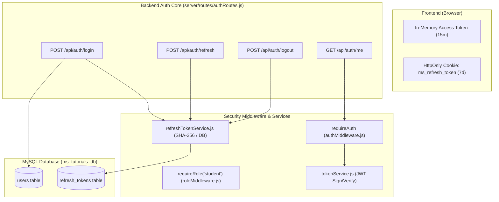
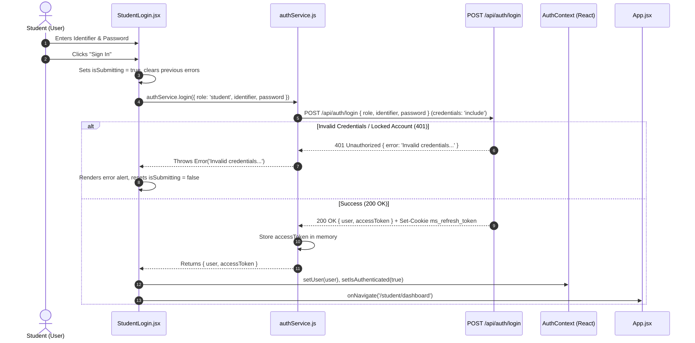
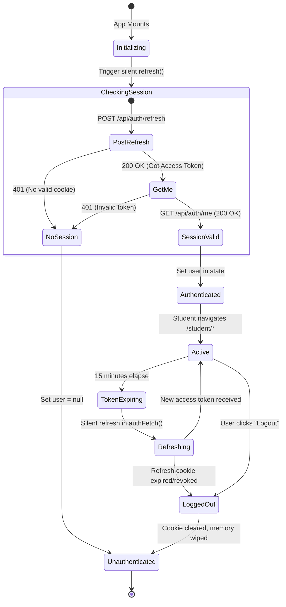
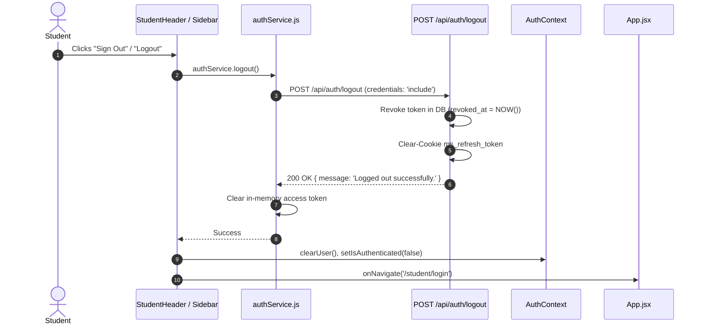
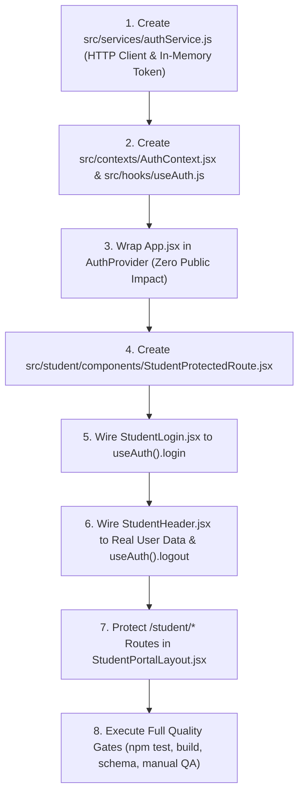

# MS Tutorials — Student Portal Authentication Integration Plan (Phase 5.10B)

> **Governing Specifications**: `docs/AI_CODING_GUIDE.md`, `docs/architecture.md`, `docs/authentication-architecture.md` (Phase 5.0), `docs/authentication-backend.md` (Phase 5.2), `docs/authorization.md` (Phase 5.3), `docs/api-architecture.md` (Phase 5.4), `docs/student-learning-experience-architecture.md` (Phase 5.9), `docs/student-portal-foundation-plan.md` (Phase 5.10A)  
> **Status**: ARCHITECTURAL SPECIFICATION & IMPLEMENTATION PLAN ONLY  
> **Target Scope**: Integration of Locked Backend Authentication with Student Portal Frontend  
> **Execution Constraint**: Zero application code, zero React modifications, zero database mutations, zero API endpoint changes, zero new dependencies, and zero changes to the locked public website in this planning phase.

---

## 1. Scope and Objective

### 1.1 Objective
The primary objective of **Phase 5.10B** is to design the complete, secure, and production-grade integration between the **locked backend authentication system** (Phases 5.0–5.3) and the **Student Portal frontend foundation** (Phase 5.10A).

This plan establishes:
1. **Frontend Authentication Service**: A clean HTTP client (`src/services/authService.js`) interfacing with existing backend routes (`/api/auth/login`, `/api/auth/refresh`, `/api/auth/logout`, `/api/auth/me`).
2. **Client Session Lifecycle**: Management of short-lived JWT access tokens in memory, silent background refresh via existing HttpOnly cookies, and automatic session restoration.
3. **Protected Route Gateway**: Securing `/student/*` routes so that unauthenticated visitors or non-student roles are prevented from viewing student workspace views.
4. **Student-Role Enforcement**: Client-side verification that `user.role === 'student'`, backed by backend authorization enforcement.
5. **Robust State & Error Management**: User-friendly UI feedback for loading, invalid credentials, account lockouts, network errors, and session expirations.

### 1.2 Strict Scope Boundaries
To maintain absolute stability and follow MS Tutorials architectural guidelines:
- **No New Backend Logic**: The backend authentication core is locked and tested (Phases 5.2 and 5.3). Zero server routes, controllers, or database tables will be altered.
- **No External State Libraries**: No Redux, Zustand, Recoil, or MobX will be introduced. Lightweight React Context + Custom Hooks (`useAuth`) provides complete, idiomatically clean state management.
- **No Third-Party Routing Dependencies**: The native history-based routing introduced in Phase 5.10A will be preserved.
- **No Downstream Integrations**: Academic context (`/api/v1/student/academic-context`), student profile (`/api/v1/student/profile`), and learning resources (`/api/v1/student/resources`) remain strictly scheduled for subsequent phases.

---

## 2. Existing Authentication Infrastructure

The backend authentication core was constructed and locked across Phases 5.1, 5.2, and 5.3.



### 2.1 Backend Contract Specifications

| Endpoint | Verb | Request Payload / Headers | Success Response (200 OK) | Error Codes |
|:---|:---:|:---|:---|:---:|
| `/api/auth/login` | `POST` | `Content-Type: application/json`<br/>`{ role: 'student', identifier: '...', password: '...' }` | `{ user: { id, role, identifier, name }, accessToken: '...' }`<br/>*(Sets HttpOnly cookie `ms_refresh_token`)* | `400` (Validation)<br/>`401` (Bad credentials / locked)<br/>`500` (Server) |
| `/api/auth/refresh` | `POST` | `credentials: 'include'`<br/>Cookie: `ms_refresh_token` | `{ accessToken: '...' }` | `401` (Missing, invalid, revoked, or expired cookie) |
| `/api/auth/logout` | `POST` | `credentials: 'include'`<br/>Cookie: `ms_refresh_token` | `{ message: 'Logged out successfully.' }`<br/>*(Clears HttpOnly cookie)* | `200` (Idempotent)<br/>`500` (Server) |
| `/api/auth/me` | `GET` | `Authorization: Bearer <accessToken>` | `{ user: { id, role, identifier, name } }` | `401` (Missing / invalid token) |

### 2.2 Security Characteristics
1. **HttpOnly Cookie**: The refresh token is stored in cookie `ms_refresh_token` with `path: /api/auth`, `SameSite: strict`, `HttpOnly: true`, and `Secure` in production. JavaScript cannot read or manipulate it.
2. **Access Token Lifetime**: 15 minutes (`JWT_ACCESS_EXPIRES_IN: '15m'`).
3. **Refresh Token Lifetime**: 7 days (`REFRESH_TOKEN_EXPIRES_IN_DAYS: 7`).
4. **Brute Force Protection**: 5 failed login attempts trigger a 15-minute account lockout (`MAX_FAILED_LOGIN_ATTEMPTS: 5`, `LOCKOUT_DURATION_MINUTES: 15`).

---

## 3. Frontend Authentication Service

A dedicated API communication module will be created at `src/services/authService.js`.

### 3.1 Design Principles
- **Native `fetch` API**: Uses standard browser `fetch` without adding Axios or external HTTP libraries.
- **Strict `credentials: 'include'`**: All requests to `/api/auth/*` must transmit and accept HttpOnly cookies.
- **In-Memory Token Holding**: The service maintains a closure variable holding the active access token in JavaScript memory.
- **No Token in Storage**: Access tokens are **never** written to `localStorage` or `sessionStorage` to mitigate Cross-Site Scripting (XSS) credential theft.

### 3.2 Method Signatures
```javascript
// Conceptual Signatures for src/services/authService.js
export const authService = {
  // Sets or retrieves the in-memory access token
  setAccessToken(token) {},
  getAccessToken() {},

  // Authenticates with backend; returns { user, accessToken }
  async login({ role = 'student', identifier, password }) {},

  // Exchanges HttpOnly cookie for new access token; returns { accessToken }
  async refresh() {},

  // Revokes refresh token in database, clears cookie, wipes memory
  async logout() {},

  // Fetches current authenticated user profile using Bearer access token
  async getMe() {},

  // Authenticated fetch wrapper that automatically attaches Bearer token
  // and handles 401 retry via refresh()
  async authFetch(url, options = {}) {},
};
```

---

## 4. Student Login Flow

The login interaction transitions the user from an unauthenticated visitor to an active student session.



### 4.1 Login Validations & Safeguards
- **Mandatory Role**: The payload always sets `role: 'student'`. The UI does not provide a role selector on the student portal login page.
- **Sanitized Inputs**: Whitespace is trimmed from `identifier`. Empty submissions are blocked client-side before network dispatch.
- **Password Obfuscation**: Password input uses `type="password"` with standard browser security rules.
- **Form State**: Submit button displays `<LoadingSpinner size="sm" />` and is disabled while the request is in-flight (`aria-busy="true"`).

---

## 5. Session Lifecycle

Session persistence operates seamlessly across page reloads, browser restarts, and tab closures without compromising security.



### 5.1 Three Lifecycle Phases
1. **Bootstrap / Hydration**: When the application loads, `AuthContext` starts in `isLoading: true`. It executes a silent `authService.refresh()` in the background. If successful, it calls `GET /api/auth/me` to populate user identity. If it fails (e.g. fresh visitor or expired session), it cleanly marks `isAuthenticated: false` without generating console errors.
2. **Active Operation**: All authenticated requests pass the short-lived access token in the `Authorization: Bearer <token>` header.
3. **Automatic Silent Refresh**: A request encountering a `401 Unauthorized` triggers an automatic, single-attempt call to `POST /api/auth/refresh`. If the refresh succeeds, the original request is replayed transparently.

---

## 6. `/api/auth/me` Integration

The `/api/auth/me` endpoint serves as the **authoritative session verification anchor**:
- **Why Required**: While `/api/auth/refresh` returns an access token, `/api/auth/me` provides the decoded, verified server-side identity object:
  ```json
  {
    "user": {
      "id": "e4f8d220-7b56-4c90-bc4a-67d1a2938491",
      "role": "student",
      "identifier": "AS26090",
      "name": "Rahul Sharma"
    }
  }
  ```
- **Caching**: The response is held in the React `AuthContext` state. It is refreshed whenever a new access token is established or during portal re-entry.
- **Verification Guarantee**: Prevents client-side state divergence where a token might exist in memory but the user record was deactivated or modified in the database.

---

## 7. Access-Token Handling

To maintain maximum defense-in-depth against credential theft:

### 7.1 In-Memory Storage Rule
- **Primary Rule**: The access token resides **strictly in closure memory** inside `authService.js`.
- **Absolute Prohibition**:
  - ❌ NEVER write access token to `window.localStorage`.
  - ❌ NEVER write access token to `window.sessionStorage`.
  - ❌ NEVER write access token to unencrypted client cookies.
- **Rationale**: LocalStorage and SessionStorage are accessible to any JavaScript running on the domain (including potential third-party scripts, browser extensions, or XSS vectors). Memory-only storage ensures that an XSS vulnerability cannot extract long-term credentials.

### 7.2 Token Expiry Strategy
- Access tokens expire in 15 minutes (`JWT_ACCESS_EXPIRES_IN`).
- The client does not attempt complex timer-based preemptive scheduling. Instead, it relies on standard reactive 401 interception:
  - If a call returns 401, `authFetch` attempts silent token refresh.
  - If refresh succeeds, the new token is stored in memory and the request is retried.
  - If refresh fails, the session is invalidated immediately.

---

## 8. Refresh-Token Mechanism Integration

The Student Portal connects to the locked Phase 5.2 refresh token infrastructure:
1. **Cookie Transmission**:
   - The frontend never reads, decodes, or parses `ms_refresh_token`.
   - The browser automatically handles cookie transport on `fetch('/api/auth/refresh', { method: 'POST', credentials: 'include' })`.
2. **Server-Side Security Enforced**:
   - Server checks SHA-256 hash in `refresh_tokens` table.
   - Server verifies expiry (`expires_at > NOW()`).
   - Server verifies revocation (`revoked_at IS NULL`).
   - Server verifies user status (`users.status === 'active'`).
3. **Multi-Tab Synchronization**:
   - If a student opens multiple tabs, all tabs share the single HttpOnly cookie.
   - When any tab refreshes, the server validates the cookie and issues a valid access token for that tab.

---

## 9. Logout Flow

Logout is a coordinated, two-way termination sequence:



### 9.1 Idempotent & Fault-Tolerant
Even if the network drops or the backend returns an error during logout:
- The client **always** purges local memory and sets `isAuthenticated: false`.
- The client redirects to `/student/login`.
- This ensures a student is never trapped in an "authenticated" visual state if the server is temporarily unreachable.

---

## 10. Protected `/student/*` Routing

The routing architecture in `src/App.jsx` will be upgraded with a dedicated **Guard Component** (`StudentProtectedRoute.jsx`):

```text
Incoming Navigation to /student/*
                │
                ▼
      Is Auth Loading? ────(Yes)────► Render Fullscreen Portal Spinner
                │
               (No)
                │
      Is Authenticated? ────(No)────► Redirect to /student/login?redirect={currentPath}
                │
               (Yes)
                │
      Is Role === 'student'? ─(No)──► Render 403 Forbidden State (Access Denied)
                │
               (Yes)
                ▼
      Render StudentPortalLayout (Dashboard, Resources, etc.)
```

### 10.1 Route Boundary Matrix
| Route | Auth Required? | Allowed Role | Unauthenticated Behavior | Wrong Role Behavior |
|:---|:---:|:---:|:---|:---|
| `/` through `/contact` | No | Any / Anonymous | Render public marketing page | Render public marketing page |
| `/student/login` | No (Guest) | Any | Render `StudentLogin` form | If already logged in as student: redirect $\to$ `/student/dashboard` |
| `/student` | Yes | `student` | Redirect $\to$ `/student/login` | Show 403 Forbidden view |
| `/student/dashboard` | Yes | `student` | Redirect $\to$ `/student/login` | Show 403 Forbidden view |
| `/student/resources` | Yes | `student` | Redirect $\to$ `/student/login` | Show 403 Forbidden view |
| `/student/*` (All other) | Yes | `student` | Redirect $\to$ `/student/login` | Show 403 Forbidden view |

---

## 11. Student-Role Enforcement

### 11.1 Client-Side Enforcement
The portal strictly validates:
```javascript
if (user.role !== 'student') {
  // Block access to student portal UI
}
```
If an administrative or teacher user logs in through the backend, the Student Portal will refuse to render student study records, displaying an explicit **Role Mismatch Card**:
> *"Access Restricted: You are signed in as an {role}. The Student Portal is reserved exclusively for enrolled students."*

### 11.2 Backend as Ultimate Authority
Client-side role checks provide clean UX; however, the **backend remains the non-negotiable security boundary**:
- Locked backend endpoints (`/api/v1/student/*`) independently execute `requireAuth` followed by `requireRole('student')`.
- Even if a malicious actor tampers with client-side state, backend requests will be rejected with `403 Forbidden`.

---

## 12. Loading and Authentication States

To ensure visual stability and prevent Content Layout Shift (CLS) or "flickering" redirects:

1. **`isInitializing` State**:
   - While the initial background refresh check is in-flight on application mount, the portal displays a clean, centered loading state using the existing `<LoadingSpinner size="lg" />`.
   - Public marketing routes **do not** block on this check; they render immediately.
2. **`isSubmitting` State**:
   - On `StudentLogin.jsx`, form inputs and submission buttons are disabled during network round-trips.
3. **Optimistic Transition**:
   - Once credentials are verified, state transitions smoothly without full-page reloads.

---

## 13. Error Handling

Deterministic error messaging adhering to honest system states:

| Scenario | HTTP Status | Frontend Presentation | Recovery Action |
|:---|:---:|:---|:---|
| **Invalid Identifier/Password** | `401 Unauthorized` | Inline alert on login card: *"Invalid credentials. Please verify your student identifier and password."* | Re-enter credentials |
| **Account Temporarily Locked** | `401 Unauthorized` | Warning alert on login card: *"Account temporarily locked due to multiple failed login attempts. Please try again in 15 minutes."* | Wait for lockout expiry |
| **Account Inactive** | `401 Unauthorized` | Alert on login card: *"Account is inactive. Please contact the academic coordinator."* | Institute support link |
| **Network Disconnection** | `FetchError` / `TypeError` | Alert: *"Unable to connect to authentication server. Please check your internet connection."* | Retry button |
| **Session Expired During Use** | `401` on refresh | Toast / modal notice: *"Your session has expired. Please sign in again."* | Redirect $\to$ `/student/login` |

---

## 14. Unauthorized / Forbidden Behavior

### 14.1 401 Unauthorized (Missing or Expired Session)
- When a user directly visits `/student/dashboard` without a session:
  1. The path is saved in the URL query parameter: `/student/login?redirect=/student/dashboard`.
  2. After successful authentication, the user is redirected back to their originally requested path.

### 14.2 403 Forbidden (Role Mismatch)
- If an authenticated user lacks the `student` role:
  - Render an honest `<Card>` using `<ErrorState title="Access Forbidden" message="..." />`.
  - Provide action buttons: `"Sign In as Student"` (calls logout first) or `"Return to Public Website"`.

---

## 15. Security Boundaries

The implementation must uphold the following security invariants:
1. **Zero Secret Exposure**: No API keys, JWT secrets, or backend passwords exist in client source code.
2. **HttpOnly Cookie Isolation**: The frontend never attempts to create, read, or overwrite `ms_refresh_token`.
3. **No Synthetic Personas**: No simulated student accounts or hardcoded bypass tokens in production or development code.
4. **Credential Masking**: Password inputs must never echo characters in logs, analytics, or error envelopes.
5. **CORS & Credentials**: Requests to `/api/auth/*` use relative paths via the Vite proxy in development (`/api`) and same-origin in production, guaranteeing strict origin validation.

---

## 16. Frontend State Ownership

State management will be implemented using a centralized, lightweight React Context pattern:

```text
src/
├── contexts/
│   └── AuthContext.jsx          # Context Provider holding { user, isAuthenticated, isLoading, login, logout }
├── hooks/
│   └── useAuth.js               # Clean consumer hook: const { user, login } = useAuth();
```

### Context Schema:
```typescript
interface AuthContextState {
  user: {
    id: string;
    role: 'student' | 'parent' | 'teacher' | 'admin';
    identifier: string;
    name: string;
  } | null;
  isAuthenticated: boolean;
  isLoading: boolean;
  error: string | null;
  login: (credentials: { identifier: string; password: string }) => Promise<void>;
  logout: () => Promise<void>;
}
```

### Why React Context Over Redux/Zustand:
- **No Dependencies**: Avoids adding 10–30 KB of third-party bundle weight.
- **Single Source of Truth**: Authentication state is global, updated infrequently (login, logout, refresh), making React Context the industry-standard architecture for auth in SPAs.

---

## 17. File and Component Changes

When Phase 5.10B implementation begins, the file modifications will be minimal and atomic:

| File Path | Action | Role & Purpose | Impact on Public Website |
|:---|:---:|:---|:---:|
| `src/services/authService.js` | **NEW** | HTTP client for login, refresh, logout, getMe, and in-memory token management. | **None** |
| `src/contexts/AuthContext.jsx` | **NEW** | React Context provider managing global authentication state and session hydration. | **None** |
| `src/hooks/useAuth.js` | **NEW** | Custom React hook providing ergonomic access to `AuthContext`. | **None** |
| `src/student/components/StudentProtectedRoute.jsx` | **NEW** | Route guard verifying authentication and student role before rendering portal views. | **None** |
| `src/student/pages/StudentLogin.jsx` | **MODIFIED** | Connect placeholder form inputs to `useAuth().login` with real loading and error states. | **None** |
| `src/student/components/StudentHeader.jsx` | **MODIFIED** | Display authenticated student's real name and identifier; connect logout button to `useAuth().logout`. | **None** |
| `src/layouts/StudentPortalLayout.jsx` | **MODIFIED** | Wrap portal content in `StudentProtectedRoute`. | **None** |
| `src/App.jsx` | **MODIFIED** | Wrap top-level application in `<AuthProvider>` to provide auth context to routes. | **Zero regression** (public branches untouched) |

---

## 18. API Integration Map

```mermaid
flowchart LR
    subgraph FrontendComponents["Frontend (React 18)"]
        LoginPage["StudentLogin.jsx"]
        Header["StudentHeader.jsx"]
        Guard["StudentProtectedRoute.jsx"]
        Hook["useAuth.js"]
    end

    subgraph ServiceLayer["Service Layer"]
        AuthService["authService.js"]
    end

    subgraph BackendAPIs["Backend APIs (server/routes/authRoutes.js)"]
        APILogin["POST /api/auth/login"]
        APIRefresh["POST /api/auth/refresh"]
        APILogout["POST /api/auth/logout"]
        APIMe["GET /api/auth/me"]
    end

    LoginPage -->|Calls login()| Hook
    Header -->|Calls logout()| Hook
    Guard -->|Reads user/auth| Hook
    Hook --> AuthService

    AuthService --> APILogin
    AuthService --> APIRefresh
    AuthService --> APILogout
    AuthService --> APIMe
```

---

## 19. Responsive and Accessibility Considerations

1. **Focus Management**:
   - Upon login error, focus is automatically directed to the error alert container (`role="alert"`, `tabIndex="-1"`).
   - In `StudentLogin.jsx`, form labels strictly associate with input IDs via `htmlFor`.
2. **Keyboard Trapping**:
   - Login submission is fully executable via `Enter` key within inputs.
3. **Screen Readers**:
   - Loading states announce status via `aria-live="polite"` (`"Authenticating, please wait..."`).
   - Active profile chip in header reflects authenticated student's full name.
4. **Touch Targets**:
   - "Sign In" button enforces minimum touch target dimensions ($\ge 44\text{px} \times 44\text{px}$).

---

## 20. Testing Strategy

### 20.1 Automated Integration Tests
Create a dedicated test suite at `tests/studentAuthFrontend.test.js` verifying:
1. `authService.login()` sends correctly structured JSON payload with `role: 'student'`.
2. `authService.login()` captures access token in memory and handles 401 error envelopes safely.
3. `authService.refresh()` calls `/api/auth/refresh` with `credentials: 'include'`.
4. `authService.logout()` calls `/api/auth/logout` and wipes in-memory token.
5. `authService.getMe()` sends `Authorization: Bearer <token>`.
6. Simulated 401 responses trigger silent refresh attempts.

### 20.2 Manual QA Matrix
| Test Case | Steps | Expected Result |
|:---|:---|:---|
| **Direct Access Unauthenticated** | Navigate to `/student/dashboard` | Redirects to `/student/login?redirect=/student/dashboard` |
| **Valid Student Login** | Enter student credentials & submit | Receives token, sets user, navigates to `/student/dashboard` |
| **Invalid Password** | Enter incorrect password | Shows clean 401 error message; inputs remain populated |
| **Locked Account** | Enter 5 consecutive invalid passwords | Shows 401 account locked warning message |
| **Non-Student Role Login** | Enter teacher/parent credentials | Rejects with 403 or role error; does not enter student dashboard |
| **Page Reload (Session Hydration)** | Refresh browser on `/student/dashboard` | Silent refresh runs; student remains authenticated without redirect |
| **Logout Execution** | Click Sign Out in Header | Token revoked, cookie cleared, redirects to `/student/login` |

---

## 21. Regression Protection for Public Website V1

To guarantee **zero regression** for the locked Public Website V1:
1. **Unconditional Public Availability**:
   - Routes `/`, `/about`, `/programs`, `/learning-system`, `/resources`, and `/contact` are not guarded. They evaluate before any protected route checks.
2. **Silent Auth Initialization**:
   - `AuthProvider` initialization happens in the background. It will **not** block rendering of marketing pages or show a global spinner on public routes.
3. **No Styling Changes**:
   - Auth components reuse existing classes (`.mst-card`, `.mst-btn`, `.mst-input`) and scoped `.mst-sp-` classes.
4. **Automated Verification**:
   - Running `npm run build` must verify 0 build errors.
   - Running `npm test` must verify 166/166 backend tests continue to pass.

---

## 22. Explicit Non-Goals

The following activities are **strictly excluded** from Phase 5.10B:
- ❌ **No Profile API Integration**: Fetching full student enrollment data from `/api/v1/student/profile` belongs to Phase 5.11.
- ❌ **No Academic Context Integration**: Fetching batch/session/board context from `/api/v1/student/academic-context` belongs to Phase 5.11.
- ❌ **No Resource Catalog Integration**: Fetching curriculum files from `/api/v1/student/resources` belongs to Phase 5.10C.
- ❌ **No Parent/Teacher/Admin Portals**: Phase 5.10B exclusively addresses the Student Portal.
- ❌ **No Backend Database Schema Changes**: No tables, columns, or seeds will be created.

---

## 23. Acceptance Criteria

Phase 5.10B planning is verified when:
- [x] All 24 architectural integration sections are documented.
- [x] Integration plan aligns with locked backend authentication specifications (`server/controllers/authController.js`).
- [x] In-memory access token handling eliminates localStorage security vulnerabilities.
- [x] Existing HttpOnly cookie refresh mechanism is preserved without client-side modification.
- [x] Protected route gateway enforces both authentication and the `student` role.
- [x] Zero dependencies are added (native fetch and React Context exclusively).
- [x] Existing 166 automated backend tests pass (`npm test`).
- [x] Production build passes with 0 errors (`npm run build`).
- [x] Database schema remains validated across 18 tables (`node database/validate-schema.js`).
- [x] Working tree shows only untracked `docs/student-portal-authentication-plan.md`.

---

## 24. Step-by-Step Implementation Sequence

When implementation authorization is granted, execution will proceed through eight atomic steps:



1. **Step 1 — Auth Service**: Implement `src/services/authService.js` with `login()`, `refresh()`, `logout()`, `getMe()`, and in-memory token closures.
2. **Step 2 — Auth Context & Hook**: Implement `src/contexts/AuthContext.jsx` and `src/hooks/useAuth.js` with background session hydration.
3. **Step 3 — Application Provider Wrapping**: Wrap the root application in `<AuthProvider>` in `src/App.jsx`.
4. **Step 4 — Protected Route Guard**: Implement `src/student/components/StudentProtectedRoute.jsx` handling loading, redirecting to login, and checking `role === 'student'`.
5. **Step 5 — Login Form Integration**: Connect `src/student/pages/StudentLogin.jsx` to `login()`, rendering live loading spinners and honest error messages.
6. **Step 6 — Header & User Display**: Update `StudentHeader.jsx` to display the authenticated student's name and connect the sign-out trigger to `logout()`.
7. **Step 7 — Portal Layout Guarding**: Apply `StudentProtectedRoute` within `StudentPortalLayout.jsx`.
8. **Step 8 — Quality Gate Verification**: Run `npm test` (166/166 passing), `npm run build` (0 errors), and database schema validation.
