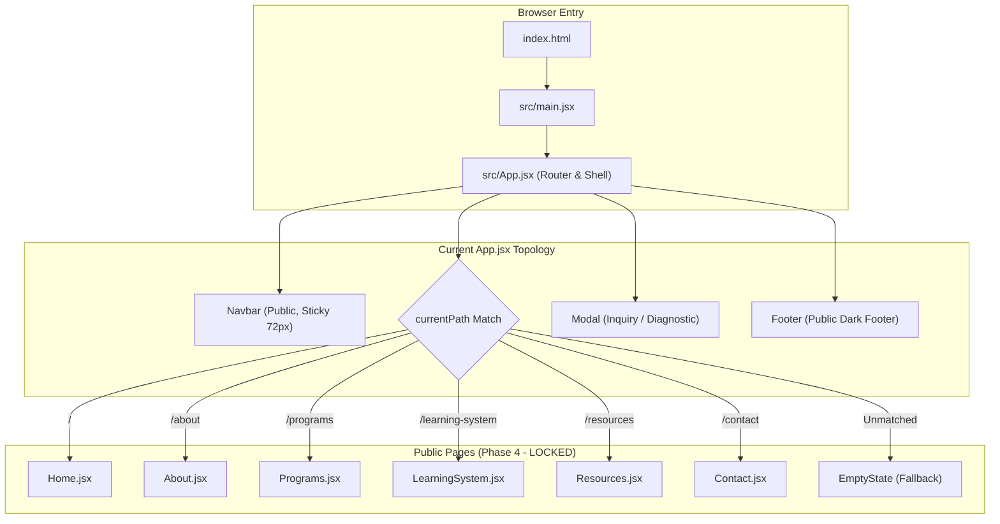
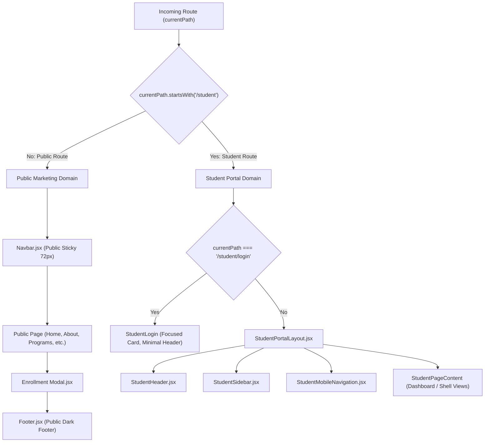
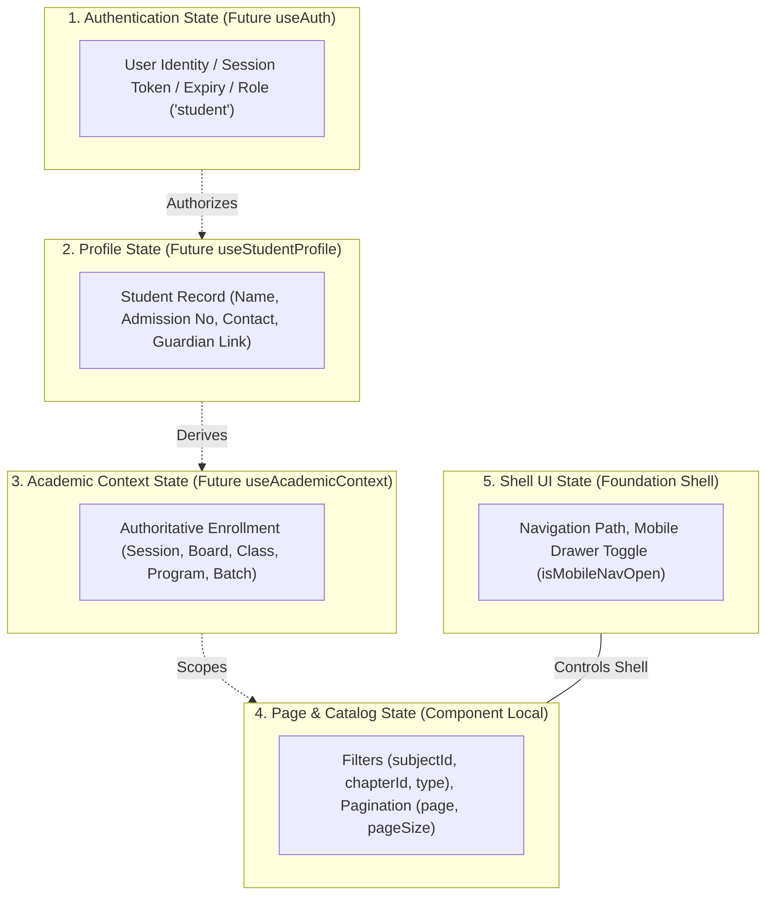
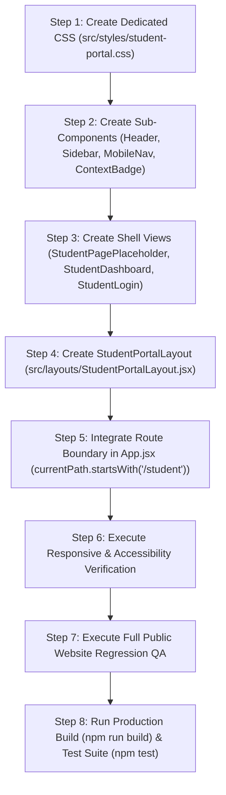

# MS Tutorials — Student Portal Frontend Foundation Plan (Phase 5.10A)

> **Governing Specifications**: `docs/AI_CODING_GUIDE.md`, `docs/architecture.md`, `docs/student-learning-experience-architecture.md` (Phase 5.9, Commit `a1bf1ac`), `docs/api-architecture.md` (Phases 5.4, 5.8A–5.8D)  
> **Status**: ARCHITECTURAL SPECIFICATION & IMPLEMENTATION PLAN ONLY  
> **Target Scope**: Frontend Foundation Shell for the Student Portal (`/student/*`)  
> **Execution Constraint**: Zero application code, zero React components, zero database mutations, zero API modifications, zero new dependencies, and zero changes to the locked public website in this planning phase.

---

## 1. Current Frontend Assessment

### 1.1 Dependency & Build Configuration
Inspection of `package.json` reveals a lean, modern Vite-powered Single Page Application (SPA):
- **Core Runtime**: React `18.3.1` and React DOM `18.3.1`.
- **Bundler & Tooling**: Vite `6.1.0` with `@vitejs/plugin-react` `4.3.4`.
- **Iconography**: `lucide-react` `0.475.0`.
- **Backend / Utility Dependencies**: `express`, `mysql2`, `jsonwebtoken`, `bcryptjs`, `cookie-parser`, `cors`, `dotenv`.
- **Routing Libraries**: **None**. There is **no** `react-router-dom`, `wouter`, or third-party client routing library installed.
- **Styling Architecture**: Pure vanilla CSS. There are no CSS-in-JS, Tailwind, Sass, or CSS Modules dependencies.

### 1.2 Routing Mechanism in `src/App.jsx`
Routing is currently managed through lightweight, component-level state:
```javascript
const [currentPath, setCurrentPath] = useState('/');
```
- Navigation transitions occur via `onNavigate(path)` callbacks passed to `<Navbar />`, `<Footer />`, and page components:
  ```javascript
  onNavigate={(path) => {
    window.scrollTo({ top: 0, behavior: 'smooth' });
    setCurrentPath(path);
  }}
  ```
- Public page rendering is orchestrated via an imperative `renderContent()` switch matching exact string equality:
  - `/` or `''` $\to$ `<Home />`
  - `/about` $\to$ `<About />`
  - `/programs` $\to$ `<Programs />`
  - `/learning-system` $\to$ `<LearningSystem />`
  - `/resources` $\to$ `<Resources />`
  - `/contact` $\to$ `<Contact />`
  - Unmatched routes fall through to a default `<EmptyState>` wrapper displaying an informational placeholder.
- Both the public `<Navbar />` (height `72px`, sticky top) and `<Footer />` (dark background `#1A1A2E`, multi-column) are rendered unconditionally around `renderContent()`.

### 1.3 Design System & Asset Assessment
The existing design system in `src/styles/` is structured as follows:
- `variables.css`: Design tokens for brand colors (`--primary: #0E9C8A`, `--navy: #0B2545`, `--dark-teal: #0A7A6B`, `--light-teal: #E6F7F5`, `--gold: #F0A500`), semantic states (`--success`, `--warning`, `--danger`, `--info`), UI surfaces (`--bg-main: #FFFFFF`, `--bg-subtle: #F8FAFC`, `--bg-muted: #F1F5F9`), typography (`--font-heading: 'Poppins'`, `--font-body: 'Inter'`), spacing scales (`--space-1` through `--space-16`), shadows (`--shadow-sm` through `--shadow-xl`), and z-index layers.
- `global.css`: CSS reset, base typography, focus indicator (`:focus-visible`), and container wrappers (`.container`, max-width `1200px`).
- `responsive.css`: Breakpoint media queries (`1024px`, `768px`) and visibility utilities (`.hide-on-mobile`, `.hide-on-desktop`).
- `components.css`: Highly polished, BEM-structured component rules:
  - Buttons (`.mst-btn`, `.mst-btn--primary`, `.mst-btn--secondary`, `.mst-btn--outline`, `.mst-btn--ghost`, `.mst-btn--danger`)
  - Cards (`.mst-card`, `.mst-card--interactive`, header, body, footer)
  - Badges (`.mst-badge`, `.mst-badge--primary`, `--success`, `--warning`, `--danger`, `--neutral`)
  - Forms (`.mst-form-group`, `.mst-label`, `.mst-input`, `.mst-select`, `.mst-textarea`)
  - Section Headers (`.mst-section-title`)
  - Dialogs (`.mst-modal-overlay`, `.mst-modal-container`, `.mst-modal-header`, etc.)
  - Feedback (`.mst-spinner`, `.mst-empty-state`, `.mst-error-state`)
  - Navigation (`.mst-navbar`, `.mst-footer`)

### 1.4 Assessment Summary
The codebase is clean, performant, and well-structured. However:
1. Public routing is tightly coupled to the public shell (`<Navbar />` + `<Footer />`).
2. There is currently no layout abstraction separating public marketing pages from authenticated application workspaces.
3. Introducing the Student Portal requires creating a clean routing boundary and a dedicated application layout without altering or breaking the existing public pages.

---

## 2. Phase 5.10A Objective

The singular objective of **Phase 5.10A** is to produce a rigorous, exhaustive architectural and implementation plan for the **first frontend layer of the Student Portal**.

This foundation must establish:
1. **A strict layout boundary**: Isolating `/student/*` from the public website layout so public marketing pages remain untouched.
2. **A dedicated application shell**: Designing the responsive desktop, tablet, and mobile framework (`StudentPortalLayout`, `StudentHeader`, `StudentSidebar`, `StudentMobileNavigation`, `StudentPageContent`).
3. **Design system reuse**: Grounding all portal UI components exclusively in existing MS Tutorials tokens and styling conventions.
4. **Clean integration boundaries**: Defining clear placeholders and state boundaries for future authentication, academic context, and resource data integration without implementing any active API calls or fake data.
5. **Zero destabilization**: Guaranteeing 100% regression-free preservation of the locked public website (routes `/`, `/about`, `/programs`, `/learning-system`, `/resources`, `/contact`), build performance, and test suites.

---

## 3. Existing Architecture



### Architectural Key Characteristics:
1. **Single Entry Point**: `src/main.jsx` mounts `<App />` inside `#root`.
2. **Global Styling Import**: `main.jsx` imports `src/styles/global.css` (which imports `variables.css` and `components.css`) and `src/styles/responsive.css`.
3. **No External Route Provider**: Navigation is managed entirely within React component state, avoiding external routing dependencies.
4. **Tight Shell Coupling**: Every route is currently framed by the marketing `Navbar` and `Footer`.

---

## 4. Student Portal Boundary

The Student Portal (`/student/*`) is an authenticated academic workspace, fundamentally distinct from the public marketing website.

### 4.1 Structural Domain Separation
| Aspect | Public Marketing Domain (`/*`) | Student Portal Domain (`/student/*`) |
|:---|:---|:---|
| **Audience** | Prospective students, parents, general visitors | Enrolled MS Tutorials students (Classes 6–10) |
| **Primary Goal** | Concept education, credibility, course enrollment | Active academic study, syllabus mastery, resource access |
| **Top Shell** | Marketing `<Navbar>` (72px, brand links, CTA) | Operational `<StudentHeader>` (64px, context chip, profile avatar) |
| **Side Shell** | None (full-width marketing containers) | Persistent collapsible `<StudentSidebar>` (260px desktop rail) |
| **Bottom Shell** | Comprehensive `<Footer>` (sitemap, legal, address) | Minimal workspace utility footer or clean edge-to-edge layout |
| **Width Model** | Centered `.container` (`max-width: 1200px`) | App canvas (`margin-left: 260px`, `max-width: 1280px` content area) |
| **Robots / SEO** | `index, follow` (public discoverability) | `noindex, nofollow` (private workspace) |
| **Auth Policy** | Anonymous, unauthenticated access | Protected by `requireRole('student')` (future phase) |

### 4.2 Route Isolation Diagram


---

## 5. Routing Strategy

### 5.1 Analysis of Options
1. **Option A: Install `react-router-dom`**:
   - *Pros*: Standard declarative route parsing (`<Routes>`, `<Route>`).
   - *Cons*: Violates **Rule 7** (*Do not add dependencies unnecessarily*) and **Rule 3** (*Make the smallest safe change*). Introduces risk of regression across the locked public website. Adds $\approx 35\text{ KB}$ bundle weight.
   - *Verdict*: **REJECTED**.

2. **Option B: Enhance Lightweight State Routing with Path Prefixing and Native History**:
   - *Pros*: Zero dependencies. Reuses existing architecture. Fully backward-compatible with public routes. Complete isolation of `/student/*`.
   - *Implementation*:
     - Synchronize `currentPath` with `window.location.pathname` upon initial render.
     - Listen to `window.addEventListener('popstate', ...)` for browser forward/back buttons.
     - On navigation, execute `window.history.pushState({}, '', path)` alongside updating `currentPath`.
     - Evaluate `currentPath.startsWith('/student')` to determine top-level layout rendering.
   - *Verdict*: **RECOMMENDED & ADOPTED**.

### 5.2 Planned Route Table for Student Portal
| Route Pattern | Target View | Phase 5.10A Status | Future Data Integration |
|:---|:---|:---|:---|
| `/student` | Redirect $\to$ `/student/dashboard` | Foundation Route | Auto-redirects to active dashboard |
| `/student/login` | Student Login View | Foundation Shell Placeholder | `POST /api/auth/login` |
| `/student/dashboard` | Student Dashboard View | Foundation Shell Placeholder | Profile + Context + Recent Resources |
| `/student/resources` | Resource Library Catalog | Foundation Shell Placeholder | `GET /api/v1/student/resources` |
| `/student/resources/:id` | Resource Detail & Viewer | Foundation Shell Placeholder | `GET /api/v1/student/resources/:id` |
| `/student/assignments` | Assignments Workspace | Honest "Upcoming Phase" Shell | Future Assignment Service |
| `/student/tests` | Assessments & Tests | Honest "Upcoming Phase" Shell | Future Assessment Service |
| `/student/results` | Performance Analytics | Honest "Upcoming Phase" Shell | Future Scoring Service |
| `/student/progress` | Curriculum Mastery & Topics | Honest "Upcoming Phase" Shell | Future Progress Tracking |
| `/student/attendance` | Session Attendance Ledger | Honest "Upcoming Phase" Shell | Future Attendance API |
| `/student/messages` | Faculty Direct Messages | Honest "Upcoming Phase" Shell | Future Communication Hub |
| `/student/announcements` | Institutional Notices | Honest "Upcoming Phase" Shell | Future Announcement Stream |
| `/student/profile` | Profile & Academic Context | Foundation Shell Placeholder | Profile + Context APIs |
| `/student/settings` | Account & Security Settings | Foundation Shell Placeholder | Client Preferences + Password API |

---

## 6. Layout Architecture

### 6.1 Layout Anatomy & Spatial Dimensions
The Student Portal layout adopts a structural rail-and-canvas layout:

```text
+----------------------------------------------------------------------------------------------------+
| StudentHeader (Height: 64px, Sticky, z-index: 1020, Border-Bottom: 1px solid var(--border-color))   |
| [Logo: MS Tutorials] | [Context Chip: CBSE 10 Achievers]                   [Notice] [User Profile] |
+------------------------------------+---------------------------------------------------------------+
| StudentSidebar                     | StudentPageContent                                            |
| Width: 260px (Desktop >= 1024px)   | Padding: var(--space-8) (Desktop), var(--space-4) (Mobile)    |
| Fixed Left, Top: 64px              | Max-width: 1280px                                             |
| Height: calc(100vh - 64px)         | Margin: 0 auto                                                |
| Background: var(--bg-subtle)       | Min-height: calc(100vh - 64px)                                |
| Overflow-Y: auto                   | Background: var(--bg-main)                                    |
|                                    |                                                               |
| Navigation Items:                  | [Breadcrumb Trail]                                            |
| • Dashboard                        | [Page Header / Title]                                         |
| • Resources                        | [Active Filter Controls / Data Table / Content Cards]         |
| • Assignments (Coming Soon)        |                                                               |
| • Tests & Results (Coming Soon)    |                                                               |
| • Progress (Coming Soon)           |                                                               |
| • Attendance (Coming Soon)         |                                                               |
| • Profile & Context                |                                                               |
| • Settings                         |                                                               |
+------------------------------------+---------------------------------------------------------------+
```

### 6.2 Viewport Tier Topologies

#### 1. Desktop Tier ($\ge 1024\text{px}$):
- **Sidebar**: Persistent, left-docked rail (`width: 260px`, `position: fixed`, `top: 64px`, `bottom: 0`).
- **Main Canvas**: `margin-left: 260px`, allowing content to scroll smoothly while sidebar remains stationary.
- **Header**: Top-docked, spans `100vw` or starts at sidebar offset; displays full brand logo, academic context chip, and user identity summary.

#### 2. Tablet Tier ($768\text{px} - 1023\text{px}$):
- **Sidebar**: Off-canvas by default. Slide-in transition (`transform: translateX(-100%)` $\to$ `translateX(0)`) when toggled.
- **Main Canvas**: Full width (`margin-left: 0`), `padding: var(--space-6)`.
- **Header**: Displays hamburger menu button on the left, compact brand logo, academic context chip, and avatar on the right.

#### 3. Mobile Handheld Tier ($360\text{px} - 767\text{px}$):
- **Sidebar / Mobile Nav**: Full off-canvas drawer with dimming backdrop (`rgba(11, 37, 69, 0.55)` with `backdrop-filter: blur(2px)`).
- **Main Canvas**: Full width, `padding: var(--space-4)`, zero horizontal overflow.
- **Header**: Height `56px` to maximize vertical viewport; displays compact logo, truncated context badge, and drawer trigger.
- **Touch Targets**: All navigation elements enforce a minimum touch bounding box of $44\text{px} \times 44\text{px}$.

---

## 7. Component Architecture

The planned structure keeps files modular, small, and strictly categorized:

```text
src/
├── layouts/
│   ├── .gitkeep
│   └── StudentPortalLayout.jsx        # Top-level portal shell (Header + Sidebar + Slot)
│
├── student/
│   ├── components/
│   │   ├── StudentHeader.jsx          # Top application bar
│   │   ├── StudentSidebar.jsx         # Desktop persistent rail navigation
│   │   ├── StudentMobileNavigation.jsx# Mobile / tablet slide-out drawer
│   │   ├── StudentContextBadge.jsx    # Compact academic session/board/class chip
│   │   └── StudentPagePlaceholder.jsx # Reusable shell placeholder for views
│   │
│   ├── pages/
│   │   ├── StudentDashboard.jsx       # Portal home shell
│   │   ├── StudentLogin.jsx           # Portal login entry shell
│   │   └── StudentProfileView.jsx     # Profile & enrollment shell
│   │
│   ├── hooks/                         # (Empty in 5.10A; reserved for future useAuth, etc.)
│   └── services/                      # (Empty in 5.10A; reserved for future API clients)
│
└── styles/
    └── student-portal.css             # Dedicated portal layout and navigation styles
```

### Component Responsibility Matrix
| Component | Location | Role & Architectural Boundaries |
|:---|:---|:---|
| `StudentPortalLayout.jsx` | `src/layouts/` | Primary shell wrapper. Manages responsive drawer state (`isMobileOpen`), keyboard listeners (`Escape` to close), and skip-to-content accessibility target. |
| `StudentHeader.jsx` | `src/student/components/` | Top bar rendering brand mark, `StudentContextBadge`, mobile hamburger trigger, notification bell placeholder, and student avatar. |
| `StudentSidebar.jsx` | `src/student/components/` | Desktop left-rail navigation with active route highlights (`aria-current="page"`), category groupings, and future module badges (`"Coming Soon"`). |
| `StudentMobileNavigation.jsx` | `src/student/components/` | Off-canvas drawer for viewports $< 1024\text{px}$. Enforces focus trapping and backdrop touch dismissal. |
| `StudentContextBadge.jsx` | `src/student/components/` | Visual chip displaying the student's active institutional context (e.g. `CBSE Class 10 (2026-27)`). |
| `StudentPagePlaceholder.jsx` | `src/student/components/` | Clean presentation widget leveraging existing `Card`, `Badge`, and `EmptyState` to render honest upcoming phase messages. |
| `student-portal.css` | `src/styles/` | Standalone CSS file importing `variables.css`. Prefixed with `.mst-sp-` to eliminate class collision with public marketing styles. |

---

## 8. Design-System Reuse

To honor **Rule 4** (*Reuse existing components*) and **Rule 5** (*Do not duplicate functionality*), the Student Portal will directly consume existing MS Tutorials UI components:

```mermaid
flowchart TD
    subgraph DesignTokens["Design Tokens (variables.css)"]
        Colors["Colors (--navy, --primary, --gold, --bg-subtle)"]
        Spacers["Spacing (--space-1 through --space-16)"]
        Radius["Border Radii (--radius-sm, --radius-md, --radius-lg)"]
        Shadows["Shadows (--shadow-sm, --shadow-md, --shadow-lg)"]
    end

    subgraph ReusedComponents["Existing Reused Components (src/components/)"]
        Btn["Button.jsx (Variants: primary, secondary, ghost, outline)"]
        Crd["Card.jsx (Container, Header, Body, Footer)"]
        Bdg["Badge.jsx (Variants: primary, success, warning, neutral)"]
        Spn["LoadingSpinner.jsx (Sizes: sm, md, lg)"]
        Emp["EmptyState.jsx (Status container with action)"]
        Err["ErrorState.jsx (Error container with retry)"]
        Inp["Input.jsx & Select.jsx (Form controls)"]
    end

    subgraph PortalShell["Student Portal Foundation (Phase 5.10A)"]
        Layout["StudentPortalLayout.jsx"]
        Header["StudentHeader.jsx"]
        Sidebar["StudentSidebar.jsx"]
        Placeholder["StudentPagePlaceholder.jsx"]
    end

    Colors --> Layout
    Spacers --> Layout
    Radius --> PortalShell
    Shadows --> Header

    Btn --> Header
    Bdg --> Header
    Bdg --> Sidebar
    Crd --> Placeholder
    Emp --> Placeholder
    Spn --> Layout
```



### Direct Component Reuse Plan:
1. **`Button.jsx`**:
   - Used in `StudentHeader` for mobile menu toggling (`variant="ghost"`).
   - Used in `StudentSidebar` for logout/switch account actions (`variant="ghost"`, `size="sm"`).
   - Used in `StudentPagePlaceholder` for navigation CTAs (`variant="primary"`).
2. **`Badge.jsx`**:
   - Used in `StudentContextBadge` (`variant="primary"`).
   - Used in `StudentSidebar` for future status pills (`"Coming Soon"` using `variant="neutral"`).
3. **`Card.jsx`**:
   - Used in `StudentDashboard` and placeholder views for content grouping.
4. **`EmptyState.jsx` & `ErrorState.jsx`**:
   - Standard containers for pending modules, zero-data situations, and connectivity failures.
5. **`LoadingSpinner.jsx`**:
   - Reserved for initial context bootstrap and async route transitions.

---

## 9. Responsive Architecture

### Breakpoint Conventions:
- **Desktop**: $\ge 1024\text{px}$ (`--container-lg`)
- **Tablet**: $768\text{px} - 1023\text{px}$ (`--container-md`)
- **Mobile**: $\le 767\text{px}$

### Responsive Behavior Rules:
```css
/* Conceptual Portal Responsive Rules (src/styles/student-portal.css) */

/* 1. Base Desktop Shell */
.mst-sp-layout {
  display: flex;
  min-height: 100vh;
  background-color: var(--bg-subtle);
}

.mst-sp-sidebar {
  width: 260px;
  position: fixed;
  top: 64px;
  bottom: 0;
  left: 0;
  z-index: var(--z-sticky);
  background-color: var(--white);
  border-right: 1px solid var(--border-color);
  overflow-y: auto;
  transition: transform var(--transition-normal);
}

.mst-sp-canvas {
  flex: 1;
  margin-left: 260px;
  min-height: calc(100vh - 64px);
  padding: var(--space-8);
  max-width: var(--container-xl);
}

/* 2. Tablet & Mobile Overrides */
@media (max-width: 1023px) {
  .mst-sp-sidebar {
    transform: translateX(-100%);
    box-shadow: var(--shadow-xl);
    z-index: var(--z-modal);
  }

  .mst-sp-sidebar--open {
    transform: translateX(0);
  }

  .mst-sp-canvas {
    margin-left: 0;
    padding: var(--space-6);
  }
}

@media (max-width: 767px) {
  .mst-sp-canvas {
    padding: var(--space-4);
  }

  .mst-sp-header__context {
    display: none; /* Hide verbose context text on small handhelds; show icon/grade badge */
  }
}
```

---

## 10. Accessibility Architecture

In compliance with WCAG 2.1 Level AA and **Rule 13** (*Maintain accessibility*):

1. **Skip Navigation**:
   - A hidden skip link at the very top of `StudentPortalLayout`:
     ```html
     <a href="#student-main-content" class="mst-sp-skip-link">
       Skip to main content
     </a>
     ```
   - Becomes visible upon keyboard `:focus-visible`, allowing keyboard users to bypass sidebar links directly to page content.
2. **Semantic Landmarks**:
   - `<header className="mst-sp-header" role="banner">`
   - `<aside className="mst-sp-sidebar" role="navigation" aria-label="Student Portal Navigation">`
   - `<main id="student-main-content" className="mst-sp-main" tabIndex="-1">`
3. **Active Link Indication**:
   - Active navigation items receive `aria-current="page"`, clear color contrast (`--primary: #0E9C8A`), and a prominent left accent indicator.
4. **Keyboard & Focus Management**:
   - When the mobile drawer opens, focus is constrained within the drawer; pressing `Escape` closes the drawer and restores focus to the menu button.
   - All interactive controls feature visible focus rings (`--focus-ring: 0 0 0 3px rgba(14, 156, 138, 0.35)`).
5. **Reduced Motion**:
   - Wrapped in `@media (prefers-reduced-motion: reduce)`: transitions set to `none` or `1ms` to accommodate vestibular sensitivities.

---

## 11. State Boundaries

To maintain clean separation of concerns and avoid monolithic state anti-patterns, the frontend boundary partitions state into five isolated tiers:



### State Boundary Definitions:
1. **Tier 1 — Authentication State**:
   - *Scope*: Application-wide security context.
   - *Phase 5.10A Rule*: **Not implemented**. Defined only as an injection point for future Phase 6 auth integration.
2. **Tier 2 — Student Profile State**:
   - *Scope*: Read-only student identity derived from `GET /api/v1/student/profile`.
   - *Phase 5.10A Rule*: **Not implemented**. Shell displays neutral placeholder student labels.
3. **Tier 3 — Academic Context State**:
   - *Scope*: Institutional parameters derived from `GET /api/v1/student/academic-context`.
   - *Phase 5.10A Rule*: **Not implemented**. Shell displays a generic mock context badge (e.g. `[Academic Session 2026-27]`) clearly documented as a development placeholder.
4. **Tier 4 — Page & Catalog State**:
   - *Scope*: Local to individual views (filter selections, page number).
   - *Phase 5.10A Rule*: **Not implemented**.
5. **Tier 5 — Shell UI State**:
   - *Scope*: Purely presentational state governing the layout shell (active path, drawer open/closed).
   - *Phase 5.10A Rule*: **Active in Phase 5.10A**.

---

## 12. API Boundaries

> [!IMPORTANT]
> **Phase 5.10A contains ZERO live API calls.**  
> The foundation layer operates purely as a static presentational shell.

However, all component prop signatures and data slots are engineered to align with existing locked backend APIs:

| Subsystem | Backend Endpoint | HTTP Verb | Locked Phase | Future Client Service |
|:---|:---|:---:|:---:|:---|
| **Authentication** | `/api/auth/login` | `POST` | Phase 5.2 | `authService.login()` |
| **Session Verification** | `/api/auth/me` | `GET` | Phase 5.3 | `authService.getMe()` |
| **Token Refresh** | `/api/auth/refresh` | `POST` | Phase 5.2 | `authService.refresh()` |
| **Student Profile** | `/api/v1/student/profile` | `GET` | Phase 5.5 | `studentService.getProfile()` |
| **Academic Context** | `/api/v1/student/academic-context` | `GET` | Phase 5.8C | `studentService.getAcademicContext()` |
| **Learning Resources** | `/api/v1/student/resources` | `GET` | Phase 5.8D | `resourceService.getResources()` |
| **Resource Detail** | `/api/v1/student/resources/:id` | `GET` | Phase 5.8D | `resourceService.getResourceById()` |

---

## 13. File Change Plan

When implementation begins in Phase 5.10B, the following minimal, atomic file set will be introduced:

| File Path | Action | Purpose & Rationale | Public Website Impact |
|:---|:---:|:---|:---:|
| `src/layouts/StudentPortalLayout.jsx` | **NEW** | Primary workspace shell wrapper providing persistent header, sidebar, and content canvas. | **None** (scoped strictly to `/student/*`) |
| `src/student/components/StudentHeader.jsx` | **NEW** | Header component with brand mark, context badge slot, and mobile drawer trigger. | **None** |
| `src/student/components/StudentSidebar.jsx` | **NEW** | Desktop persistent sidebar rendering portal navigation links and active highlights. | **None** |
| `src/student/components/StudentMobileNavigation.jsx` | **NEW** | Accessible mobile slide-out drawer for viewports $< 1024\text{px}$. | **None** |
| `src/student/components/StudentContextBadge.jsx` | **NEW** | Compact badge rendering active session, board, and grade. | **None** |
| `src/student/components/StudentPagePlaceholder.jsx` | **NEW** | Clean shell card component displaying upcoming roadmap status for unphased routes. | **None** |
| `src/student/pages/StudentDashboard.jsx` | **NEW** | Minimal dashboard shell displaying context overview and upcoming module cards. | **None** |
| `src/student/pages/StudentLogin.jsx` | **NEW** | Standalone login view shell with email/password inputs and return-to-home link. | **None** |
| `src/styles/student-portal.css` | **NEW** | BEM-scoped portal styles prefixed with `.mst-sp-`. Does not touch public classes. | **None** |
| `src/App.jsx` | **MODIFIED** | Add route condition: if `currentPath.startsWith('/student')`, render `StudentPortalLayout`; otherwise render existing public `Navbar` + `Footer`. | **Zero regression** (public branches untouched) |

---

## 14. Implementation Sequence

The implementation will proceed in eight strictly ordered, reversible steps:



### Detailed Step Descriptions:
- **Step 1 — Dedicated Portal CSS**: Create `src/styles/student-portal.css`. Define layout grid, sidebar widths, header heights, transitions, and drawer overlays using existing variables from `variables.css`.
- **Step 2 — Presentational Shell Components**: Implement `StudentHeader`, `StudentSidebar`, `StudentMobileNavigation`, and `StudentContextBadge`.
- **Step 3 — Shell Views & Placeholders**: Implement `StudentPagePlaceholder` to handle future routes (`/student/assignments`, `/student/tests`, etc.) honestly without dummy data.
- **Step 4 — Layout Assembly**: Assemble components into `StudentPortalLayout.jsx`. Wire drawer open/close state and keyboard escape handlers.
- **Step 5 — Route Isolation in `src/App.jsx`**:
  - Add path prefix detection:
    ```javascript
    if (currentPath.startsWith('/student')) {
      return (
        <StudentPortalLayout
          currentPath={currentPath}
          onNavigate={(path) => {
            window.scrollTo({ top: 0, behavior: 'smooth' });
            setCurrentPath(path);
          }}
        />
      );
    }
    ```
  - Retain 100% of existing logic for public routes (`/`, `/about`, `/programs`, etc.).
- **Step 6 — Responsive & a11y QA**: Test 360px, 768px, and 1280px viewports. Confirm no horizontal overflow. Test keyboard navigation and ARIA landmarks.
- **Step 7 — Public Website Regression QA**: Manually verify all six public pages to confirm zero visual or layout regressions.
- **Step 8 — Build & Test Verification**: Confirm `npm run build` succeeds with 0 errors and `npm test` passes 166/166 tests.

---

## 15. Testing Plan

### 15.1 Automated Test Suites (`npm test`)
- Run all 166 existing tests to verify zero regressions across locked backend APIs:
  - Identity & Auth (Phase 5.2, 5.3, 5.5): 57 tests
  - Academic Catalog & Curriculum (Phase 5.8A, 5.8B): 48 tests
  - Student Academic Context (Phase 5.8C): 25 tests
  - Learning Resources (Phase 5.8D): 36 tests
- Add new unit/smoke tests for portal layout rendering if applicable in Phase 5.10B.

### 15.2 Visual & Functional Responsive QA Matrix
| Viewport | Target Device | Verification Criteria |
|:---|:---|:---|
| **$360\text{px} \times 740\text{px}$** | Small Mobile (e.g. Galaxy S8) | Zero horizontal scroll (`document.body.scrollWidth === window.innerWidth`). Header displays compact logo and drawer button. Drawer opens cleanly over backdrop. Touch targets $\ge 44\text{px}$. |
| **$390\text{px} \times 844\text{px}$** | Standard Mobile (e.g. iPhone 14) | Clean typography, cards stack vertically with proper margins (`var(--space-4)`). |
| **$768\text{px} \times 1024\text{px}$** | Tablet Portrait (e.g. iPad) | Off-canvas drawer trigger visible. Canvas utilizes full width with balanced padding. |
| **$1024\text{px} \times 768\text{px}$** | Tablet Landscape | Persistent sidebar (`260px`) locks to the left. Main canvas scrolls independently. |
| **$1280\text{px} \times 800\text{px}$** | Laptop / Desktop | Full desktop layout. Context chip visible in header. Active sidebar item highlighted. |
| **$1920\text{px} \times 1080\text{px}$** | Full HD Monitor | Canvas max-width constrained to `1280px` (`--container-xl`), centered with clean margins. |

### 15.3 Public Website Regression Checklist
- [ ] `/` (Home): Hero, Value Props, Class Programs, Learning System, CTA buttons, and Inquiry Modal remain 100% functional.
- [ ] `/about`: Leadership, Pedagogy, Faculty, and Values sections intact.
- [ ] `/programs`: Class 6–10 cards, tabs, and enrollment triggers intact.
- [ ] `/learning-system`: 4-pillar methodology, assessment loop, and diagnostic CTAs intact.
- [ ] `/resources`: Public resource catalog, search, and download cards intact.
- [ ] `/contact`: Location details, phone/email, and inquiry form intact.
- [ ] Modal: Diagnostic test and enrollment modals open, validate, and submit properly.

---

## 16. Risk Assessment

| Potential Risk | Severity | Likelihood | Mitigation Strategy |
|:---|:---:|:---:|:---|
| **CSS Style Bleed into Public Website** | High | Low | Isolate all portal classes with `.mst-sp-` namespace and store rules in a dedicated `student-portal.css` file. Never override base HTML tags (`body`, `main`, `h1-h6`) globally. |
| **Public Routing Regressions** | High | Low | Public routes execute through untouched conditional branches. The portal check is strictly additive: `if (currentPath.startsWith('/student'))`. |
| **Layout Shift / CLS on Viewport Resize** | Medium | Medium | Use CSS media queries and flexbox/grid for layout structure rather than JavaScript window resize event listeners. |
| **Broken Back/Forward Navigation** | Medium | Medium | Handle browser history via standard `popstate` event listeners synchronized with `currentPath`. |
| **Accidental Fake Data Injection** | Medium | Low | Enforce strict rule: no mock student names, fake grades, or synthetic progress percentages. Use honest, generic shell cards indicating roadmap phases. |

---

## 17. Explicit Non-Goals

To maintain strict phase boundaries and avoid scope creep, the following tasks are **explicitly out of scope** for Phase 5.10A:
1. ❌ **No Live API Integration**: Do not connect `fetch()` or Axios to `/api/v1/student/*` or `/api/auth/*`.
2. ❌ **No Authentication Logic**: Do not implement JWT cookie extraction, login submission, password hashing, or token refresh logic.
3. ❌ **No Real or Mock Student Records**: Do not create fake student profiles, sample grades, or synthetic attendance records.
4. ❌ **No External Router Installation**: Do not install `react-router-dom` or other routing packages.
5. ❌ **No Changes to Locked Public Pages**: Do not alter `Home.jsx`, `About.jsx`, `Programs.jsx`, `LearningSystem.jsx`, `Resources.jsx`, or `Contact.jsx`.
6. ❌ **No Database Changes**: Do not create or run SQL migrations.
7. ❌ **No Git Commits or Pushes**: This phase concludes strictly at the planning and architectural documentation stage.

---

## 18. Acceptance Criteria

Phase 5.10A is complete when:
- [x] Comprehensive inspection of repository files (`package.json`, `App.jsx`, `src/components/`, `src/styles/`, `docs/`) is completed.
- [x] All 18 architectural plan sections are documented in `docs/student-portal-foundation-plan.md`.
- [x] Routing strategy isolates `/student/*` without requiring external routing dependencies.
- [x] Layout architecture cleanly defines desktop persistent rail, tablet collapsible nav, and mobile drawer.
- [x] Design system reuse strategy specifies exact component consumption without duplicating CSS tokens.
- [x] State and API boundaries are established with zero live API calls or fake data.
- [x] File change plan and sequential implementation steps are clearly detailed.
- [x] Existing 166 automated tests pass with 0 failures (`npm test`).
- [x] Production build passes with 0 errors and 0 warnings (`npm run build`).
- [x] Database schema remains validated across all 18 tables (`node database/validate-schema.js`).
- [x] Working tree shows only untracked `docs/student-portal-foundation-plan.md` via `git status --short`.
